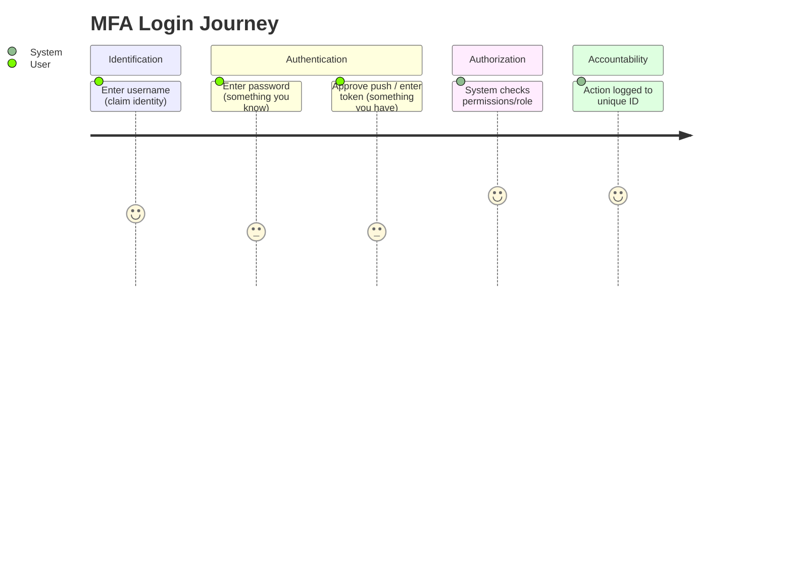
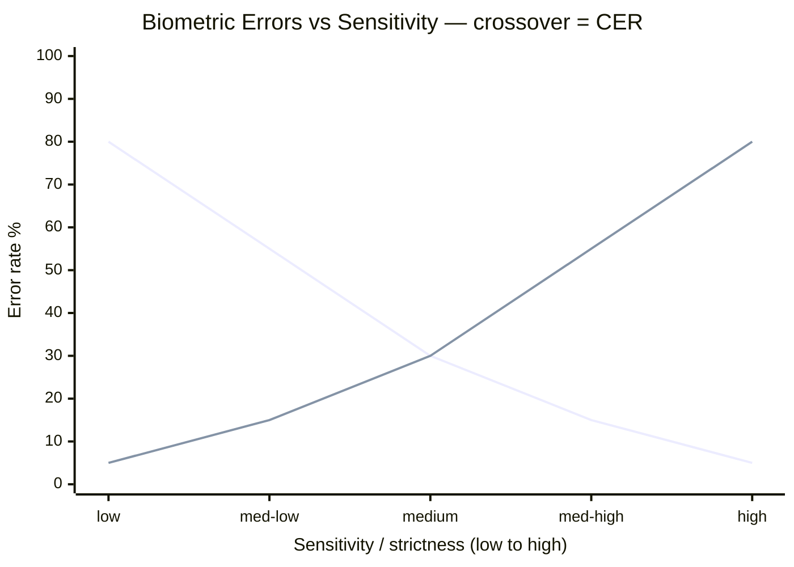

# Authentication Methods

## Overview

Authentication is the step that proves a claimed identity is real, using one or more factors. The strength of authentication comes from combining factors of *different types* — knowledge, possession, biometric — so that compromising one (a stolen password) does not hand over the account. That single idea drives most of this topic, including why two passwords never count as two factors.

## Key Concepts

### Authentication Factors
| Factor | Type | Examples |
|--------|------|---------|
| **Something you know** | Knowledge | Password, PIN, security question |
| **Something you have** | Possession | Smart card, token, phone, key |
| **Something you are** | Biometric | Fingerprint, iris, face, voice |
| **Somewhere you are** | Location | GPS, IP-based geolocation |
| **Something you do** | Behavior | Typing pattern, gait, signature |

### Multi-Factor Authentication (MFA)
- Must use **two or more different factors** (not two of the same type)
- Password + PIN = single factor (both are knowledge)
- Password + token = two-factor (knowledge + possession)
- MFA significantly reduces account compromise

### Biometric Authentication
| Metric | Description |
|--------|-------------|
| **FRR** (False Rejection Rate) | Type I error - rejecting a legitimate user |
| **FAR** (False Acceptance Rate) | Type II error - accepting an impostor |
| **CER/EER** (Crossover/Equal Error Rate) | Where FRR = FAR; lower is better |

- **Type I** (FRR) = false rejection = "rejecting the right person"
- **Type II** (FAR) = false acceptance = "accepting the wrong person"
- CER is used to compare biometric systems (lower CER = more accurate)

**Two categories of biometric:**
- **Physiological** = a physical trait you *are*: fingerprint, iris, retina, hand geometry, face.
- **Behavioral** = how you *do* something: voice, signature, keystroke dynamics (typing rhythm), gait.

**Iris vs. retina (classic trap):**
- **Iris scan** = pattern of the colored ring around the pupil. Non-invasive, stable over life, fast.
- **Retina scan** = blood-vessel pattern at the back of the eye. Very accurate but invasive and can reveal health information (e.g., diabetes) — a privacy concern.

### Password Best Practices
- Minimum length (12+ characters preferred)
- Complexity requirements (mixed case, numbers, symbols)
- No password reuse
- Account lockout after failed attempts
- Salted hashing for storage (bcrypt, scrypt, PBKDF2)
- Never store passwords in plaintext

### Token-Based Authentication
- **Synchronous** - time-based tokens (TOTP); device and server share a secret
- **Asynchronous** - challenge-response tokens; server sends challenge, token responds
- **HOTP** - HMAC-based one-time password (counter-based)
- **TOTP** - time-based one-time password (most common, e.g., Google Authenticator)
- **FIDO2/WebAuthn** - passwordless authentication standard using public key cryptography
- **Hard token vs. soft token:** a **hard token** is a physical device that generates codes (RSA SecurID fob, YubiKey); a **soft token** is a software app generating codes (Authenticator app on a phone). Both are Type 2 (something you have).

### Certificate-Based Authentication
- Authenticate with a **digital certificate** instead of a password: the holder's **private key** proves identity (the cert binds the public key to the identity).
- Used for smart-card logon, machine/device auth, and mutual TLS. No shared secret to phish.

## Exam Tips

- **Type I** = false rejection (too strict); **Type II** = false acceptance (too lenient)
- Lower **CER** = better biometric system
- Two passwords are NOT two-factor (same factor used twice)
- Smart card = something you **have** (the card) + something you **know** (the PIN) = two-factor
- Biometric FAR is the more dangerous error (letting unauthorized users in)

## Diagrams

### User Authentication Journey

> User-journey diagrams map steps and the "feel"/friction at each.

**Takeaway:** IAAA in action — **Identify → Authenticate (MFA = 2 different factor types) → Authorize → Account (log)**.

### Biometric Accuracy (CER) — XY Chart

> Shows the FRR and FAR curves crossing — the crossover is the CER.

**Takeaway:** As strictness rises, **FAR (impostors accepted) falls** but **FRR (legit users rejected) rises**. They cross at the **CER** — the key accuracy metric. **Lower CER = better device.** (Type 2/FAR is the dangerous error.)

## Related Topics

- [Access Control Models](Access%20Control%20Models.md) - what happens after authentication
- [Identity Management](Identity%20Management.md) - lifecycle of identities
- [Identity Federation and SSO](Identity%20Federation%20and%20SSO.md) - single sign-on
- [Access Control Attacks](Access%20Control%20Attacks.md) - attacks against authentication
- [Cryptography](../03-security-architecture-and-engineering/Cryptography.md) - underlying mechanisms
