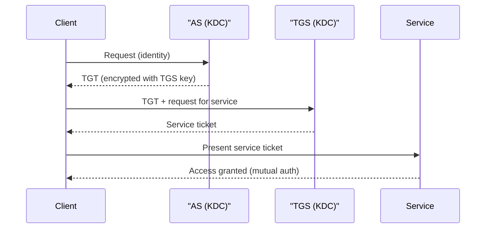

# Authorization and Accountability

## Overview

Authorization determines what an authenticated subject can do. Accountability ensures actions can be traced back to individuals.

## Key Concepts

### The AAA Framework
1. **Authentication** - Who are you? (verify identity)
2. **Authorization** - What can you do? (grant permissions)
3. **Accountability** - What did you do? (audit trail)

### Authorization Principles
- **Need to Know** - access limited to information necessary for the task
- **Least Privilege** - minimum permissions required
- **Default Deny** - if not explicitly permitted, access is denied
- **Implicit Deny** - if no rule matches, deny access (firewall principle)

### Accountability Mechanisms
- **Audit Logs** - record of who did what, when, and from where
- **Logging** - capturing system and user events
- **Monitoring** - real-time observation of activity
- **Non-repudiation** - cannot deny performing an action (digital signatures, logs)

> **Accountable vs. responsible (cloud):** accountability can be delegated only in execution, never in ownership. The **cloud consumer is accountable** for its data (the owner/controller); the **cloud provider is responsible** for carrying out the agreed tasks (the processor). You can outsource the work, not the accountability.

### AAA Protocols
| Protocol | Use | Notes |
|----------|-----|-------|
| **RADIUS** | Network access (Wi-Fi, VPN) | Encrypts password only; uses UDP |
| **TACACS+** | Network device administration | Encrypts entire payload; uses TCP; Cisco |
| **Diameter** | Mobile/wireless networks | Enhanced RADIUS successor |
| **Kerberos** | Enterprise SSO | Ticket-based; uses symmetric encryption |

### Kerberos Components
- **KDC** (Key Distribution Center) - central authentication server
  - **AS** (Authentication Service) - verifies identity, issues TGT
  - **TGS** (Ticket Granting Service) - issues service tickets
- **TGT** (Ticket Granting Ticket) - proves identity to TGS
- **Service Ticket** - grants access to a specific service
- Uses **symmetric encryption**; time-sensitive (requires clock synchronization)

## Exam Tips

- **RADIUS** encrypts only the password; **TACACS+** encrypts the entire session
- **Kerberos** is vulnerable to **replay attacks** (mitigated by timestamps) and **pass-the-ticket**
- Accountability requires **identification + authentication + audit**
- Without identification, you cannot have accountability
- Default deny / implicit deny is always the safer approach

## Common Traps

- **RADIUS vs. TACACS+:** RADIUS uses **UDP** and encrypts **only the password**; TACACS+ uses **TCP** and encrypts the **entire payload**, and separates AAA into independent functions. "Encrypts the whole packet / used for device administration" = TACACS+.
- **Authentication vs. accountability:** accountability is impossible without *unique* identification — shared accounts break the audit trail. If the stem says "actions could not be traced to a person," the root cause is shared/unidentified accounts.

## Diagrams

### Kerberos ticket exchange
The KDC's AS issues a TGT; the client trades the TGT at the TGS for a service ticket, which the service validates — using timestamps to resist replay.

## Related Topics

- [Authentication Methods](Authentication%20Methods.md)
- [Access Control Models](Access%20Control%20Models.md)
- [Identity Federation and SSO](Identity%20Federation%20and%20SSO.md) - Kerberos, SAML, OAuth
- [Domain 7 - Security Operations](../07-security-operations/00%20Domain%207%20-%20Security%20Operations.md) - log management and monitoring
