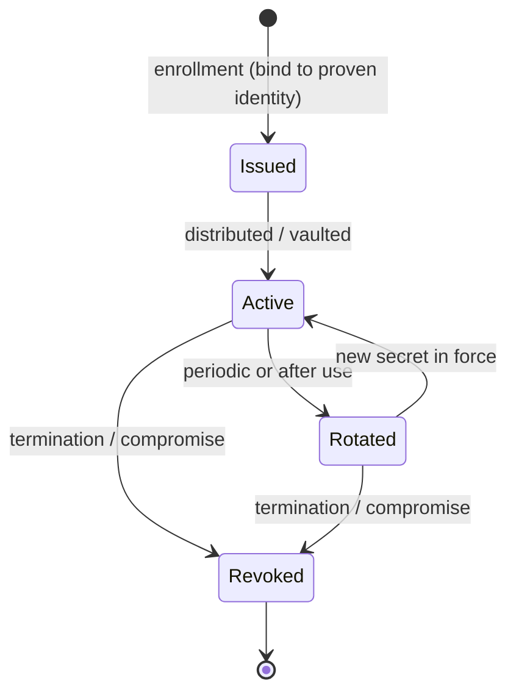

# Credential Management Systems

## Overview

A credential management system is the machinery that issues, stores, distributes, rotates, and revokes the secrets people and machines use to prove identity — passwords, keys, certificates, API tokens. The reason it is its own topic is that credentials are the thing attackers actually want; almost every breach is, at bottom, a stolen or guessed credential. A good credential management system makes secrets strong, keeps them out of human memory and source code, changes them often, and kills them the instant an identity is deprovisioned. The intuition: a credential you never see, that changes after every use, and that dies when you leave, is very hard to abuse.

This sits next to but is distinct from authentication itself. Authentication is the act of proving identity; credential management is the lifecycle and custody of the secrets that make that proof possible.

## Key Concepts

### What a credential management system does

| Function | Description |
|----------|-------------|
| **Issuance / enrollment** | Creates the credential and binds it to a proven identity (links to identity proofing) |
| **Storage / vaulting** | Keeps secrets encrypted at rest, not in plaintext files or memory |
| **Distribution** | Delivers the secret securely to the consumer (injects it, never emails it) |
| **Rotation** | Changes the secret periodically or after use |
| **Revocation** | Invalidates the credential on termination, compromise, or role change |
| **Recovery / reset** | Self-service or assisted reset with identity re-verification |

### Password vaults and managers

A password vault (enterprise) or password manager (personal) stores credentials in an encrypted store unlocked by a single master secret, generates strong unique passwords, and autofills them. The benefit is unique, high-entropy passwords per site without human memory; the risk is concentration — the master password and the vault become a single high-value target, so the master secret should be strong and MFA-protected.

### Secrets management for machines

Applications, scripts, and pipelines also need credentials (database passwords, API keys, certificates). Hardcoding these in source code or config files is a classic finding. A **secrets manager** (e.g., a vault service) stores them centrally, hands them out at runtime via short-lived tokens, rotates them automatically, and audits access — applying the same vault-rotate-revoke discipline to non-human identities.

### Self-service password reset (SSPR)

SSPR lets users reset forgotten passwords without a helpdesk call, after re-verifying identity (MFA, security questions, a verified phone/email). It cuts cost and lockout time but the *re-verification* must be strong — weak reset questions are a well-known account-takeover path, so the reset channel must be at least as strong as the login it protects.

### Credential strength and storage hygiene

Strong credential management also means how secrets are *stored on the server*: never plaintext, always salted and hashed with a slow algorithm (bcrypt, scrypt, Argon2, PBKDF2). The salt defeats precomputed rainbow tables; the slow hash defeats fast offline cracking. (Storage of the verifier is part of credential management; the cracking attacks live in [Access Control Attacks](Access%20Control%20Attacks.md).)

### Certificate and key lifecycle

Certificates and keys are credentials too. Their management — issuance by a CA, distribution, expiry, renewal, and revocation (CRL/OCSP) — is a credential management problem with the same lifecycle shape: bind to a proven identity, protect the private key, and revoke promptly.

## Common traps / easily confused

- **Credential management vs. identity management:** identity management governs the *account and its access*; credential management governs the *secrets* that authenticate it. They overlap at issuance and deprovisioning but answer different questions ("who has access" vs. "what secret proves it").
- **Vault concentration risk:** centralising passwords is good practice but creates a single high-value target — the answer is to protect the master/vault with MFA and strong encryption, not to avoid the vault.
- **Hardcoded secrets** are the expected answer when a stem describes API keys in code or config — remediate with a **secrets manager** and rotation.
- **SSPR weakness is in the verification step**, not the reset itself; weak knowledge-based questions undermine it.

## Exam Tips

- "Developers store database passwords in source code" → move to a **secrets management / vault** solution with rotation.
- "Users reuse weak passwords across systems" → **enterprise password manager/vault** generating unique credentials.
- Protect the password vault's master credential with **MFA** — it is the single point of compromise.
- Credentials must be **revoked immediately on termination**, same as the account.
- Server-side: store password verifiers **salted and hashed** with a slow KDF, never reversibly encrypted or plaintext.

## Diagrams

### Credential lifecycle
A managed secret is bound to a proven identity, used, rotated repeatedly, and decisively revoked at the end.

## Related Topics

- [Privileged Access Management](Privileged%20Access%20Management.md) - vaulting and rotation for privileged secrets
- [Authentication Methods](Authentication%20Methods.md) - what credentials prove
- [Identity Proofing and Assurance Levels](Identity%20Proofing%20and%20Assurance%20Levels.md) - binding credentials to a real identity
- [Identity Management](Identity%20Management.md) - account lifecycle
- [Access Control Attacks](Access%20Control%20Attacks.md) - credential attacks the system defends against
