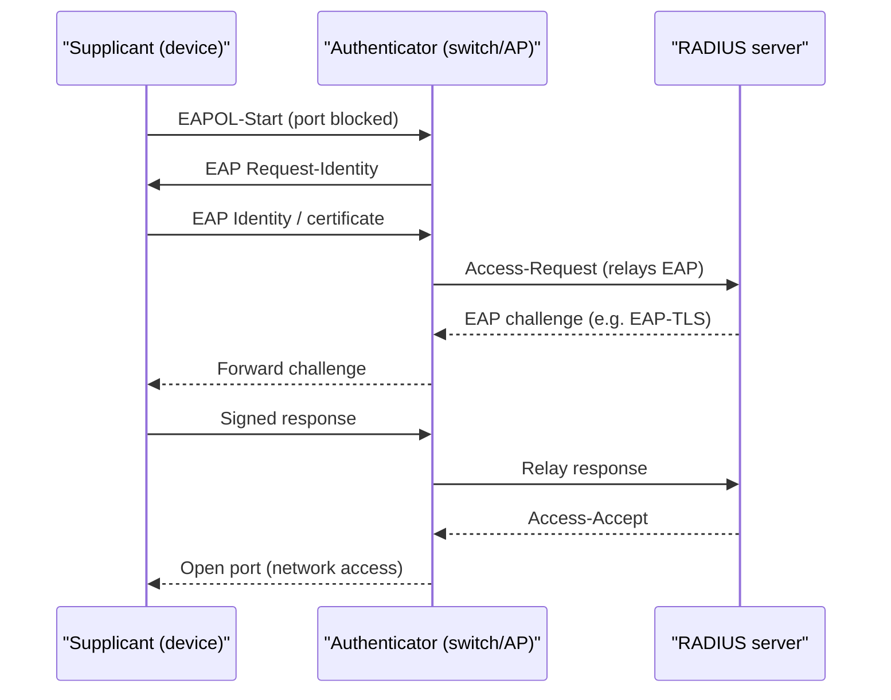

# Device Identity and Network Access Control

## Overview

Most of identity management is about *people*, but devices and services need identities too — and a network is only as trustworthy as the machines allowed onto it. A laptop with the right user password can still be a personal, unpatched, malware-laden machine. **Device identity** gives each machine its own verifiable credential (usually a certificate), and **Network Access Control (NAC)** is the gatekeeper that checks both *who* and *what* before letting a device communicate, and can quarantine devices that fail. The intuition: authenticate the endpoint the same way you authenticate the user, and make admission conditional on the device's security posture, not just on a valid login.

## Key Concepts

### Device identity

A device proves it is a known, trusted endpoint using a credential bound to the hardware:

- **Device certificates** — a machine certificate issued by the enterprise CA; the basis of mutual TLS and certificate-based 802.1X.
- **TPM (Trusted Platform Module)** — a hardware chip that stores keys and can attest to the device's identity and boot integrity, so the credential cannot be trivially copied to another machine.
- **MAC address** — a weak device identifier; spoofable, so acceptable only as a low-assurance hint, never as real authentication.

Device identity lets policy say "only corporate-managed, certificate-holding machines may join," closing the gap that user-only authentication leaves open.

### Network Access Control (NAC)

NAC enforces policy at the point a device tries to connect. It can authenticate the device and/or user, evaluate the device's **posture/health** (patch level, antivirus running, disk encryption, configuration), and then **admit, deny, or quarantine**.

- **Pre-admission** NAC checks posture *before* granting network access.
- **Post-admission** NAC continuously monitors and can revoke access if a device falls out of compliance.
- **Agent-based** NAC uses software on the endpoint for deep posture data; **agentless** NAC scans the device from the network (less detail, no install).
- Non-compliant devices are sent to a **remediation/quarantine VLAN** with limited access (e.g., only to patch servers) until they are fixed.

### 802.1X port-based access control

IEEE **802.1X** is the standard for authenticating a device *before* it gets a usable network port — wired or wireless. Three roles:

| Role | Who | Job |
|------|-----|-----|
| **Supplicant** | The connecting device | Presents credentials |
| **Authenticator** | The switch or wireless AP | Blocks the port until auth succeeds; relays messages |
| **Authentication server** | Usually **RADIUS** | Makes the accept/deny decision |

802.1X carries credentials inside **EAP (Extensible Authentication Protocol)** — e.g., EAP-TLS (certificate-based, strongest), PEAP, EAP-TTLS. The port stays closed to normal traffic until authentication passes, so an unauthenticated device cannot reach the network at all.

### Device management context (MDM/UEM)

Mobile Device Management / Unified Endpoint Management enrols devices, pushes their identity certificates and configuration, enforces encryption and screen locks, and can remote-wipe a lost device. NAC and MDM complement each other: MDM establishes and maintains the device's trusted state; NAC checks that state at admission.

## Common traps / easily confused

- **802.1X roles:** supplicant = device, authenticator = **switch/AP** (not the server), authentication server = **RADIUS**. The switch enforces; RADIUS decides.
- **NAC checks posture/health, not just identity** — "admit only patched, AV-enabled devices and quarantine the rest" is NAC.
- **Pre- vs. post-admission:** pre-admission gates entry; post-admission keeps watching and can evict a device that drifts out of compliance.
- **MAC address is not authentication** — it is spoofable; certificate-based (EAP-TLS) device auth is the strong answer.
- **NAC ≠ firewall.** A firewall filters traffic by rules between networks; NAC decides whether a *device* may join the network in the first place and in what posture.
- **EAP is a framework, not a single method** — EAP-TLS (certs) is the strongest common variant.

## Exam Tips

- "Authenticate a device before granting a network port" → **802.1X** with supplicant / authenticator (switch) / **RADIUS** server.
- "Allow only compliant, healthy endpoints and quarantine the rest" → **NAC** with posture assessment and a remediation VLAN.
- Strong device authentication uses **certificates (EAP-TLS) / TPM-backed identity**, not MAC addresses.
- NAC can be **pre-admission** (gate) and/or **post-admission** (continuous compliance).
- Pair **MDM/UEM** (maintains device trust) with **NAC** (verifies it at admission).

## Diagrams

### 802.1X port-based authentication
The supplicant authenticates through the authenticator (switch/AP), which relays EAP to the RADIUS server; the port stays blocked until Access-Accept.

## Related Topics

- [AAA Protocols](AAA%20Protocols.md) - 802.1X uses a RADIUS authentication server
- [Authentication Methods](Authentication%20Methods.md) - certificate-based authentication
- [Identity Management](Identity%20Management.md) - identities for devices and services
- [Domain 4 - Communication and Network Security](../04-communication-and-network-security/00%20Domain%204%20-%20Communication%20and%20Network%20Security.md) - network controls
