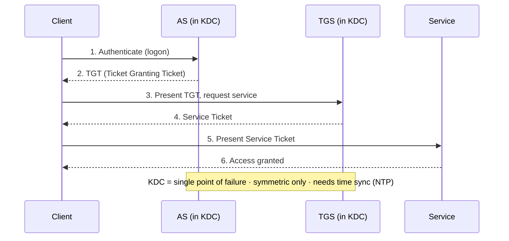
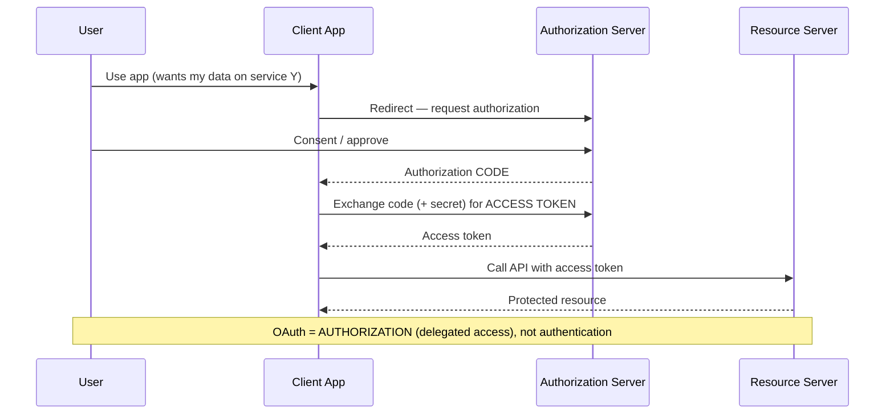
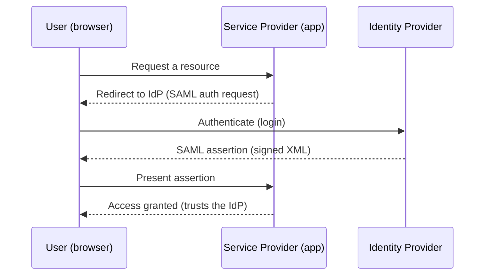
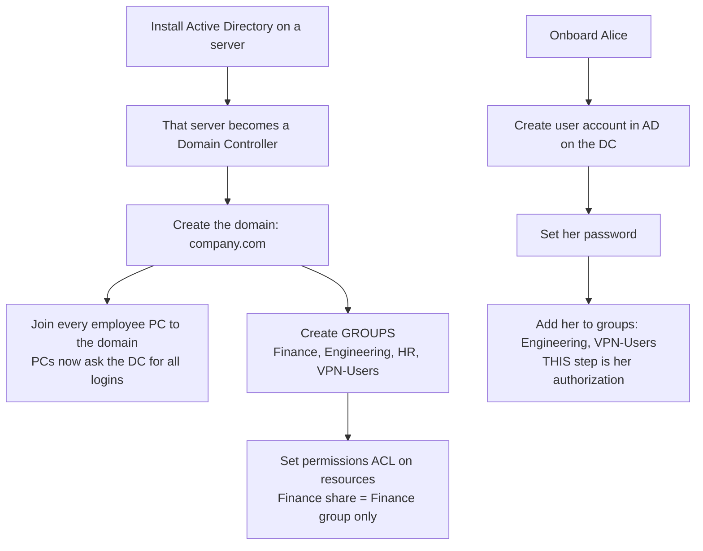
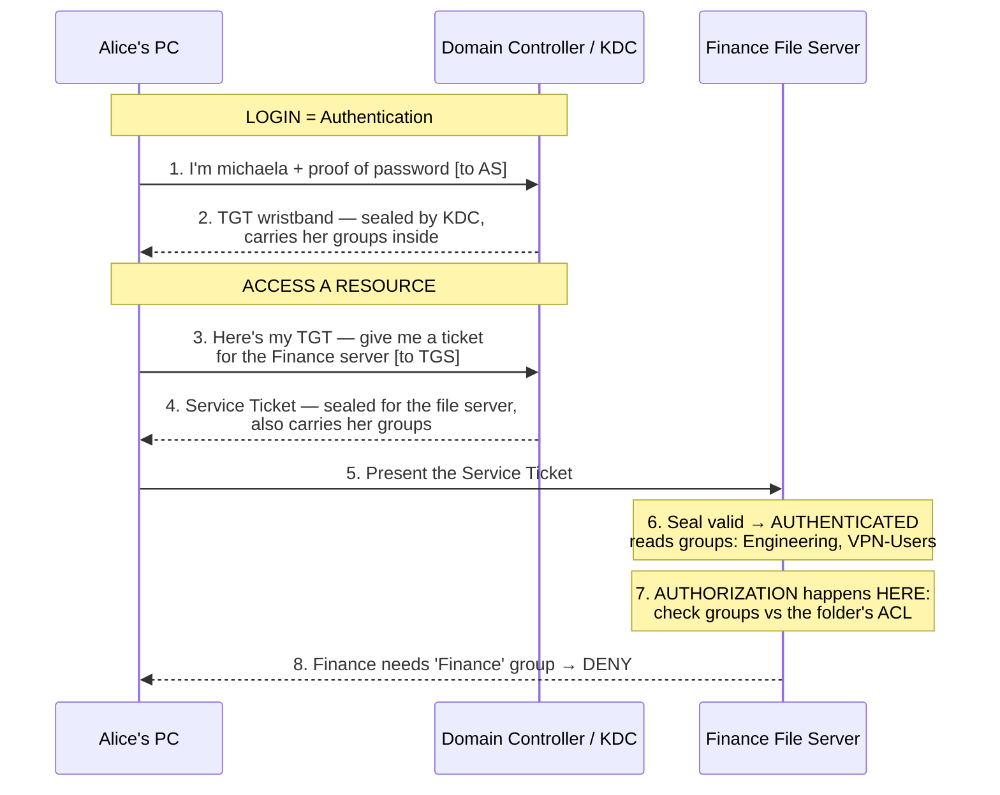
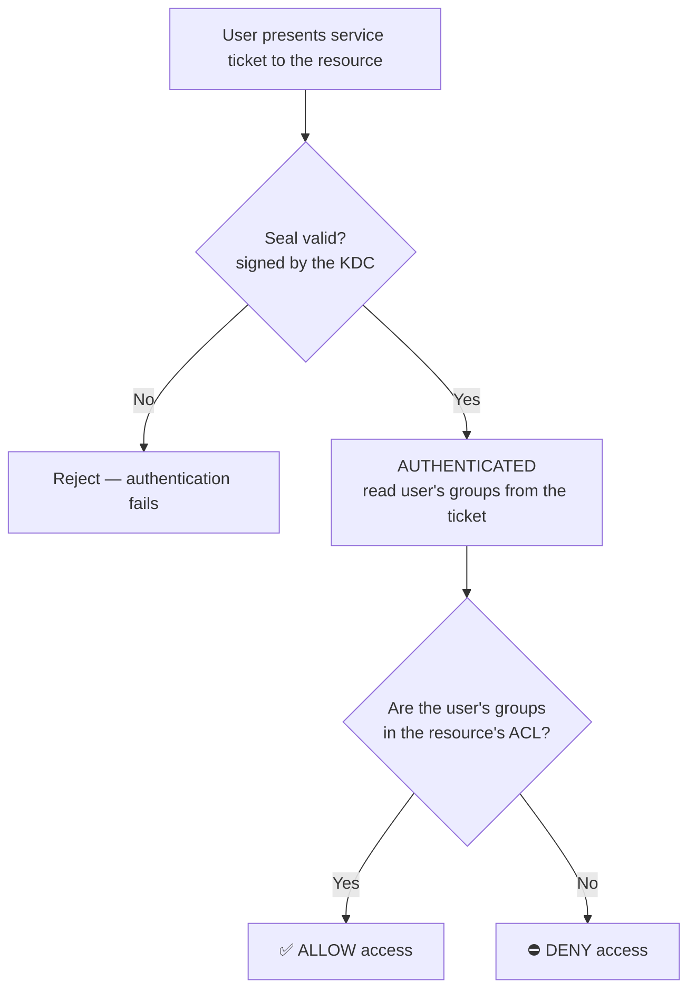

# Identity Federation and SSO

## Overview

SSO lets a user authenticate once and reach many systems; federation extends that trust *across organizational boundaries* so one login works at partner services too. The trade-off is concentration of risk — convenience and fewer passwords, but the SSO account becomes a single high-value target. The exam leans hard on telling the standards apart: SAML (XML, enterprise web SSO), OAuth (authorization/delegation), and OIDC (authentication built on OAuth).

## Key Concepts

### Single Sign-On (SSO)
- User authenticates once, gains access to multiple systems
- Reduces password fatigue and helpdesk calls
- Risk: single point of compromise (if SSO account is breached, all access is lost)

### Federation Standards
| Standard | Purpose | Notes |
|----------|---------|-------|
| **SAML** (Security Assertion Markup Language) | Web SSO between organizations | XML-based; enterprise standard |
| **OAuth 2.0** | Authorization delegation | Grants access to resources without sharing credentials |
| **OpenID Connect (OIDC)** | Authentication layer on OAuth 2.0 | Identity verification; returns ID token |
| **Kerberos** | LAN SSO | Ticket-based; single realm or cross-realm trusts |
| **WS-Federation** | Web services federation | Microsoft ecosystem (ADFS) |

### SAML Components
- **Identity Provider (IdP)** - authenticates the user (e.g., corporate AD)
- **Service Provider (SP)** - the application/service being accessed
- **Assertion** - XML document with authentication/authorization data
- Flow: User -> SP -> IdP (authenticate) -> SP (with assertion) -> Access

**The four SAML building blocks (exam list):**
- **Assertions** - the identity/attribute/authorization statements (XML).
- **Protocol** - request/response rules for asking for and returning assertions.
- **Bindings** - how SAML messages map onto a transport (e.g., HTTP POST, HTTP Redirect).
- **Profiles** - combinations of assertions/protocol/bindings for a specific use case (e.g., Web Browser SSO).

### OAuth 2.0 vs. OpenID Connect
- **OAuth 2.0** = authorization only ("this app can access your photos")
- **OIDC** = authentication + authorization ("verify who you are AND what you can access")
- OAuth issues **access tokens**; OIDC adds **ID tokens**
- **Standards/maintainers (exam trap):** **OAuth 2.0** is described in **RFC 6749** and is maintained by the **IETF**. **OIDC** is *built on* OAuth 2.0 (RFC 6749) but is maintained by the **OpenID Foundation** (not IETF). So a system that lets users authenticate via a third party *without the site seeing/storing credentials*, "uses technologies in RFC 6749 but is **not** maintained by IETF" → **OIDC** (the not-IETF clue rules out plain OAuth).

### OIDC Components and Flows

**Components:**
- **Relying Party (RP)** = the web application that authenticates the user via the IdP (trap — RP is the *web app* doing the authentication, NOT the authorization server)
- **Identity Provider (IdP)** = the OIDC server that holds identity and issues tokens
- **Authorization Server** = part of the IdP that issues tokens
- **Resource Owner** = the end user who owns the protected resources
- **End User** = the human authenticating

**OIDC Flow Types:**

| Flow | How it works | When to use |
|---|---|---|
| **Authorization Code Flow** | RP receives a code from IdP, then exchanges it directly with IdP for the ID token (server-to-server). **Most secure.** | Confidential clients (server-side apps) — trigger phrase: "RP provided an auth code and must use it to directly request the ID token" |
| **Implicit Flow** | Token returned directly in URL fragment. No code exchange. **Deprecated for security reasons.** | Legacy SPAs (use PKCE instead now) |
| **Hybrid Flow** | Combines code + token in one flow — RP gets some tokens directly + a code to exchange | Mixed scenarios |
| **Client Credentials Flow** | Service-to-service, no user involved | Machine-to-machine auth |

**Trigger phrase mapping:**
- "RP gets a code, exchanges it for ID token" → **Authorization Code Flow**
- "Token returned directly, deprecated" → **Implicit Flow**

### Virtual Directory vs Meta-Directory

These are easily confused with regular directory services. Common trap:

| Type | What it does |
|---|---|
| **Directory Service** | The actual identity store (AD, LDAP, NDS) |
| **Meta-Directory** | Aggregates multiple directories into one logical view (data-pull approach, periodic sync) |
| **Virtual Directory** | Same role as meta-directory but **real-time view** (queries on demand, no data sync) |

**Trigger phrase:** "Virtual directory plays the same role in IAM as ___" → **Meta-directory** (NOT directory service)

### Synchronous vs Asynchronous Tokens

| Token Type | How it works | Examples |
|---|---|---|
| **Synchronous time-based** | Server and token share time; token displays current OTP | TOTP, Google Authenticator |
| **Synchronous counter-based** | Server and token share a counter; press to advance | HOTP, RSA SecurID counter mode |
| **Asynchronous nonce-based / challenge-response** | Server sends challenge; token computes response using nonce | Smart card challenge-response |

**Trigger phrase:** "Challenge/response scheme to authenticate" → **Asynchronous nonce-based** (NOT synchronous — challenge-response is async by definition)

### Virtual Password

A **virtual password** = passphrase converted into the **length and format required by a specific system or application**.

- NOT a hash (that's a different concept)
- NOT an encryption key
- It's the system-specific representation of the user's passphrase

**Trigger phrase:** "Passphrase converted to a length/format" or "derived from a passphrase" → **Virtual Password**

### Kerberos vs. SESAME
- **Kerberos** = **symmetric** encryption only (+ timestamps); KDC is a single point of failure.
- **SESAME** = a Kerberos successor that adds **asymmetric (public-key)** crypto on top of symmetric, and uses a **PAC (Privilege Attribute Certificate)** to carry the user's identity and access rights. Trap pairing: "symmetric + asymmetric / uses a PAC" = **SESAME**, not Kerberos.

### Linked vs. Synced vs. Federated Identity
- **Linked** - the same person's separate accounts in different systems are *associated* (no data moved).
- **Synced** - identity data is *copied/synchronized* between systems (e.g., on-prem AD → cloud).
- **Federated** - a *trust relationship* lets one login work across domains, with **no credential copying** (the SP trusts the IdP's assertion).

### Federation Trust Models
- **Cross-certification** - each organization certifies the other (peer-to-peer)
- **Third-party trust** - trusted third party (bridge CA) manages trust
- **Federation** - trust agreements between IdPs and SPs

## Exam Tips

- **SAML** = enterprise SSO, XML-based, most comprehensive
- **OAuth** = authorization (not authentication)
- **OIDC** = authentication (built on top of OAuth)
- SSO increases convenience but also increases risk (single point of failure)
- Kerberos requires **time synchronization** between all systems

## Diagrams

### Kerberos Authentication — Sequence

**Takeaway:** AS issues TGT → TGS issues service ticket → service grants access. Symmetric only; KDC is the SPOF.

### OAuth 2.0 Authorization Code Flow — Sequence

**Takeaway:** OAuth = delegated authorization (code → token → access). OIDC adds authentication on top.

### SAML Web SSO — Sequence

**Takeaway:** SP trusts the IdP's signed XML assertion — one login works across federated services.

### Active Directory + Kerberos — End-to-End Flow

The whole story: build the company → onboard a user → log in → access a resource.
Watch where **authentication** (Kerberos) ends and **authorization** (the resource) begins.

---

#### 1️⃣ Setup & Onboarding — where authorization is *defined*

> Her access is decided here, by **which groups she's in** — before she ever logs in.

---

#### 2️⃣ Login + Resource Access — the Kerberos ticket flow

> Kerberos **proved who she is** and **carried her groups**. It did NOT decide access.

---

#### 3️⃣ The Authorization Decision — done BY the resource

---

#### Who does what

| Step | Who | Job |
|---|---|---|
| Prove who you are | **Kerberos / KDC** | **Authentication** |
| Carry your group memberships | **Kerberos ticket** | delivers identity + groups |
| Decide allow/deny | **The resource + its ACL** | **Authorization** |

- **Authentication** = "who are you?" → Kerberos (AS issues the TGT, TGS issues service tickets).
- **Authorization** = "are your groups on my list?" → the **resource** checks the groups (delivered in the ticket) against **its own ACL**.

> **Why Golden/Silver tickets are deadly:** they forge the **groups inside the ticket**. The resource *trusts* those groups and never re-checks them → forge `Domain Admins` and every resource authorizes you. You were attacking exactly this handoff.

**CISSP-depth:** Kerberos = authentication + SSO via AS→TGS tickets; authorization is enforced **at the resource** against an **ACL** using the user's **group memberships**. The crypto/PAC internals are below exam level — the *handoff* is the testable idea.

## Related Topics

- [Authentication Methods](Authentication%20Methods.md)
- [Authorization and Accountability](Authorization%20and%20Accountability.md) - Kerberos, RADIUS
- [Identity Management](Identity%20Management.md) - federation extends identity across boundaries
- [Domain 4 - Communication and Network Security](../04-communication-and-network-security/00%20Domain%204%20-%20Communication%20and%20Network%20Security.md) - protocols used
