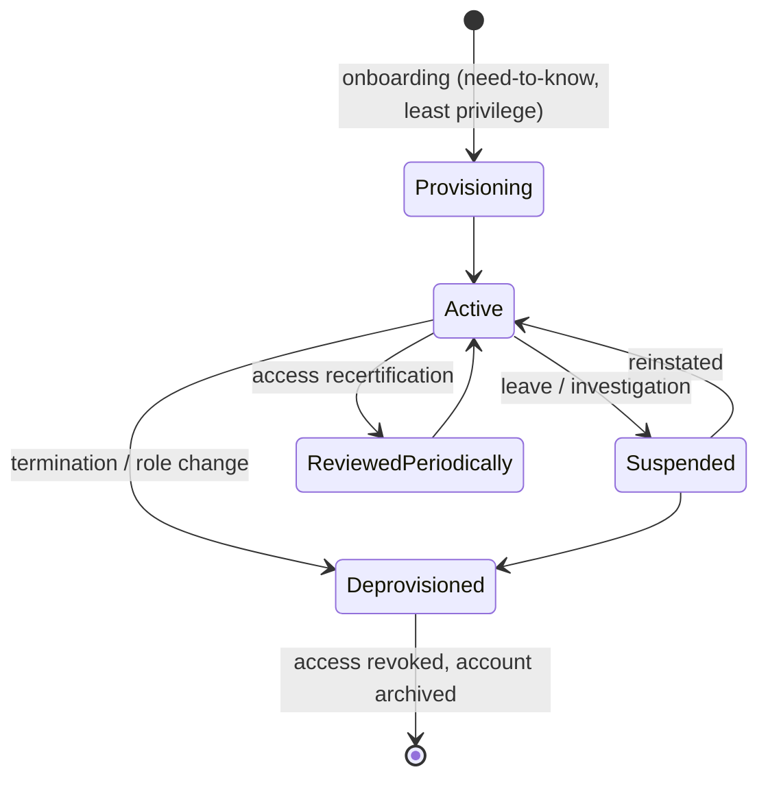

# Identity Management

## Overview

Identity management governs an account's whole life — from creation, through every role change, to the day it must be shut off. The recurring exam theme is that access must track reality: provision with least privilege, review it periodically, and deprovision *immediately* on termination. The classic failure is the orphaned account that lingers after someone leaves, so tying provisioning to HR events is the safer design.

## Key Concepts

### Identity Lifecycle
1. **Provisioning** - creating accounts and granting initial access
2. **Management** - maintaining, modifying access as roles change
3. **Review** - periodic access reviews/recertification
4. **Deprovisioning** - removing access when no longer needed

**JML (Joiner–Mover–Leaver)** = the lifecycle framed by HR events: **Joiner** = provision on hire; **Mover** = adjust access on role change (and remove the old access — see privilege creep); **Leaver** = revoke promptly on termination.

**Identity proofing (registration / enrollment)** = verifying a person really is who they claim *before* issuing credentials (checking ID documents). It is the enrollment step that anchors the whole identity to a real person.

**Privilege creep (authorization creep)** = the gradual accumulation of access beyond what's needed, typically because **Mover** changes add new rights without removing old ones. Countered by access reviews / recertification.

### Directory Services
- **LDAP** (Lightweight Directory Access Protocol) - standard for accessing directories
- **Active Directory** (Microsoft) - most common enterprise directory
- **X.500** - original directory standard (LDAP is a lightweight version)
- Centralized identity store for authentication and authorization
- **IDaaS (Identity as a Service)** - cloud-delivered identity management (SSO, MFA, provisioning), e.g., Okta, Azure AD / Entra ID.

### Provisioning Standard
- **SPML (Service Provisioning Markup Language)** - XML standard for automating account **provisioning/deprovisioning** across systems. (Contrast: **SAML** carries authentication assertions, not provisioning.)

### Identity Governance
- **Access Reviews/Recertification** - periodic review of who has access to what
- **Privileged Access Management (PAM)** - managing and monitoring privileged accounts
- **Separation of Duties** - enforced through role design
- **Least Privilege** - enforced through access provisioning

### Provisioning Methods
- **Manual** - administrator creates accounts (slow, error-prone)
- **Automated** - triggered by HR system events (onboarding, role change, termination)
- **Self-Service** - user requests access through a portal (with approval workflow)
- **Just-in-Time (JIT)** - access provisioned on demand and revoked after use

### Service Accounts
- Used by applications and services, not people (a service account's purpose is **to run applications**)
- Higher risk because they're often over-privileged and passwords rarely rotate
- Must be inventoried, monitored, and have passwords managed
- Should follow least privilege

### Privileged Accounts (what an access review covers)
**Privileged accounts** = accounts with elevated rights: **root/administrator accounts** and **service accounts**. A privileged-account access review targets **these**, NOT regular **user** accounts or **guest** accounts (those aren't privileged). Exam trap: "which privileged accounts would a review include?" → **root + service**, not user/guest.

## Exam Tips

- Access should be **revoked immediately** upon termination
- Access reviews should be performed **regularly** (quarterly, annually)
- Provisioning should be tied to **HR processes** for accuracy
- JIT provisioning supports Zero Trust and least privilege
- Service accounts need the same governance as human accounts

## Diagrams

### Identity / Account Lifecycle — State Diagram

**Takeaway:** Provision with least privilege → periodic access reviews → **deprovision promptly** on termination (orphaned accounts are a top risk).

## Related Topics

- [Authentication Methods](Authentication%20Methods.md) - how identities authenticate
- [Access Control Models](Access%20Control%20Models.md) - how access is granted
- [Personnel Security](../01-security-and-risk-management/Personnel%20Security.md) - hiring/termination processes
- [Identity Federation and SSO](Identity%20Federation%20and%20SSO.md)
