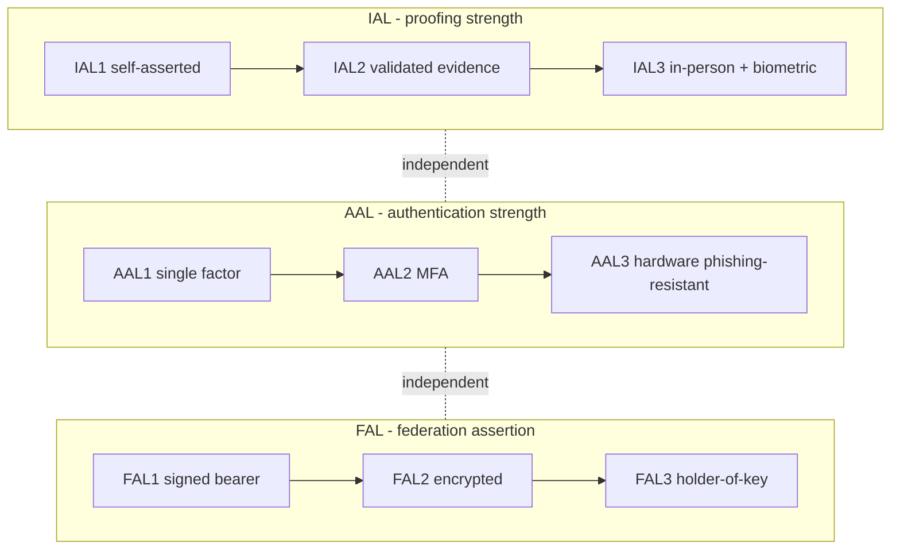

# Identity Proofing and Assurance Levels

## Overview

Before you ever issue someone a password or a badge, you have to answer a prior question: is this person really who they claim to be? **Identity proofing** (also called registration or enrollment) is that step — verifying a real-world identity *before* binding a credential to it. It is the anchor of the whole identity system, because every later authentication only proves "the same person who enrolled is back," never "this is genuinely Jane Smith." If proofing was weak, strong authentication just reliably re-admits an impostor.

NIST SP 800-63 splits identity assurance into three independent dimensions — **how well you proved the identity (IAL)**, **how strongly you authenticate (AAL)**, and **how trustworthy a federated assertion is (FAL)**. The exam wants you to keep these three apart and to know that proofing strength and authentication strength are separate decisions.

## Key Concepts

### Identity proofing (registration / enrollment)

Proofing collects and validates evidence that the applicant is a real, unique person and that they are the one presenting the evidence. It typically checks identity documents (passport, driver's licence), validates them against authoritative sources, and confirms the applicant possesses them (in person or via a verified video/selfie process). Done well, it stops fraudulent enrollments at the front door. Done badly — "anyone who fills in the form gets an account" — it undermines everything downstream.

### The three NIST assurance levels

| Dimension | Question it answers | Levels |
|-----------|---------------------|--------|
| **IAL** — Identity Assurance Level | How rigorously was the real-world identity proved? | IAL1 → IAL3 |
| **AAL** — Authenticator Assurance Level | How strong is the authentication at login? | AAL1 → AAL3 |
| **FAL** — Federation Assurance Level | How strong/protected is the federated assertion? | FAL1 → FAL3 |

**IAL (proofing strength):**
- **IAL1** — no real-world proofing required; self-asserted attributes (sign-up forms).
- **IAL2** — remote or in-person proofing with validated evidence; the level for most services handling real identities.
- **IAL3** — in-person (or supervised remote) proofing with verified biometric and strong evidence; highest rigour.

**AAL (authentication strength):**
- **AAL1** — single-factor permitted; some assurance.
- **AAL2** — **MFA required** (two distinct factors); the common bar for sensitive access.
- **AAL3** — MFA with a **hardware-based, phishing-resistant authenticator** and verifier-impersonation resistance; highest.

**FAL (federation strength):**
- **FAL1** — bearer assertion, signed by the IdP.
- **FAL2** — assertion is encrypted to the relying party.
- **FAL3** — subject must also present a **holder-of-key** proof, binding the assertion to a key they control.

### The dimensions are independent

A system can be high on one and low on another. You might lightly proof an identity (IAL1) but require strong MFA at login (AAL2), or rigorously proof an identity (IAL2) that then logs in with a single factor. Decoupling them is deliberate — proofing rigour and authentication rigour are chosen separately to match risk. This separation (introduced in NIST 800-63 rev 3) is exactly the distinction the exam tests.

### Why proofing precedes everything

Proofing → credential issuance → authentication → authorization. Each step trusts the one before. Weak proofing is unfixable downstream: you cannot authenticate your way out of having enrolled an impostor. This is why high-trust systems invest in strong registration.

## Common traps / easily confused

- **IAL vs. AAL:** IAL = *proofing* (did we verify who you are at enrollment?); AAL = *authentication* (how strong is the login?). "Verifying identity documents before issuing a credential" = IAL; "requiring MFA at sign-in" = AAL.
- **FAL is only about federation** — the assurance of the *assertion* between IdP and relying party, not about the user's password.
- **Proofing ≠ authentication.** Authentication re-recognises an already-enrolled subject; proofing establishes the subject in the first place.
- **AAL2 means MFA; AAL3 means hardware + phishing-resistant.** Don't conflate "MFA" with "the highest level" — MFA alone is AAL2, not AAL3.
- **Identity proofing = registration = enrollment** — three names for the same front-door step.

## Exam Tips

- "Verify a person's real identity *before* issuing credentials" → **identity proofing / registration**, measured by **IAL**.
- "How strong is the authentication?" → **AAL** (AAL2 = MFA, AAL3 = hardware phishing-resistant).
- "Assurance of a federated SAML/OIDC assertion" → **FAL**.
- The three NIST dimensions are **independent** — high authentication does not imply strong proofing.
- Weak enrollment cannot be repaired by strong authentication — fix proofing at the source.

## Diagrams

### Three independent assurance dimensions
NIST 800-63 separates how well identity was proved (IAL), how strong the login is (AAL), and how trustworthy a federated assertion is (FAL) — each chosen independently.

## Related Topics

- [Identity Management](Identity%20Management.md) - proofing as the first lifecycle step
- [Credential Management Systems](Credential%20Management%20Systems.md) - issuing credentials after proofing
- [Multifactor Authentication Mechanisms](Multifactor%20Authentication%20Mechanisms.md) - AAL2/AAL3 authenticators
- [Identity Federation and SSO](Identity%20Federation%20and%20SSO.md) - federated assertions (FAL)
- [Authentication Methods](Authentication%20Methods.md)
