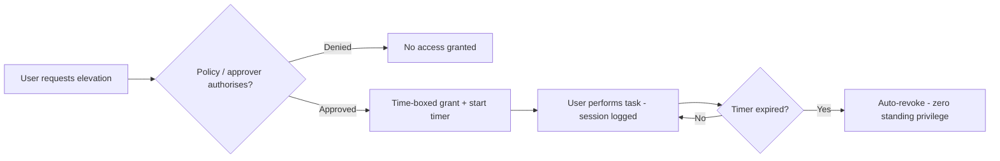

# Just-in-Time Access

## Overview

Just-in-Time (JIT) access flips the default of identity management. Instead of giving someone a permission and leaving it on their account forever ("standing access"), JIT grants the permission at the moment it is needed, for a bounded window, and automatically takes it back when the window closes. The intuition: access that does not exist cannot be abused or stolen. An attacker who compromises an account at 3 a.m. finds it holds no elevated rights, because those rights only appear during an approved task and then vanish.

JIT is how modern environments approach **zero standing privilege** and is a natural fit for least privilege and Zero Trust — you are no longer trusting a long-lived grant, you are trusting a fresh, time-boxed, justified one.

## Key Concepts

### How JIT works

A typical JIT flow: the user requests elevation for a specific role or resource → a policy or approver authorises it → the system grants the access and starts a timer → the user does the work → the access is automatically revoked at expiry (and ideally the session is logged). The grant is **temporary, scoped, and auditable**.

### Forms of JIT

| Form | Mechanism |
|------|-----------|
| **Time-bound elevation** | A user's role is activated for, say, 1 hour, then deactivated |
| **Ephemeral accounts** | A brand-new account is created for the task and deleted afterward |
| **Just-in-time credentials** | A short-lived credential (token, certificate, one-time password) is issued for the session |
| **Broker/approval-based** | A PAM broker grants access on approval and revokes on completion |

### Standing access vs. JIT

**Standing access** is permanent — it persists between uses and is the access an attacker inherits on compromise. **JIT access** is the opposite: zero at rest, present only during an approved task. Removing standing privilege is the single biggest reduction in administrative attack surface, which is why JIT underpins zero standing privilege.

### Why JIT supports least privilege and Zero Trust

Least privilege says "only the access you need." JIT adds the time dimension — "only the access you need, only while you need it." Zero Trust never assumes a grant is still valid; JIT makes every elevated grant fresh, explicitly justified, and short-lived, so there is nothing stale to trust.

## Common traps / easily confused

- **JIT vs. PAM:** JIT is a *technique* (grant access only when needed); PAM is the broader *discipline* (vaulting, rotation, recording) that often *implements* JIT for privileged accounts. JIT is one feature inside a PAM strategy, not a synonym for it.
- **JIT is about time, least privilege is about scope.** The exam pairs them: least privilege limits *what*, JIT limits *when/how long*. Together they give "minimum access for the minimum time."
- **JIT reduces standing privilege; it does not eliminate authentication.** The user still proves identity (often with MFA) before the time-boxed grant is issued.
- **Ephemeral/JIT credentials beat long-lived ones** because a captured short-lived token expires before it is useful.

## Exam Tips

- "Reduce the attack surface from permanently elevated admin rights" → **JIT / zero standing privilege**.
- "Access granted on demand and revoked after use" in a provisioning question → **just-in-time provisioning**.
- JIT is a key enabler of **Zero Trust** and **least privilege** for administrators.
- Pair JIT with **approval workflow + session logging** so the temporary grant is both authorised and accountable.

## Diagrams

### JIT access flow
Access is requested, approved, granted for a bounded window, then auto-revoked at expiry — leaving zero standing privilege.

## Related Topics

- [Privileged Access Management](Privileged%20Access%20Management.md) - the discipline JIT lives inside
- [Identity Management](Identity%20Management.md) - provisioning methods including JIT
- [Credential Management Systems](Credential%20Management%20Systems.md) - issuing short-lived credentials
- [Least Privilege](../01-security-and-risk-management/Least%20Privilege.md)
- [Secure Network Architecture](../04-communication-and-network-security/Secure%20Network%20Architecture.md) - Zero Trust
