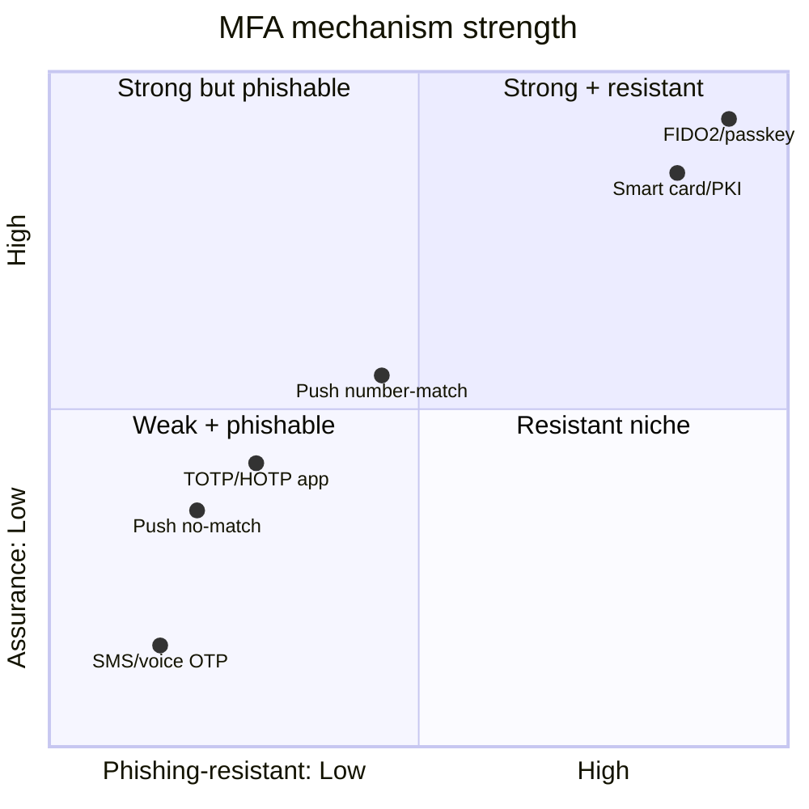

# Multifactor Authentication Mechanisms

## Overview

[Authentication Methods](Authentication%20Methods.md) covers *why* MFA works — combining factors of different types so one stolen secret is not enough. This note goes one level deeper into the *mechanisms* people actually use as the "something you have" factor, because the exam increasingly distinguishes them by strength, especially by **phishing resistance**. The single idea that ranks them: a factor an attacker can trick you into typing or approving on a fake site is weak; a factor cryptographically bound to the real site is strong. That is why SMS codes sit at the bottom and FIDO2/passkeys sit at the top.

## Key Concepts

### One-time passwords: HOTP and TOTP

A one-time password (OTP) is a short code valid only once. Two algorithms:

- **HOTP (HMAC-based OTP)** — **counter-based**. The token and server share a secret and a counter; each press advances the counter to produce the next code. Codes stay valid until used, so the token and server can drift out of sync.
- **TOTP (Time-based OTP)** — **time-based**. The code is derived from the shared secret and the current time, so it changes every ~30 seconds. This is what authenticator apps (and RSA SecurID time mode) use; it requires rough clock synchronisation.

Both are "something you have" (the seed/device). Both are *phishable* — a user can be tricked into typing the current code into a fake site that relays it in real time.

### Push notifications

A push-based authenticator sends an approve/deny prompt to a registered phone. It is more convenient than typing a code, but vulnerable to **MFA fatigue / push bombing** — the attacker, already holding the password, spams prompts until the user taps "approve" out of annoyance. The mitigation is **number matching** (the user must enter a number shown on the login screen), which defeats blind approval.

### SMS and voice OTP (weakest)

Codes sent by text or phone call are better than nothing but the weakest mainstream factor: vulnerable to **SIM swapping** (attacker ports your number), SS7 interception, and ordinary phishing relay. NIST discourages SMS for higher assurance. If the stem contrasts SMS with an app or hardware key, SMS is the weak answer.

### FIDO2 / WebAuthn and passkeys (phishing-resistant)

FIDO2 (the WebAuthn standard plus the CTAP device protocol) uses **public-key cryptography**: the authenticator (a security key like a YubiKey, or a platform authenticator like a phone/laptop) holds a private key; the site holds the public key. At login the authenticator signs a challenge **bound to the site's origin**, so a credential simply will not work on a look-alike phishing domain. There is **no shared secret to phish, relay, or breach on the server**. This is the gold standard — **phishing-resistant** authentication, and the basis of NIST AAL3.

A **passkey** is a FIDO2 credential made user-friendly: a discoverable, often cloud-synced private key that replaces the password entirely (passwordless), unlocked locally by biometric or PIN. Same phishing-resistant cryptography, designed for consumer scale.

### Ranking by strength (the exam's mental model)

| Mechanism | Phishing-resistant? | Notes |
|-----------|--------------------|-------|
| **SMS / voice OTP** | No | SIM swap, interception — weakest |
| **TOTP/HOTP app code** | No | Relayable in real time, but no SIM-swap exposure |
| **Push (no number match)** | No | MFA fatigue / push bombing |
| **Push with number matching** | Partial | Defeats blind approval |
| **FIDO2 security key / passkey** | **Yes** | Origin-bound public-key; AAL3-capable; gold standard |

### Smart cards and certificates

A smart card combines "something you have" (the card holding a private key) with "something you know" (the PIN), authenticating via a certificate rather than a password. Like FIDO2 it relies on a private key that never leaves the device, making it strong and phishing-resistant for enterprise/PKI environments.

## Common traps / easily confused

- **HOTP vs. TOTP:** HOTP = **counter/event-based** (code valid until used); TOTP = **time-based** (code expires every ~30 s). "Counter-based, can drift" = HOTP; "changes every 30 seconds, needs time sync" = TOTP.
- **Phishing-resistant means FIDO2/passkeys or smart-card/PKI**, *not* OTP or push. If a question asks for phishing-resistant MFA, OTP and SMS are wrong by definition because they can be relayed.
- **SMS is the weakest factor** when ranked — SIM swap is the keyword.
- **MFA fatigue / push bombing** is countered by **number matching**, not by adding another push.
- **Passkey ≠ password manager.** A passkey is a FIDO2 private-key credential (passwordless, phishing-resistant), not just a stored password.
- All these are still **one factor each** ("something you have"); MFA means combining one of them with a *different* type (password or biometric).

## Exam Tips

- "Phishing-resistant / strongest MFA" → **FIDO2 security key or passkey** (origin-bound public-key crypto); smart-card/PKI also qualifies.
- "Users approving fraudulent prompts" (MFA fatigue) → enable **number matching**.
- "Codes intercepted via SIM swap" → the weak factor is **SMS OTP**; move to app or hardware key.
- HOTP = **counter**, TOTP = **time** — lock this pair.
- A security key/passkey has **no server-side shared secret**, so a breach of the site cannot reveal the credential.

## Diagrams

### Mechanism strength ranking
Plotting phishing resistance against overall assurance: SMS sits lowest; FIDO2/passkeys and smart-card/PKI sit highest.

## Related Topics

- [Authentication Methods](Authentication%20Methods.md) - factor types and biometrics
- [Identity Proofing and Assurance Levels](Identity%20Proofing%20and%20Assurance%20Levels.md) - AAL2/AAL3 authenticators
- [Smart Card Types](Smart%20Card%20Types.md) - card configurations
- [Access Control Attacks](Access%20Control%20Attacks.md) - phishing, credential theft
- [Credential Management Systems](Credential%20Management%20Systems.md)
