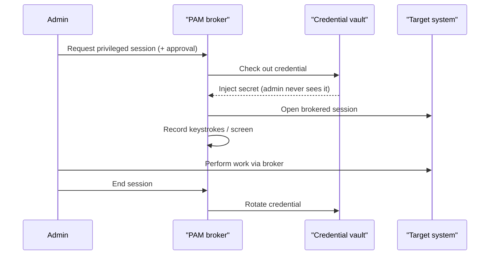

# Privileged Access Management

## Overview

A privileged account is one that can change the system itself rather than just use it — root, Domain Admin, a database `sa` account, a hypervisor login, a service account that owns a backup job. These accounts are the keys to the kingdom, so attackers go straight for them and auditors scrutinise them. Privileged Access Management (PAM) is the set of controls that keeps those keys in a locked box, hands them out only when needed, watches what gets done with them, and takes them back afterward. The mental model that answers most exam questions: **never let a human know a privileged password, never let privilege sit idle on an account, and record everything privileged that happens.**

PAM matters because ordinary identity controls assume the account can do limited damage. A privileged account breaks that assumption — one compromise can disable logging, create new admins, and exfiltrate everything — so it gets a heavier, separate layer of governance.

## Key Concepts

### What counts as privileged

Privileged access is any access that exceeds a standard user's: administrative/root accounts, service accounts, emergency "break-glass" accounts, application-to-application secrets, and the elevated rights inside otherwise-normal accounts. A privileged-access review targets **administrator and service accounts**, not regular user or guest accounts.

### The core PAM controls

| Control | What it does | Why it matters |
|---------|--------------|----------------|
| **Credential vaulting** | Stores privileged passwords/keys in an encrypted vault; humans check them out, never memorise them | Removes shared, static, known admin passwords |
| **Password/secret rotation** | Automatically changes the privileged credential after each use or on a schedule | A stolen credential is useless after rotation |
| **Session brokering (proxying)** | The admin connects *through* the PAM tool to the target; the tool injects the credential | The admin never sees the actual password |
| **Session recording/monitoring** | Captures keystrokes, commands, and screen video of privileged sessions | Forensics, accountability, deterrence |
| **Just-in-time elevation** | Grants privilege only for a bounded window, then revokes it | Eliminates standing privilege (see [Just-in-Time Access](Just-in-Time%20Access.md)) |
| **Least-privilege enforcement** | Grants only the specific elevated rights needed, not blanket admin | Limits blast radius |
| **Approval workflow** | Requires a request + approver before elevation | Adds a human checkpoint and an audit trail |

### Break-glass (emergency) accounts

A break-glass account is a highly privileged emergency account used when normal access paths fail (the PAM system is down, MFA is broken, the only admin is unreachable). It is deliberately powerful, so it is wrapped in compensating controls: the credential is sealed in the vault, using it fires an immediate high-priority alert, and every use is reviewed afterward. The point is controlled, monitored exception — not a convenient backdoor.

### Standing privilege vs. zero standing privilege

**Standing privilege** is permanent elevated access that sits on an account whether or not it is being used — the classic attack surface. **Zero standing privilege (ZSP)** is the goal state where accounts hold no elevated rights at rest and are elevated only on demand via JIT. ZSP is a key enabler of Zero Trust for administrators.

### PAM vs. IAM (the scope distinction)

IAM governs *all* identities and their everyday access; PAM is the specialised subset that governs the *privileged* ones with extra controls (vaulting, recording, JIT). Think of PAM as IAM with the volume turned up for the accounts that can do the most harm.

## Common traps / easily confused

- **PAM vs. IGA/IAM:** Identity Governance and Administration handles provisioning, roles, and access reviews for normal users; PAM specifically locks down, brokers, and records *privileged* sessions. If the stem stresses vaulting, session recording, or admin password rotation, the answer is PAM.
- **Vaulting vs. rotation:** vaulting *stores and hides* the credential; rotation *changes* it after use. Both together mean a checked-out password is hidden and short-lived.
- **Session recording is for privileged accountability**, not for stopping the initial login — it is detective/deterrent, not preventive.
- **Break-glass is not a shared admin account for convenience.** Its defining traits are: sealed credential, alert on use, mandatory after-action review.
- **PAM reduces, but does not by itself create, least privilege** — least privilege is the principle; PAM is one mechanism that enforces it for elevated access.

## Exam Tips

- The best mitigation for "admins share a known root password" is a **PAM solution with credential vaulting and rotation**, so no human knows the password.
- "Eliminate standing privilege" → **just-in-time access / zero standing privilege**.
- Need to prove *what an administrator actually did* → **privileged session recording/monitoring**.
- Emergency access when systems fail → **break-glass account** with alerting and post-use review.
- Service accounts are privileged accounts: inventory them, rotate their secrets, and bring them under PAM.

## Diagrams

### Session brokering and vaulting
The admin connects through the PAM broker, which injects a vaulted secret, records the session, and rotates the credential afterward — so no human ever sees the password.

## Related Topics

- [Just-in-Time Access](Just-in-Time%20Access.md) - granting privilege only when needed
- [Credential Management Systems](Credential%20Management%20Systems.md) - vaulting and secrets
- [Identity Management](Identity%20Management.md) - lifecycle of accounts including privileged ones
- [Account Access Review and Recertification](Account%20Access%20Review%20and%20Recertification.md) - reviewing privileged access
- [Least Privilege](../01-security-and-risk-management/Least%20Privilege.md)
- [Access Control Attacks](Access%20Control%20Attacks.md) - privilege escalation
