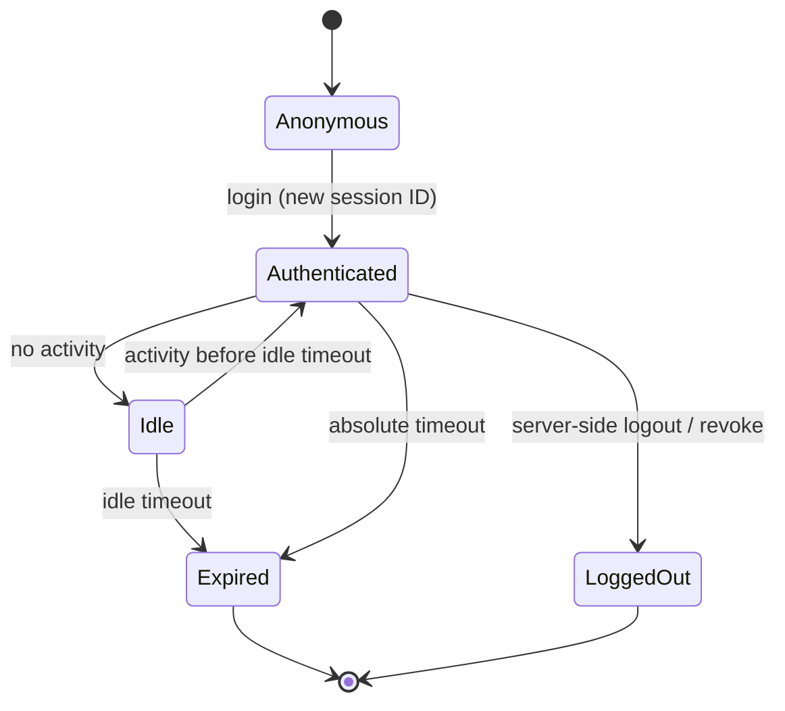

# Session Management

## Overview

Authentication happens once, but the user stays logged in for minutes or hours afterward. That logged-in state is a **session**, and it is represented by a token (a session ID in a cookie, a bearer token, a Kerberos ticket). Here is the key insight: after login, the application stops checking your password and starts trusting the token. So whoever holds a valid token *is* the user, as far as the system is concerned. Session management is the discipline of issuing that token safely, protecting it in transit and at rest, expiring it, and destroying it on logout — because a stolen or never-expiring token is a login without a password.

The exam treats session management as the bridge between authentication (proving identity once) and ongoing authorization (every subsequent request riding on the session).

## Key Concepts

### The session lifecycle

A session is **created** at successful authentication, **maintained** across requests by presenting the token, and **terminated** by logout, timeout, or revocation. The token must be unpredictable (high entropy, random), bound to the user, and invalidated decisively at the end — leaving valid tokens lying around is the root of most session attacks.

### Timeouts

| Timeout type | What it does |
|--------------|--------------|
| **Idle (inactivity) timeout** | Ends the session after a period of no activity (e.g., 15 min) — protects unattended workstations |
| **Absolute (session) timeout** | Ends the session after a fixed maximum lifetime regardless of activity (e.g., 8 h) — limits how long a stolen token stays useful |

Both matter: idle timeout handles the walk-away threat; absolute timeout caps total exposure even for an active session. A screen-saver lock with re-authentication is the workstation-level equivalent of an idle timeout.

### Protecting session tokens (cookies)

- **`Secure` flag** — cookie only sent over HTTPS, so it is not exposed on plaintext HTTP.
- **`HttpOnly` flag** — cookie not readable by JavaScript, blunting theft via cross-site scripting.
- **`SameSite` attribute** — limits cross-site sending, mitigating cross-site request forgery (CSRF).
- **Regenerate the session ID at login** — issue a *new* ID after authentication so any pre-set ID is discarded (defeats session fixation).
- **Transmit only over TLS** — so the token cannot be sniffed.

### Logout and termination

A real logout must invalidate the token **server-side**, not merely delete it from the browser. If the server still honours the old token, "logging out" did nothing. Sessions should also be terminable centrally (revoke on compromise, on password change, on deprovisioning).

### Concurrent sessions and re-authentication

Limiting or visibly listing concurrent sessions helps detect hijack. Sensitive actions (changing a password, a wire transfer) should force **step-up re-authentication** even within a valid session, so a hijacked session cannot perform the most damaging operations unchallenged.

## Common traps / easily confused

- **Idle vs. absolute timeout:** idle resets on activity; absolute does not. "Logs out after 30 minutes of inactivity" = idle; "must log in again every 12 hours no matter what" = absolute.
- **Session fixation vs. session hijacking:** fixation plants a known session ID on the victim *before* login (defeated by regenerating the ID at login); hijacking steals a valid token *after* login (defeated by `HttpOnly`, TLS, short timeouts).
- **`HttpOnly` stops XSS-based cookie theft; `SameSite`/CSRF tokens stop CSRF.** Don't swap them: HttpOnly = JS can't read it; SameSite = browser won't send it cross-site.
- **Client-side logout is not termination** — the token must be killed server-side.
- A session token is a **bearer credential**: possession alone grants access, which is exactly why it must be protected like a password.

## Exam Tips

- "Unattended workstation gets accessed" → **idle/inactivity timeout** and **screen lock with re-authentication**.
- Prevent stolen cookies from being read by injected script → **HttpOnly**; from being sent over HTTP → **Secure**; from CSRF → **SameSite / anti-CSRF tokens**.
- Defeat **session fixation** by **regenerating the session ID after authentication**.
- After login, the **token**, not the password, is what is trusted — protect and expire it accordingly.
- True logout invalidates the session **on the server**.

## Diagrams

### Session lifecycle
A session moves from anonymous to authenticated, can lapse into idle, and ends via timeout or server-side logout.

## Related Topics

- [Authentication Methods](Authentication%20Methods.md) - the login that creates the session
- [Access Control Attacks](Access%20Control%20Attacks.md) - session hijacking, fixation, replay
- [Authorization and Accountability](Authorization%20and%20Accountability.md) - every request rides the session
- [Identity Federation and SSO](Identity%20Federation%20and%20SSO.md) - federated sessions and tokens
