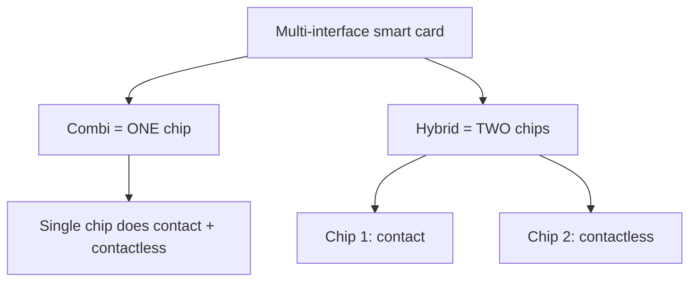

# Smart Card Types

## Overview

Smart cards with multiple interface technologies come in two distinct configurations. CISSP tests the precise distinction — the two terms are easily reversed and the test deliberately offers swapped options to catch this.

## The Two Configurations

### Combi Card
- **ONE chip with dual interface**
- Single chip that can operate as both contact (insert into reader) AND contactless (RF/NFC)
- The single chip handles both modes
- **Trigger phrase:** "one chip, contact and contactless"

### Hybrid Card
- **TWO separate chips**
- One chip for contact interface, one chip for contactless interface
- Each chip handles its own mode independently
- **Trigger phrase:** "two chips, one contact + one contactless"

## CISSP Trigger Mapping

| Question phrase | Answer |
|---|---|
| "ONE chip, dual interface (contact AND contactless)" | **Combi** |
| "TWO chips, separate contact + contactless" | **Hybrid** |

## The Reversed-Pair Trap

The exam writes a "definition" answer that swaps the two labels, hoping you grab the familiar word without checking which chip count it's glued to. The correct pairing is the one at the top of this note:

- **Combi** = **ONE** chip, dual interface (contact AND contactless on the same chip).
- **Hybrid** = **TWO** chips (one contact, one contactless), each working independently.

So an option reading "combi has two chips, hybrid has one chip" is **reversed and wrong**. The right statement is "**combi has one chip, hybrid has two chips**."

**Memory hook:**
- **Combi** = "combination" — two technologies *combined into one chip* → **ONE chip**.
- **Hybrid** = two distinct parts bolted together → **TWO chips**.

## Other Card Types for Context

- **Contact card** = requires physical insertion into reader
- **Contactless card** = uses RF/NFC, no physical contact
- **Magnetic stripe** = legacy, data on magnetic stripe (not really a "smart" card)
- **Memory card** = stores data but no processing capability
- **Microprocessor card** = has a CPU on the chip (true smart card)

## Exam Tips

- When you see "combi" and "hybrid" in the same question, watch for the reversed-label trap
- **Combi = one chip, dual interface; Hybrid = two chips** — lock this pairing
- The question tests precise definitions, not reasoning, so memorize the pair cold

## Diagrams

### Combi vs. Hybrid chip count
The load-bearing distinction: Combi = one dual-interface chip; Hybrid = two separate single-interface chips.

## Related Topics

- [Authentication Methods](Authentication%20Methods.md)
- [Identity Management](Identity%20Management.md)
- [CRAM-SHEET](../../practice/sheets/CRAM-SHEET.md)
