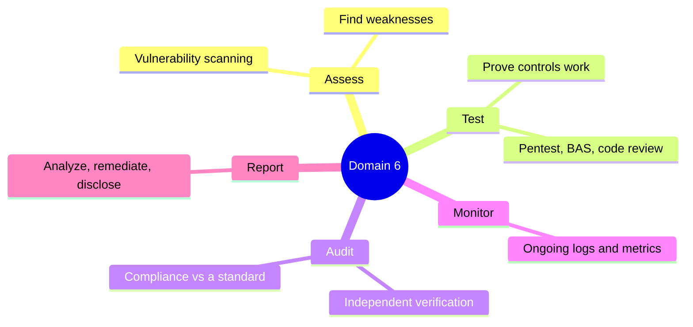

# Domain 6 - Security Assessment and Testing (12%)

This domain is about how you *check your own work*. Every other domain builds controls; Domain 6 asks whether those controls actually exist, function, and keep working over time. The core verbs are assess (find weaknesses), test (prove controls work), audit (independently verify compliance), and monitor (watch continuously). Exam questions here lean heavily on telling apart look-alike activities — scan vs. pentest, assessment vs. audit, internal vs. external.

---

## Topics Checklist

- [ ] [Assessment and Test Strategies](Assessment%20and%20Test%20Strategies.md)
- [ ] [Security Control Testing](Security%20Control%20Testing.md)
- [ ] [Vulnerability Assessment](Vulnerability%20Assessment.md)
- [ ] [Penetration Testing](Penetration%20Testing.md)
- [ ] [Software Testing Methods](Software%20Testing%20Methods.md)
- [ ] [Log Management and Monitoring](Log%20Management%20and%20Monitoring.md)
- [ ] [Collecting Security Process Data](Collecting%20Security%20Process%20Data.md)
- [ ] [Analyzing and Reporting Test Results](Analyzing%20and%20Reporting%20Test%20Results.md)
- [ ] [Security Auditing](Security%20Auditing.md)

---

## Domain Summary

This domain focuses on:

- **Strategy** - designing and validating risk-driven assessment/test/audit programs
- **Assessment** - identifying weaknesses (vulnerability scanning)
- **Testing** - validating controls work (pentest, code review, BAS, synthetic transactions)
- **Auditing** - independent verification of compliance
- **Monitoring** - ongoing observation through logs and metrics
- **Process data** - account reviews, KPIs/KRIs, backup verification, training, DR/BC
- **Reporting** - analyzing output, remediation, exceptions, ethical disclosure

---

## Key Relationships

- Testing validates controls from all other domains
- Audit requirements from [Compliance and Legal Issues](../01-security-and-risk-management/Compliance%20and%20Legal%20Issues.md) (Domain 1)
- Vulnerability findings feed [Risk Management](../01-security-and-risk-management/Risk%20Management.md) (Domain 1)
- Log monitoring ties to [Domain 7 - Security Operations](../07-security-operations/00%20Domain%207%20-%20Security%20Operations.md)
- Software testing ties to [Domain 8 - Software Development Security](../08-software-development-security/00%20Domain%208%20-%20Software%20Development%20Security.md)

---

## Diagrams

### The verbs of Domain 6

How you check your own work — and the easily-confused activities the exam separates.

---
