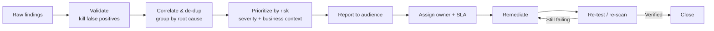
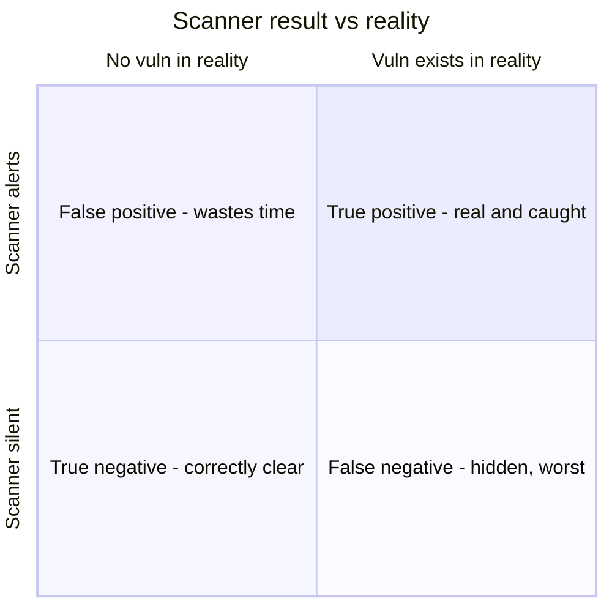

# Analyzing and Reporting Test Results

## Overview

A scan, pentest, or audit produces raw output — hundreds of findings, logs, and observations. That output is worthless until someone analyzes it, prioritizes it, and reports it to people who can act. This objective is about the *back end* of testing: making sense of results and driving them to closure. The intuition that ties it together is **audience**: a report for a system administrator, a report for the CISO, and a report for the board are three different documents built from the same findings. The single most common failure mode — and a frequent exam answer — is a technically excellent test whose report is too dense, too late, or aimed at the wrong reader to actually change anything.

A useful frame: the goal is not the report, it's the **remediation**. Analysis exists to rank what matters; reporting exists to get the right fix to the right owner; and the loop only closes when findings are fixed and re-tested. Everything else — formatting, severity scores, executive summaries — serves that loop.

## Key Concepts

### Analyzing the output

Raw findings have to be refined before they mean anything.

- **Validate first — kill the false positives.** A scanner flags things that aren't real. Confirming findings (manually or with a second method) before reporting protects credibility; a report full of false positives gets ignored. The mirror risk is the **false negative** — a real issue the test missed — which is the more dangerous of the two because it hides.
- **Correlate and de-duplicate.** The same root cause (one missing patch, one bad baseline) often appears as many findings across many hosts. Group by root cause so remediation targets the source, not the symptoms.
- **Prioritize by risk, not raw score.** Severity (e.g., CVSS) is the starting point, but **business context** decides true priority: an internet-facing crown-jewel system outranks a high-CVSS bug on an isolated lab box. Likelihood × impact, tempered by exposure and compensating controls, gives the real ranking.
- **Identify root cause and trends.** Good analysis names *why* (unpatched software, weak change control, missing input validation) and whether findings are getting better or worse over time — that is what management can actually steer.

### Writing the report (audience-driven)

The same findings get packaged differently by reader. A strong report layers them.

| Layer | Audience | Contains |
|-------|----------|----------|
| **Executive summary** | Leadership / board | Risk in business terms, overall posture, key decisions needed — no jargon |
| **Findings / risk detail** | Security & risk managers | Each finding with severity, risk rating, business impact, recommendation |
| **Technical detail / appendix** | Engineers, admins | Evidence, reproduction steps, affected assets, exact remediation |

Good reports share traits: findings are **prioritized** (most important first), each is **actionable** (a clear recommended fix and owner), they are **evidence-backed** (so findings can be reproduced and trusted), and they are **timely** (a brilliant report delivered after the system is breached is useless). Reports are sensitive documents — they are effectively a map of your weaknesses — so they are classified, access-controlled, and transmitted securely.

### Remediation and tracking

The report hands off to a fix-and-verify loop.

1. **Assign an owner and a due date** per finding, weighted by priority.
2. **Remediate** — patch, reconfigure, redesign, or apply a compensating control.
3. **Re-test / re-scan to verify** the fix actually worked and didn't break something else. *Unverified remediation is not remediation* — closing a finding without re-testing is a common wrong practice.
4. **Track to closure** in a register so open findings don't quietly age. Aging open items are themselves a KRI (see [Collecting Security Process Data](Collecting%20Security%20Process%20Data.md)).

### Remediation SLAs by severity

Mature programs don't fix everything at once or on a vague "soon" — they bind a **remediation deadline (SLA) to the risk rating**, so the worst issues get forced attention while low-risk ones don't consume scarce effort. The exact windows are organizational policy, but the *pattern* is what the exam rewards: higher risk → shorter allowed time to fix.

| Severity (illustrative) | Typical remediation window |
|-------------------------|----------------------------|
| Critical | Immediately / days |
| High | Weeks |
| Medium | Months |
| Low | Next cycle / risk-accept |

The point is the principle, not the numbers: remediation is **prioritized and time-bound by risk**, and anything that can't meet its window goes through the exception process below.

### Exception handling and risk acceptance

Not every finding gets fixed. When remediation is impractical, too costly, or would break the business, the organization handles it as a formal **exception**:

- A documented request explains *why* the fix won't happen now and what **compensating controls** reduce the exposure in the meantime.
- An accountable **risk owner (senior management) formally accepts the residual risk** — exceptions are a management decision, not an engineer's call, and they must be approved and signed.
- Exceptions are **time-bounded and reviewed** (with an expiry/re-evaluation date), not permanent. An open-ended exception is a governance failure.

This connects straight to Domain 1's risk treatment: an exception is documented, approved, time-limited **risk acceptance**, and it must be visible to leadership, never buried by the technical team.

### Ethical disclosure

How you reveal a vulnerability — especially one you found in someone else's product — is itself governed by ethics, and (ISC)² holds members to its Code of Ethics.

- **Coordinated / responsible disclosure** — report the flaw *privately to the vendor first*, give reasonable time to patch, then disclose publicly. This is the expected, ethical default and protects users.
- **Full disclosure** — publish details immediately and publicly; pressures vendors to act fast but exposes users while no fix exists.
- **Non-disclosure** — keep it secret; risky because others may already know or rediscover it, leaving users defenseless.

Internally, disclosure ethics also mean reporting findings **honestly and completely** even when results are embarrassing — you do not hide or soften findings to protect a team or hit a deadline. Suppressing a known vulnerability violates professional ethics and the public-safety priority of the (ISC)² code.

## Common traps / easily-confused

- **False positive vs. false negative:** a false positive wastes time but is visible; a false negative is undetected and therefore more dangerous. Validate to remove false positives before reporting.
- **Severity vs. priority:** CVSS/severity is a starting score; true priority adds **business context and exposure**. The highest-CVSS finding is not automatically the top priority.
- **Report ≠ done:** the deliverable is **remediation verified by re-testing**, not the document. Closing findings without re-test is wrong.
- **Exception = approved, documented, time-bounded risk acceptance** by a **senior risk owner** — not an indefinite engineering shortcut, and never a silent one.
- **Responsible vs. full disclosure:** responsible/coordinated (vendor first, then public) is the ethical default; full disclosure exposes users while unpatched. Don't pick "publish immediately" as the ethical choice.
- **Audience mismatch:** executives need business-risk language, not raw scanner output. A report that doesn't fit its reader is a frequent root cause of inaction.

## Exam Tips

- **Validate findings (remove false positives) before reporting** — credibility is everything.
- **Prioritize by risk = severity + business context**, not by raw CVSS alone.
- The loop closes only when findings are **remediated and re-tested/re-scanned**.
- **Exceptions require senior-management sign-off, compensating controls, and an expiry date.** Risk acceptance is a leadership decision.
- **Coordinated/responsible disclosure** (notify the vendor, allow time, then publish) is the ethical default; report internal findings honestly even when unflattering.
- Tailor the report to its **audience** — executive summary for leadership, technical detail for engineers.

## Diagrams

### From raw findings to closure

The loop closes only when a fix is re-tested, not when the report ships.

### False positive vs. false negative

The confusion matrix; the silent false negative is the dangerous corner.

## Related Topics

- [Collecting Security Process Data](Collecting%20Security%20Process%20Data.md) - metrics, management review, open-finding tracking
- [Security Control Testing](Security%20Control%20Testing.md) - the tests that produce this output
- [Assessment and Test Strategies](Assessment%20and%20Test%20Strategies.md) - reporting paths defined up front
- [Risk Management](../01-security-and-risk-management/Risk%20Management.md) - risk acceptance and treatment of exceptions
- [Security Governance](../01-security-and-risk-management/Security%20Governance.md) - ethics, accountability, leadership oversight
