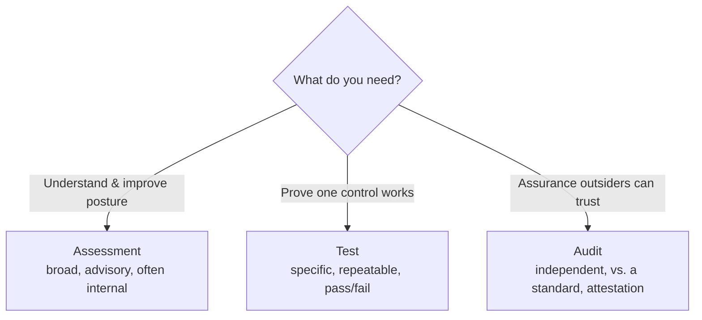
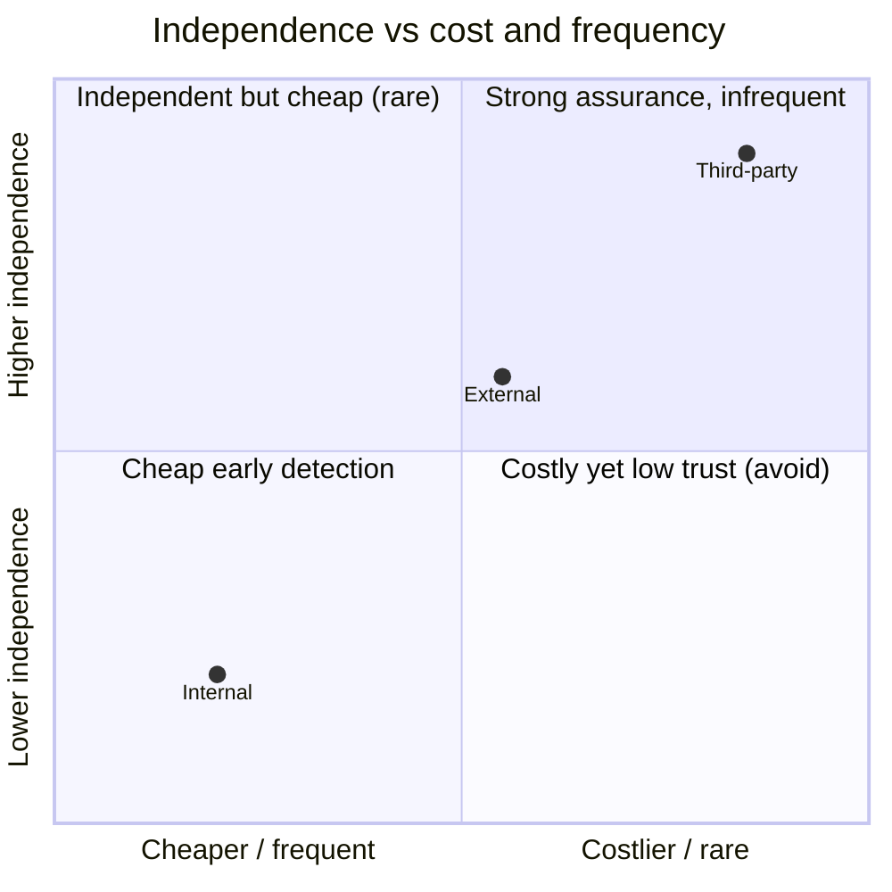

# Assessment and Test Strategies

## Overview

Before you run a single scan or hire a single pentester, someone has to decide *what* gets tested, *how often*, *by whom*, and *against which standard* — and then prove that program actually works. That planning layer is what the exam means by designing and validating assessment, test, and audit strategies. The intuition: testing is not a one-off event you do because a regulation forced you to; it is a deliberate, risk-driven program. The highest-value assets and highest-risk systems get tested most rigorously and most often, low-risk ones less so. A strategy that tests everything equally is wasting effort; one that tests only what is convenient is leaving the dangerous gaps untouched.

Three words get used loosely and the exam wants you to keep them apart. An **assessment** is a broad, often advisory review of how secure something is — it can include testing, interviews, and document review, and its goal is to *understand and improve*. A **test** is a specific, repeatable procedure that exercises a control to see whether it works — pass or fail. An **audit** is a formal, *independent* evaluation against a defined standard that produces an attestation others can rely on. Assess to learn, test to prove a control works, audit to give outsiders trustworthy assurance.

## Key Concepts

### Designing the strategy (the planning side)

A test or assessment program is built top-down from risk and obligations, not bottom-up from whatever tools you happen to own.

- **Start from drivers.** What forces testing here? Regulation (PCI DSS quarterly scans, HIPAA, SOX), contractual commitments, internal policy, and your own risk assessment. These set the floor.
- **Scope by risk and asset value.** Map systems to the data they handle and the risk they carry. Crown-jewel systems get deep, frequent testing; commodity systems get lighter coverage. This is where the asset inventory and data classification from Domain 2 feed straight in.
- **Pick the right method per target.** Match the technique to the question being asked — a vulnerability scan for broad coverage of known flaws, a pentest to prove exploitability, code review for custom software, a configuration/compliance check for hardening baselines. (See [Security Control Testing](Security%20Control%20Testing.md) for the full menu.)
- **Set frequency and triggers.** Some testing is calendar-driven (annual pentest, quarterly scan); some is event-driven (after a major change, a new deployment, or a significant incident). A good strategy names both.
- **Define who performs it** and at what level of independence — internal staff, an engaged external firm, or a fully independent third party (see below).
- **Define success criteria and reporting paths up front** so results are comparable over time and reach people who can act.

### Validating the strategy (the part candidates forget)

Designing the program is only half of objective 6.1 — you also have to **validate** it, meaning prove the program itself is adequate and actually doing its job. A test program can look busy and still be blind. Validation asks:

- Is **coverage** complete? Are there assets, environments (dev/test, cloud, OT), or attack surfaces nobody is testing? (See test coverage analysis in [Security Control Testing](Security%20Control%20Testing.md).)
- Are the **methods appropriate and current** — are scanners signature-up-to-date, are testers competent, are we testing the way real attackers operate?
- Do findings actually get **remediated and re-verified**, or do they pile up unread?
- Is the program **independent enough** for the assurance it claims to provide?

Validation is often done by having an independent party review or re-perform a sample of the testing, or by benchmarking the program against a framework. The recurring exam idea: *a control — including the testing control — is only trustworthy once it has been independently checked.*

### Internal, external, and third-party strategies

Who runs the assessment changes how much outsiders can trust the result. Independence increases as you move down this list.

| Strategy | Who performs it | Independence | Typical use |
|----------|-----------------|--------------|-------------|
| **Internal** | The organization's own staff/audit team | Lowest — they report to management | Self-assessment, finding issues early, preparing for an external review |
| **External** | An outside firm the organization engages and pays | Higher — outsiders, but hired by the client | Compliance testing, certification prep, expert pentests |
| **Third-party** | An independent auditor engaged by a regulator, customer, or under an attestation standard | Highest — fully independent of the audited org | SOC attestations, certifications outsiders rely on |

Key relationships to hold onto:

- **Internal testing does not replace external/third-party assurance.** You can find your own problems, but you cannot certify yourself to a customer. Internal work *prepares* you; independent work *attests*.
- **More independence costs more and runs less often**, which is exactly why a layered strategy mixes them: frequent cheap internal testing, periodic expensive independent testing.
- A mature program also **tests its suppliers** — you inherit their weaknesses, so vendor assessments (often via SOC reports) are part of your strategy, not separate from it.

### Standards and frameworks that shape strategies

A strategy is usually anchored to an external standard so results are comparable and defensible: **ISO/IEC 27001** (auditable ISMS), **NIST SP 800-53A** (procedures for assessing 800-53 controls), **NIST SP 800-115** (technical guide to security testing), **PCI DSS** (prescriptive scan/pentest cadence), and **COBIT** (governance/audit). You do not need to memorize their contents for strategy questions — recognize that a defensible program maps its testing to a recognized framework rather than inventing its own yardstick.

## Common traps / easily-confused

- **Assess vs. test vs. audit:** assessment = broad advisory review to improve; test = specific repeatable procedure to prove a control works; audit = independent evaluation against a standard producing an attestation. Stem stresses independence/compliance/certification → audit. Stem stresses understanding/improving posture → assessment.
- **Design vs. validate:** designing the strategy is choosing scope, methods, frequency, and owners. Validating it is proving the program itself has adequate coverage and that findings get fixed. Objective 6.1 explicitly wants both — if a question asks how you know your *testing program* is sufficient, the answer is independent validation, not "we run more scans."
- **Risk-based ≠ test everything:** a correct strategy concentrates effort on high-value, high-risk assets. "Test all systems identically and continuously" is the distractor that sounds thorough but is poor resource use.
- **Internal first, external for assurance:** internal assessment is great for early detection and cheaper cadence, but only an independent external/third-party engagement gives assurance outsiders will accept.

## Exam Tips

- Testing should be **risk-driven and continuous**, not a once-a-year compliance ritual.
- The program must be **both designed and validated** — independent review of the test program is how you validate it.
- Independence ranking for assurance: **internal < external < third-party**. For results outsiders must trust, pick the most independent option the scenario allows.
- Event triggers (major change, new system, post-incident) belong in the strategy alongside calendar cadence.
- Anchor strategies to a recognized framework (ISO 27001, NIST 800-53A/800-115, PCI DSS) so testing is comparable and defensible.

## Diagrams

### Assess vs. test vs. audit

Pick the activity by the question you need answered.

### Who runs it — independence vs. cost

More independence buys more trust but costs more and runs less often.

## Related Topics

- [Security Control Testing](Security%20Control%20Testing.md) - the menu of techniques a strategy selects from
- [Security Auditing](Security%20Auditing.md) - audit independence, SOC reports, audit lifecycle
- [Collecting Security Process Data](Collecting%20Security%20Process%20Data.md) - the operational data a strategy reviews
- [Analyzing and Reporting Test Results](Analyzing%20and%20Reporting%20Test%20Results.md) - turning test output into action
- [Risk Management](../01-security-and-risk-management/Risk%20Management.md) - risk assessment drives test scope and priority
