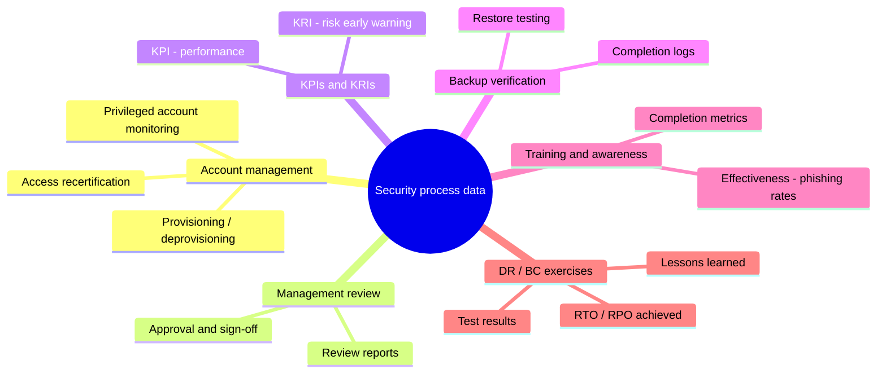

# Collecting Security Process Data

## Overview

Testing tells you whether a control *works*; collecting security process data tells you whether your security *program* is being run properly day to day. This is the quiet, unglamorous half of Domain 6, and it is heavily tested precisely because candidates skip it. The intuition: a security program is a set of recurring operational processes — provisioning accounts, reviewing them, backing up data, training people, exercising the DR plan — and each of those processes throws off data that proves it is actually happening. Management's job is to *collect and review* that data so the program stays healthy, gaps get caught, and there is evidence to show an auditor.

The recurring exam theme is **management review and approval**: it is not enough for a process to run automatically — a responsible human has to look at the output and sign off. An account-review report nobody reads, or a backup that completes but is never verified, provides almost no assurance. Collecting the data is step one; reviewing and acting on it is what actually counts.

## Key Concepts

### Account management

Identity is provisioned, changed, and removed constantly, and that lifecycle is where access quietly drifts out of control. The data you collect here proves accounts match reality.

- **Provisioning and deprovisioning records** — every account create/modify/disable should be traceable to an authorized request. The high-risk event is the **leaver**: an account that should have been disabled but wasn't.
- **Access reviews / recertification** — periodically, managers and data owners re-confirm that each user still needs the access they have. This catches **privilege creep** (access accumulating as people change roles) and orphaned accounts. Reviews must be *approved* and the results retained.
- **Privileged account monitoring** — admin accounts get extra scrutiny: who has them, are they used, are they still warranted.
- **Anomalies to surface** — dormant/inactive accounts, shared accounts, accounts with no owner, separation-of-duties violations.

The exam point: account management data exists to keep access aligned to need (least privilege), and the recurring weak spot is timely deprovisioning of departed users.

### Management review and approval

This is the connective tissue across every item in this note. **Management review** is the formal, documented step where leadership examines security process output — review reports, metrics, audit findings, exception requests — and makes decisions. In ISMS terms (ISO 27001) this is the **management review** that keeps the program aligned and resourced. The "**and approval**" matters: results and exceptions require sign-off from someone accountable, which both creates an audit trail and forces ownership of risk. If a question describes a process that runs but whose output nobody reviews or approves, the gap *is* the missing management review.

### Key performance and key risk indicators (KPIs and KRIs)

Metrics turn raw process data into something leadership can steer by. The exam wants the distinction clean:

| | KPI | KRI |
|--|-----|-----|
| Measures | How well a process is **performing** | How much **risk exposure** is changing |
| Looks | Backward / present — are we hitting targets? | Forward — is risk rising toward a threshold? |
| Examples | % systems patched on time, mean time to detect/respond, % staff trained | number of unpatched critical vulns, count of failed logins, % overdue access reviews |

- A **KPI** is a *performance* gauge ("are we doing the job well?"). A **KRI** is an early-warning *risk* gauge ("is danger increasing?"). The same underlying number can feed both, but the framing differs.
- Good indicators are tied to objectives, measurable, and have defined thresholds that trigger action. A metric nobody acts on is vanity.

### Backup verification

Backups are a control like any other, and the only proof they work is **restoring from them**. Collecting backup process data means confirming not just that jobs completed but that the data is actually recoverable.

- **Successful-completion logs** show the job ran — necessary but not sufficient.
- **Restore/recovery testing** is the real verification: periodically restore data and confirm integrity. An untested backup is an assumption, not a control.
- Verify backups meet the **RPO** (how much data loss is tolerable) and that restores fit within the **RTO** (how fast you must be back) — these targets come from the BIA in Domain 1/7.
- Watch for off-site/immutable copies (ransomware resilience) and retention matching policy.

Exam cue: "how do you know your backups work?" → *test a restore.* Completion status alone is a distractor.

### Training and security awareness

People are a control, and you collect data to prove the human layer is being maintained and is effective.

- **Completion metrics** — who has finished required awareness training, who is overdue.
- **Effectiveness measures** — these matter more than completion. Phishing-simulation click rates, incident-reporting rates, and assessment scores show whether behavior actually changed. Falling click rates over time is the signal you want.
- **Role-based depth** — developers, admins, and executives need targeted training beyond the baseline; tracking shows whether the right people got the right content.

The distinction the exam likes: *completion* proves attendance; *effectiveness* (phishing results, reporting behavior) proves the training worked.

### Disaster recovery (DR) and business continuity (BC) data

Exercising the DR/BC plan generates data that proves the organization can actually survive a disruption — and reveals where it can't.

- **Test/exercise results** — outcomes of checklist, tabletop/structured walk-through, simulation, parallel, and full-interruption tests (depth increases across that order; full-interruption is the most rigorous and most disruptive).
- **Achieved vs. target metrics** — did the actual recovery meet **RTO/RPO**? A plan that recovers in 8 hours against a 4-hour RTO has a documented gap to fix.
- **Lessons learned / after-action items** — every exercise should feed corrective actions back into the plan, and tracking closure of those items is itself process data.

This data closes the loop with Domain 7's BCP/DRP: you don't just *have* a plan, you collect evidence that exercising it produces acceptable results, and you update the plan when it doesn't.

## Common traps / easily-confused

- **KPI vs. KRI:** KPI = performance ("doing it well?"), backward/present-looking. KRI = risk ("is exposure rising?"), forward-looking early warning. Don't swap them.
- **Backup completed vs. backup verified:** a successful job log is not verification. Only a successful **restore test** proves recoverability.
- **Training completion vs. effectiveness:** 100% completion says people attended; phishing-click-rate and reporting trends say whether it changed behavior. Effectiveness is the stronger metric.
- **Collecting data vs. reviewing it:** generating reports is worthless without **management review and approval**. The missing-sign-off gap is a common right answer.
- **Account review timing:** the dangerous failure is the un-deprovisioned leaver; recurring access recertification is the control that catches it, not the initial provisioning approval.

## Exam Tips

- **Management review and approval** is the thread through all of these — a process whose output nobody reviews provides little assurance.
- **The only valid backup verification is a restore test**; completion status is a trap.
- **KPI = performance, KRI = risk/early-warning.** Memorize the one-word split.
- For training, **effectiveness metrics (phishing rates, reporting) beat completion metrics.**
- DR/BC data is judged against **RTO/RPO** targets and must feed lessons-learned back into the plan.
- Account-management data exists to enforce least privilege; **timely deprovisioning** of leavers is the classic weak point.

## Diagrams

### What process data you collect

The categories of operational evidence that prove the security program is actually running.

## Related Topics

- [Analyzing and Reporting Test Results](Analyzing%20and%20Reporting%20Test%20Results.md) - turning collected data into reports and action
- [Assessment and Test Strategies](Assessment%20and%20Test%20Strategies.md) - the program these processes feed
- [Authorization and Accountability](../05-identity-and-access-management/Authorization%20and%20Accountability.md) - account lifecycle and access reviews
- [Risk Management](../01-security-and-risk-management/Risk%20Management.md) - KRIs and risk thresholds
- [Domain 7 - Security Operations](../07-security-operations/00%20Domain%207%20-%20Security%20Operations.md) - backups, DR/BC exercises, awareness operations
