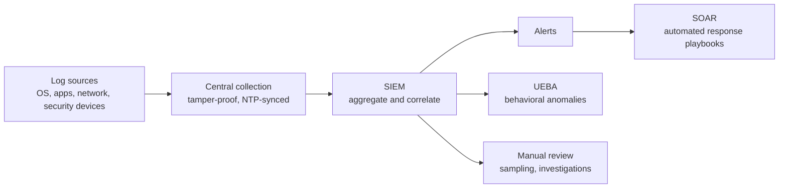

# Log Management and Monitoring

## Overview

Logs are the record of what happened on your systems, and monitoring is the act of actually looking at that record. The two have to go together: a log nobody reviews catches nothing, and an alert with no underlying log can't be investigated. Done well, logging plus monitoring gives you detection (spotting an attack in progress), accountability (tying actions to a person), and evidence (proving what occurred after the fact). The hard part on the exam is rarely *what* a log is — it's the supporting practices that make logs trustworthy: central collection, tamper protection, and synchronized time.

## Key Concepts

### Log Sources
- Operating system logs (Windows Event Log, syslog)
- Application logs
- Security device logs (firewall, IDS/IPS, WAF)
- Authentication logs
- Network logs (flow data, DNS queries)
- Cloud service logs (CloudTrail, audit logs)

### SIEM (Security Information and Event Management)
- Aggregates logs from multiple sources
- Correlates events to detect patterns
- Real-time alerting on suspicious activity
- Dashboards and reporting
- Long-term log retention for compliance
- Examples: Splunk, Microsoft Sentinel, IBM QRadar

### Key Metrics and KPIs
- **MTTD** (Mean Time to Detect) - how quickly threats are identified
- **MTTR** (Mean Time to Respond) - how quickly incidents are resolved
- **Coverage** - percentage of assets being monitored
- **False Positive Rate** - alerts that aren't real incidents

### Log Protection
- Logs must be protected from tampering (integrity)
- Write-once storage or centralized logging
- Access to logs should be restricted
- Retention must meet legal/regulatory requirements
- Time synchronization (NTP) across all systems is critical

### Log Types — know what each records
- **Security/audit logs** - authentications, authorization decisions, privilege use, policy changes (the accountability record).
- **System logs** - OS events, service starts/stops, hardware errors.
- **Application logs** - what the app did: transactions, errors, business events.
- **Network/flow logs** - connection metadata (who talked to whom, when, how much). **NetFlow** captures metadata only — cheap, scalable, no payload; **full packet capture** records the actual content — heavy storage but full forensic detail. Match the trade-off: "metadata of all connections" → flow; "reconstruct the exact data sent" → full packet capture.

### Egress / Data Exfiltration Monitoring
Monitoring instinctively watches *inbound* traffic, but detecting a breach in progress usually means watching what *leaves*. **Egress monitoring** inspects outbound traffic for sensitive data leaving the network — large transfers, connections to known-bad hosts, DNS tunneling, traffic to unusual destinations. It overlaps with **DLP** (data loss prevention), which inspects content against classification rules. Exam cue: "detect data being stolen / leaving" → egress monitoring / DLP, not inbound firewall rules.

### Beyond the SIEM — SOAR and UEBA
- **SOAR (Security Orchestration, Automation, and Response)** sits on top of the SIEM and automates the *response*: playbooks/runbooks that triage and act on alerts (e.g., auto-isolate a host, open a ticket). SIEM detects and alerts; SOAR orchestrates and responds. Don't conflate them.
- **UEBA (User and Entity Behavior Analytics)** baselines normal behavior for users and devices, then flags *anomalies* (impossible travel, a user suddenly accessing unusual data). Strong against insider threats and compromised accounts that static signature rules miss.

### Reviewing logs — manual and automated
Volume makes manual review of raw logs impractical at scale, which is why correlation engines exist — but targeted **manual log review** still matters for investigations and for sampling high-value systems. Data-reduction techniques (clipping levels, sampling — see [Security Auditing](Security%20Auditing.md)) keep review feasible. The recurring exam idea: collection is cheap, *review and correlation* are where the value (and the gaps) lie.

### Continuous Monitoring
- Ongoing awareness of security posture
- Automated scanning and assessment, real-time threat detection, compliance dashboards
- **Continuous monitoring** is the formal program of maintaining ongoing awareness of security posture to support risk decisions — **NIST SP 800-137** is the reference. It is the engine behind ongoing/continuous authorization, as opposed to a point-in-time assessment that is stale the moment it finishes.

## Exam Tips

- Logs are useless if not **reviewed** - automated correlation (SIEM) is essential
- **Time synchronization** (NTP) is critical for correlating events across systems
- Logs should be sent to a **centralized, separate system** to prevent tampering
- SIEM provides correlation that individual log sources cannot
- **SIEM detects/alerts; SOAR automates the response** — keep them distinct
- **Egress monitoring/DLP** detects data leaving; UEBA detects behavioral anomalies/insiders
- Log retention requirements vary by regulation; continuous monitoring follows **NIST SP 800-137**

## Diagrams

### From raw logs to response

Collection is cheap; the value (and the gaps) live in correlation and review.

## Related Topics

- [Security Auditing](Security%20Auditing.md) - logs support audit activities
- [Domain 7 - Security Operations](../07-security-operations/00%20Domain%207%20-%20Security%20Operations.md) - operational monitoring
- [Authorization and Accountability](../05-identity-and-access-management/Authorization%20and%20Accountability.md) - logs enable accountability
- [Incident Response](../07-security-operations/Incident%20Response.md) - logs are key evidence
