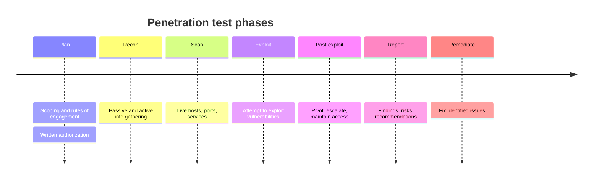

# Penetration Testing

## Overview

A penetration test hires an attacker to attack you on purpose. The point isn't to produce a list of weaknesses (a vulnerability scan does that) — it's to *prove* whether those weaknesses can actually be chained into real damage: a foothold, privilege escalation, access to data that matters. Because a pentest deliberately exploits live systems, the single most important thing surrounding it is authorization. Without written permission defining scope and rules, the same actions are simply a crime.

## Key Concepts

### Penetration Testing Types
| Type | Knowledge | Simulates |
|------|-----------|-----------|
| **Black Box** | No prior knowledge | External attacker |
| **White Box** | Full knowledge (source code, architecture) | Insider or comprehensive review |
| **Gray Box** | Partial knowledge | Attacker with some inside info |

### Blind vs. Double-Blind
- **Blind test** - the tester has limited information, but the *target/defenders are informed* a test is coming.
- **Double-blind test** - the tester has limited information *and* the defenders are *not* warned. This also tests detection and response (the blue team / SOC), not just the vulnerabilities.

### Internal vs. External Perspective
Separate from knowledge level (box color), this is *where the tester sits*:
- **External** - launched from outside the perimeter; simulates an internet-based attacker.
- **Internal** - launched from inside the network; simulates a malicious insider or an already-compromised host.

### Banner Grabbing / Fingerprinting
Reading service banners and responses to identify the OS, software, and *version* running on a host — so the tester can look up which known vulnerabilities apply.

### Penetration Testing Phases
1. **Planning/Scoping** - define rules of engagement, get authorization
2. **Reconnaissance/Discovery** - gather information (passive and active)
3. **Scanning/Enumeration** - identify live hosts, open ports, services
4. **Exploitation** - attempt to exploit vulnerabilities
5. **Post-Exploitation** - pivot, escalate privileges, maintain access
6. **Reporting** - document findings, risks, and recommendations
7. **Remediation** - fix identified issues

### Rules of Engagement
- Written authorization (get-out-of-jail-free letter)
- Scope (what systems, what methods)
- Timing (when testing occurs)
- Restrictions (what's off-limits)
- Communication plan (who to contact if issues arise)
- Data handling (how to treat discovered sensitive data)

### What gets pentested (target types)
A "penetration test" isn't only network exploitation — scope the stem to the right target:
- **Network** - external perimeter or internal segment exploitation.
- **Web application** - app-layer flaws (injection, auth bypass, OWASP Top 10) beyond what a scanner finds.
- **Wireless** - rogue APs, weak encryption, evil-twin attacks.
- **Social engineering** - phishing, pretexting, vishing — testing *people*, the most common real entry point.
- **Physical** - tailgating, lock bypass, dropped USBs — testing physical controls.

### Assumed-breach testing
Rather than spend days getting initial access, an **assumed-breach** engagement *starts* the tester with a foothold (e.g., a low-priv internal account or a planted host) to focus on what an attacker does *after* getting in — lateral movement, privilege escalation, reaching the crown jewels. It's efficient and realistic given that breaches happen; it tests internal detection and segmentation rather than only the perimeter.

### Methodologies and standards
Pentests follow recognized methodologies so they're repeatable and defensible: **NIST SP 800-115** (technical guide to security testing), **PTES** (Penetration Testing Execution Standard), **OSSTMM** (Open Source Security Testing Methodology Manual), and **OWASP Testing Guide / WSTG** for web apps. You don't need their contents — recognize that a credible test maps to a published methodology rather than improvising.

### Authorization in the cloud and with third parties
Authorization gets more complicated the moment you don't own the infrastructure. When you pentest a system hosted at a **cloud provider, the asset owner's permission is not enough** — you're also touching the provider's shared infrastructure, so you must follow the provider's rules of engagement (many now allow customer testing of your own resources without prior approval, but you remain bound by their policy and prohibited from testing their underlying platform or other tenants). The same care applies to **SaaS and other multi-tenant** services. And when a third-party firm runs the test, the **written authorization must come from someone with the authority to grant it** (senior management/system owner), not from the people being tested — a tester acting on an unauthorized or improperly-authorized go-ahead is exposed legally. The unchanging rule: no clear, written, properly-scoped authorization from the right authority, no test.

### Red Team vs. Blue Team vs. Purple Team
| Team | Role |
|------|------|
| **Red Team** | Offensive - simulates attackers |
| **Blue Team** | Defensive - detects and responds |
| **Purple Team** | Collaborative - Red and Blue work together to improve both |
| **White Team** | Oversight - referees and coordinators |

### Bug Bounty Programs
- Crowdsourced vulnerability discovery
- Responsible disclosure frameworks
- Incentivizes external security researchers

### Security Tools — Know the PRIMARY Job
| Tool | Primary purpose |
|------|-----------------|
| **Nmap** | Port scanning / network mapping — host discovery, open ports, service & OS fingerprinting (can run NSE vuln scripts, but that's a bolt-on) |
| **Nessus** (also OpenVAS, Qualys, Nexpose) | Network **vulnerability** scanning — checks hosts against a database of known weaknesses, produces a risk-rated report |
| **Metasploit** | **Exploitation** framework — exploits vulnerabilities to prove access (pops a shell); does not primarily scan |
| **lsof** | "List open files" — a *local* Linux/Unix host diagnostic (which process holds which file/socket); **not** a network scanner (common distractor) |

Exam tactic — match the verb: "port scan / network map / discovery" → **Nmap**; "vulnerability scan" → **Nessus/OpenVAS/Qualys**; "exploit / gain access" → **Metasploit**.

## Exam Tips

- **Always get written authorization** before penetration testing
- Black box is the most realistic but least thorough
- White box is the most thorough but least realistic
- Pen testing **exploits** vulnerabilities; vulnerability scanning only **identifies** them
- Purple team approach maximizes learning and improvement

## Common Traps

- **Pentest vs. vulnerability scan:** a scan *identifies and lists* weaknesses; a pentest *exploits* them to demonstrate real impact. If the question stresses proving impact or attacker actions, it's a pentest. If it stresses breadth/coverage of known issues, it's a scan.
- **Black box ≠ better:** black box is the most *realistic* but least *thorough*; white box is the most *thorough* but least realistic. Don't pick whichever sounds more rigorous — match it to the question's goal.
- **Red vs. Blue vs. Purple:** Red attacks, Blue defends, Purple is the two collaborating (not a separate skill set). White team referees and sets the rules.

## Diagrams

### Penetration test phases

The ordered flow from authorization to fix; authorization gates the whole thing.

## Related Topics

- [Vulnerability Assessment](Vulnerability%20Assessment.md) - feeds into pen testing
- [Risk Management](../01-security-and-risk-management/Risk%20Management.md) - pen test results inform risk decisions
- [Network Attacks](../04-communication-and-network-security/Network%20Attacks.md) - attack techniques used in pen testing
- [Domain 7 - Security Operations](../07-security-operations/00%20Domain%207%20-%20Security%20Operations.md) - blue team operations
