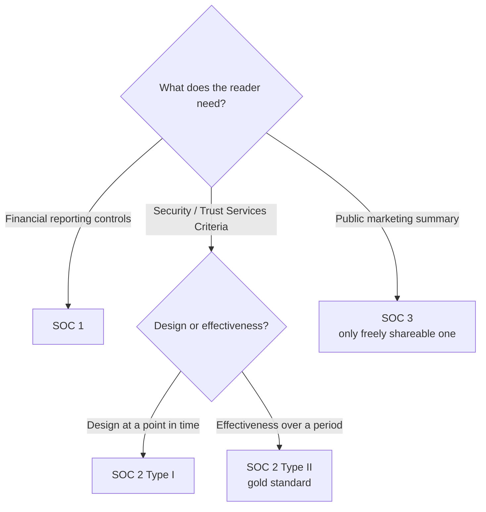
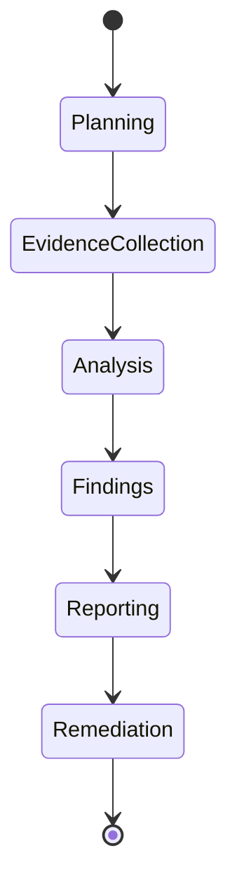

# Security Auditing

## Overview

An audit is a formal, independent check that your controls match a defined standard — and the word that carries all the weight is *independent*. The auditor cannot be the person who runs the thing being audited, because the whole value of an audit is an outside opinion someone else can trust. That's also why audits map to external standards (ISO 27001, PCI DSS, SOC) and produce a report others rely on. Compare this with an assessment, which is a broader, often internal review meant to help you improve — an assessment advises, an audit attests.

## Key Concepts

### Audit Types
| Type | Conducted By | Purpose |
|------|-------------|---------|
| **Internal Audit** | Internal audit team | Self-assessment, preparation |
| **External Audit** | Independent third party | Compliance, certification |
| **Regulatory Audit** | Government/regulatory body | Legal compliance |
| **Third-Party Audit** | Auditor hired by customer or regulator | Vendor assessment |

### SOC Reports (Service Organization Controls)
| Report | Audience | Focus | Duration |
|--------|----------|-------|----------|
| **SOC 1** | Financial auditors | Financial reporting controls | Point-in-time or period |
| **SOC 2 Type I** | Restricted | Trust Services Criteria (design) | Point in time |
| **SOC 2 Type II** | Restricted | Trust Services Criteria (effectiveness) | Period (6-12 months) |
| **SOC 3** | Public | General summary | Period |

### Trust Services Criteria (SOC 2)
1. **Security** (mandatory)
2. **Availability**
3. **Processing Integrity**
4. **Confidentiality**
5. **Privacy**

### Audit Standards and Frameworks
- **ISACA** - CISA certification, COBIT framework
- **ISO 27001** - auditable ISMS standard
- **NIST 800-53** - security controls catalog (federal)
- **PCI DSS** - payment card security audit requirements

### Oversight and Independence
- The **audit committee** of the **board of directors** provides top-level, independent oversight of the audit function and internal controls — the auditors ultimately answer here, not to the management they audit.
- **Assessors by independence:** **internal** (the org's own staff — least independent) → **external** (engaged outsiders) → **third-party** (fully independent; performs SOC audits/attestations). For *truly independent* assurance, pick a third-party/external auditor.

### Reducing Audit Data (clipping vs. sampling)
- **Clipping level** - a fixed *threshold* that discards events below it. This is **nonstatistical** data reduction. "Reduce audited data, nonstatistical" → clipping level.
- **Sampling** - select a representative subset to review; this is **statistical**. Use a **random** sample for a fair, unbiased audit.

### Audit Process
1. Planning and scoping
2. Evidence collection (interviews, observation, document review, testing)
3. Analysis and evaluation
4. Findings and recommendations
5. Report issuance
6. Remediation tracking

### Audit Evidence — how auditors actually conclude
Auditors don't take your word; they gather **evidence** of four main kinds: **inquiry** (interviews — weakest, just what people say), **observation** (watching a process happen), **inspection/examination** (reviewing documents, configs, logs), and **re-performance** (the auditor independently re-runs the control to confirm it works — strongest). When an answer asks for the most reliable assurance, lean toward re-performance/inspection over inquiry. A control with no evidence behind it is, to an auditor, a control that doesn't exist.

### Attestation vs. Certification
- **Attestation** - an independent auditor issues an *opinion/report* on whether controls are designed and operating as described (e.g., a SOC 2 report). It attests to a point or period; it is not a pass/fail badge.
- **Certification** - a formal *credential* awarded against a standard's requirements (e.g., ISO/IEC 27001 certification by an accredited body). It says "you meet this standard."
Both require independence; the difference is an opinion-on-controls (attestation) vs. a credential-against-a-standard (certification).

### Gap Assessment
Before a real audit, organizations run a **gap assessment** (gap analysis): compare the current state against the target standard to find what's missing, then remediate *before* the auditor arrives. It's internal, advisory, and a preparation step — not the audit itself.

### CSA STAR (cloud)
The **Cloud Security Alliance STAR** program provides cloud-specific assurance built on the **Cloud Controls Matrix (CCM)**: Level 1 is self-assessment (lowest assurance), Level 2 is third-party audit/attestation (often combined with SOC 2). Recognize STAR/CCM as the cloud parallel to SOC for assessing a cloud provider.

## Exam Tips

- **SOC 2 Type II** is the gold standard (tests effectiveness over time)
- **SOC 3** is the only publicly shareable SOC report
- Internal audits are important but do not replace external audits
- Auditors should be **independent** of the function being audited
- Audit findings should be tracked through remediation
- **Sampling when you can't review 100%:** use a **random sample** — it's the only **unbiased** method. "First 20% alphabetically," "most recently used," or "least recently used" all introduce **bias** and are wrong answers for a fair review/audit.

## Common Traps

- **Audit vs. assessment:** an *audit* independently verifies conformance to a standard and produces an attestation; an *assessment* is a broader, often internal, advisory review aimed at improvement. If the stem emphasizes independence, compliance, or certification, it's an audit.
- **Internal vs. external:** internal audits prepare you and find issues early but cannot certify you to outsiders — only an independent external auditor can. Internal audit does not *replace* external audit.
- **SOC report confusion:** SOC 1 = financial reporting controls; SOC 2 = security/Trust Services Criteria (Type I = design at a point in time, Type II = effectiveness over a period); SOC 3 = the only one you can publish freely.

## Diagrams

### Choosing the SOC report

Pick by who reads it and whether they need design or proven effectiveness.

### Audit lifecycle

The independent evaluation runs as a repeatable sequence ending in remediation tracking.

## Related Topics

- [Security Governance](../01-security-and-risk-management/Security%20Governance.md) - governance audits
- [Compliance and Legal Issues](../01-security-and-risk-management/Compliance%20and%20Legal%20Issues.md) - regulatory audit requirements
- [Supply Chain Risk Management](../01-security-and-risk-management/Supply%20Chain%20Risk%20Management.md) - vendor audits via SOC reports
- [Log Management and Monitoring](Log%20Management%20and%20Monitoring.md) - audit log review
