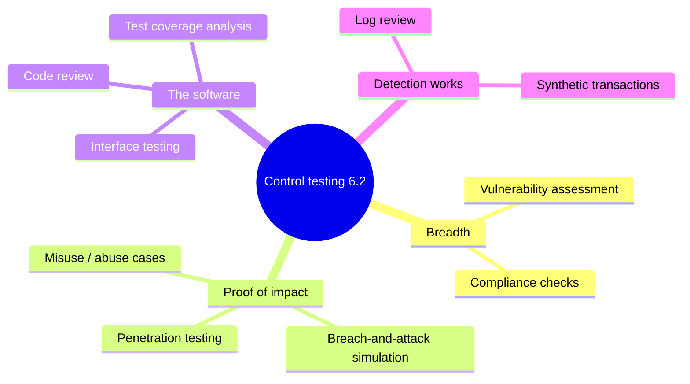
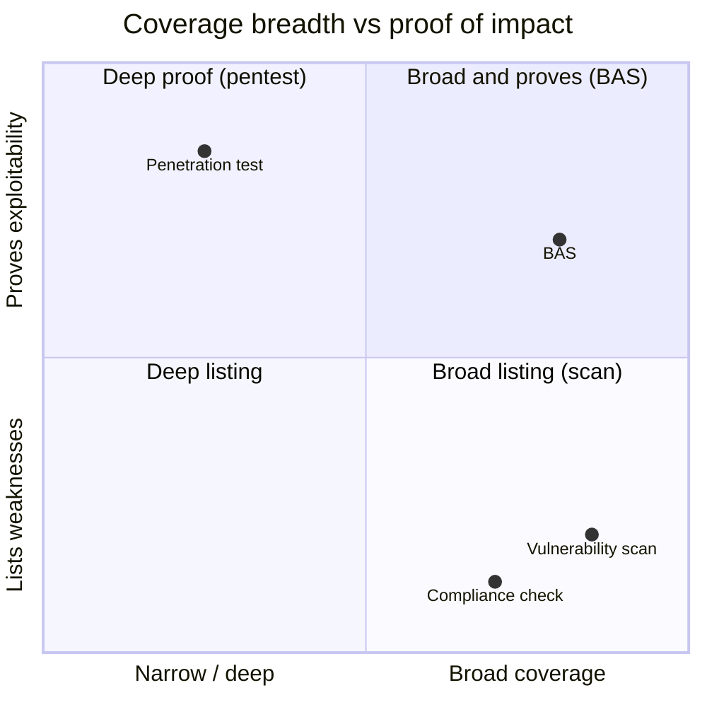

# Security Control Testing

## Overview

Security control testing is the (ISC)² heading that gathers every hands-on technique for checking whether a control actually works into one menu. The exam objective lists them explicitly: vulnerability assessment, penetration testing, log reviews, synthetic transactions, code review and testing, misuse case testing, test coverage analysis, interface testing, breach-and-attack simulation, and compliance checks. The skill the exam rewards is not deep expertise in each — it is *matching the right technique to the question being asked*. Each method answers a different question, and picking the wrong tool is the classic wrong answer.

The mental model: some techniques are about **breadth** (how many known weaknesses exist — vulnerability assessment, compliance checks), some about **proof** (can a weakness actually be exploited for impact — pentest, breach-and-attack simulation, misuse cases), some about **the software itself** (code review, interface testing), and some about **whether your detection works** (log review, synthetic transactions). Keep those four buckets in mind and most stems sort themselves.

## Key Concepts

### The full menu (and where each is covered in depth)

| Technique | The question it answers | Depth note |
|-----------|------------------------|------------|
| **Vulnerability assessment** | Where are we weak, broadly? (known flaws, misconfigs, missing patches) | See [Vulnerability Assessment](Vulnerability%20Assessment.md) |
| **Penetration testing** | Can a weakness be exploited for real impact? | See [Penetration Testing](Penetration%20Testing.md) |
| **Log reviews** | Did we record it, and is anyone detecting it? | See [Log Management and Monitoring](Log%20Management%20and%20Monitoring.md) |
| **Synthetic transactions** | Does the service work and perform *right now*, proactively? | Below |
| **Code review and testing** | Is the source code itself sound? | See [Software Testing Methods](Software%20Testing%20Methods.md) |
| **Misuse / abuse case testing** | What happens when someone uses the system maliciously? | Below + Software Testing |
| **Test coverage analysis** | How much of the system did our testing actually exercise? | Below |
| **Interface testing** | Do the seams between components/systems behave? | Below |
| **Breach-and-attack simulation (BAS)** | Would our defenses catch a real attacker, continuously? | Below |
| **Compliance checks** | Do configurations match the required baseline/standard? | Below |

### Synthetic transactions

A **synthetic transaction** is a scripted, simulated interaction with a system — a robot that logs in, adds an item to a cart, and checks out, on a schedule — used to verify the service is available and performing correctly *before a real user hits a problem*. This is **proactive** monitoring. Contrast with **Real User Monitoring (RUM)**, which *passively* watches actual user traffic and is therefore reactive: RUM tells you real users are already suffering, synthetic transactions warn you first. Synthetic transactions are how you test SLA-style availability and the health of a control's user-facing path.

### Interface testing

Most breaches and outages happen not inside a component but at the **seams** — the APIs, message queues, and boundaries where one system hands data to another. Interface testing exercises those connection points: APIs, web service endpoints, the boundaries between application tiers, and hardware/software interfaces. It checks that each side handles the other's inputs and errors correctly, including malformed or unexpected data crossing the boundary. The exam framing: interface testing targets the *connections between modules/systems*, distinct from unit testing (inside one module) and from UI testing (just the human-facing screen).

### Misuse / abuse case testing

Normal ("use case") testing confirms the system does what a legitimate user wants. **Misuse case testing** flips the perspective: it models what a *malicious* actor would try and tests whether the system resists it. You derive misuse cases from threat modeling — for each feature, ask "how would an attacker abuse this?" — then test those paths (e.g., can the password-reset flow be used to enumerate accounts?). It is structured negative testing from the attacker's point of view, and it is how you validate that controls hold up against intent, not just accident.

### Test coverage analysis

**Test coverage analysis** measures how much of the system your testing actually exercised, exposing the parts nobody checked. It comes in two flavors that the exam likes to separate:

- **Code coverage** — the percentage of the *code* run during testing, broken down into precise sub-types (statement, branch, condition, function, loop, path — see [Software Testing Methods](Software%20Testing%20Methods.md) for the exact definitions).
- **Requirements/test coverage** — the percentage of the documented *requirements* that have at least one test.

The load-bearing caveat: **coverage measures thoroughness, not security.** 100% statement coverage means every line ran, not that the code is safe — you can fully cover code that is fully vulnerable. Coverage analysis is about finding *blind spots* in your testing, not certifying quality. Note coverage analysis also applies at the program level: are there systems or environments the *overall test strategy* never touches? (See validation in [Assessment and Test Strategies](Assessment%20and%20Test%20Strategies.md).)

### Breach-and-attack simulation (BAS)

**Breach-and-attack simulation** is an automated, continuous platform that safely replays real attacker techniques (often mapped to MITRE ATT&CK) against your live environment to answer one question: *would our existing defenses actually detect and stop this?* Think of it as a robot red team that runs constantly rather than once a year.

Place it against its neighbors:

- **Vulnerability scan** finds known weaknesses but does not exploit or test detection.
- **Penetration test** is a human expert proving exploitability — deep, creative, but a point-in-time snapshot that is expensive and infrequent.
- **BAS** is automated and continuous — broad and repeatable validation of *whether your blue team's controls fire*, but it follows known scripted techniques and lacks a human's creativity. It validates detection and response coverage between pentests, not as a replacement for them.

The exam cue: "automated, continuous validation that security controls detect known attack techniques" → BAS. "Human attacker proving real exploitability" → pentest.

### Compliance checks

A **compliance check** verifies that systems and processes match a required standard or hardening baseline — confirming configurations conform to PCI DSS, a CIS Benchmark, an STIG, or internal policy. These are often automated with **SCAP**-based tools that read a defined baseline and report each setting as pass/fail. Compliance checks answer "are we configured the way the rule says?" — which is *conformance*, not the same as "are we secure" or "can this be exploited." A system can be fully compliant and still carry real risk (compliance is a floor), and conversely a secure system can fail a check on a setting that does not matter in context. Distinguish a compliance check (configuration vs. standard) from an audit (independent attestation that uses such checks as evidence).

## Common traps / easily-confused

- **Breadth vs. proof:** vulnerability assessment and compliance checks list/verify weaknesses and settings; pentest, BAS, and misuse cases prove something can be exploited or that defenses fire. Match the verb in the stem.
- **BAS vs. pentest vs. vuln scan:** scan = find known flaws; pentest = human proves exploitability (point-in-time); BAS = automated, continuous test of whether controls *detect* attacks. Don't call continuous automated control-validation a "penetration test."
- **Synthetic vs. real user monitoring:** synthetic = scripted, proactive, catches problems before users do; RUM = passive observation of real traffic, reactive.
- **Interface vs. unit vs. UI testing:** interface = the seams/APIs between components or systems; unit = inside one component; UI = the human-facing screen.
- **Compliance check vs. secure:** conforming to a baseline is not the same as being secure; compliance is a minimum, not proof of safety. And a compliance check is evidence *for* an audit, not the audit itself.
- **Coverage = thoroughness, not security:** high coverage tells you how much was tested, never how good the code is.

## Exam Tips

- Learn the menu as four buckets: **breadth** (vuln assessment, compliance checks), **proof of impact** (pentest, BAS, misuse cases), **the software** (code review, interface testing, coverage), **detection works** (log review, synthetic transactions).
- **Synthetic transactions = proactive**; reaching real users first is the whole point.
- **BAS = automated + continuous + tests detection**; pentest = human + point-in-time + tests exploitability.
- **Compliance checks verify configuration against a baseline** (often via SCAP) — conformance, not security.
- **Test coverage analysis finds untested areas**; it never certifies the tested areas are safe.

## Diagrams

### The 6.2 testing menu in four buckets

Sort any technique by the kind of question it answers.

### Breadth vs. proof of impact

Some methods list weaknesses; others prove something can actually be exploited or detected.

## Related Topics

- [Assessment and Test Strategies](Assessment%20and%20Test%20Strategies.md) - choosing which technique to apply where
- [Vulnerability Assessment](Vulnerability%20Assessment.md) - breadth of known weaknesses
- [Penetration Testing](Penetration%20Testing.md) - proving exploitability
- [Software Testing Methods](Software%20Testing%20Methods.md) - code review, coverage types, misuse cases in depth
- [Log Management and Monitoring](Log%20Management%20and%20Monitoring.md) - log review as control testing
- [Analyzing and Reporting Test Results](Analyzing%20and%20Reporting%20Test%20Results.md) - what to do with the output
