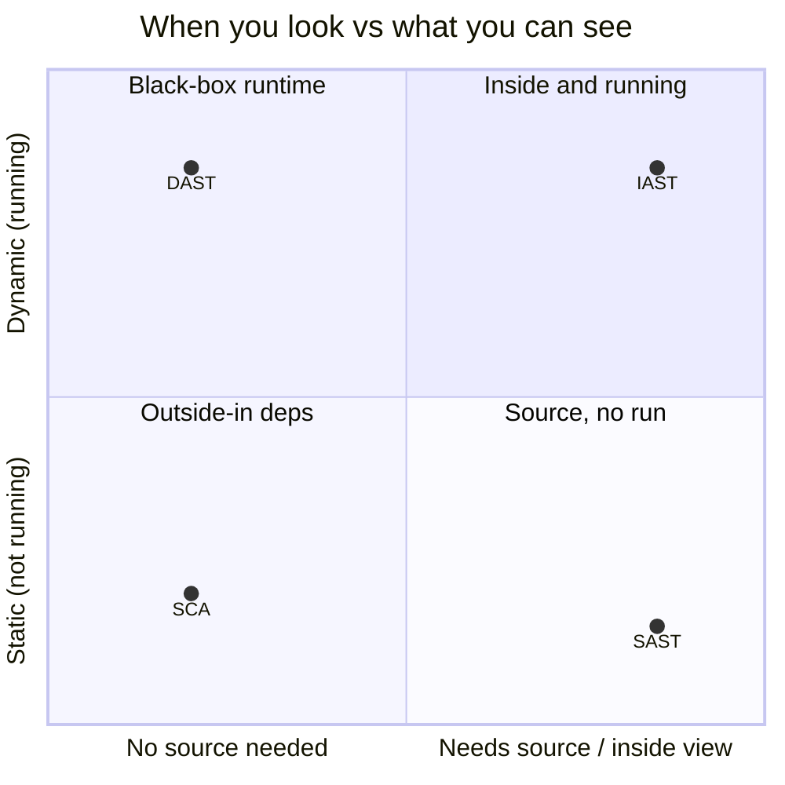
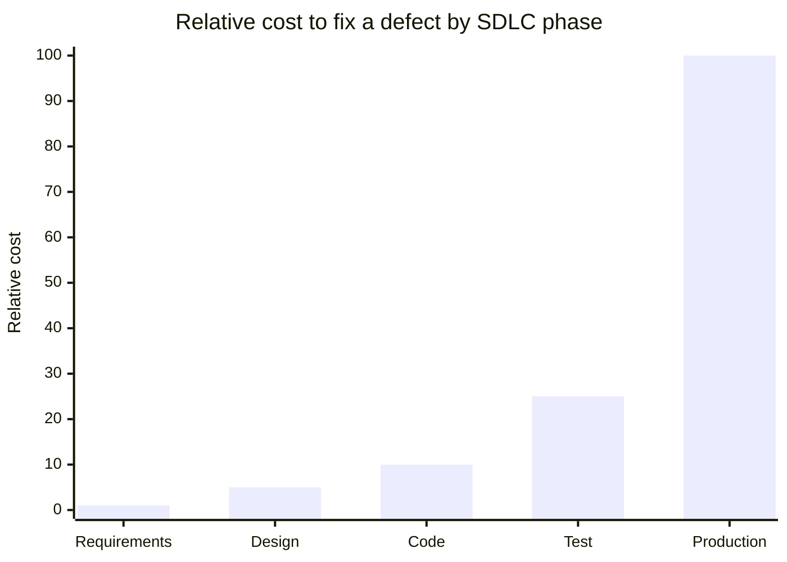

# Software Testing Methods

## Overview

Software testing is how you find flaws before an attacker does, and the central choice is *when* you look. Static testing reads the code without running it (cheap, early, catches issues at the source); dynamic testing runs the program and watches how it behaves (catches what only appears at runtime). Neither replaces the other — mature programs do both, and do them continuously across the SDLC rather than as a final gate. A second theme the exam loves: don't confuse *coverage* (how much code or how many requirements you exercised) with *security* (how good the code actually is). High coverage means thorough, not safe.

## Key Concepts

### Static vs. Dynamic Testing
| Type | When | How |
|------|------|-----|
| **Static (SAST)** | Without running code | Code review, static analysis tools |
| **Dynamic (DAST)** | While running code | Runtime testing, fuzzing |
| **IAST** | During execution | Instruments code for real-time analysis |

**The four analysis approaches (know which sees what):**
- **SAST (static)** reads source/bytecode without running it — finds flaws early and pinpoints the exact line, but produces more false positives and can't see runtime behavior. Needs source access.
- **DAST (dynamic)** attacks the running application from the outside — no source needed, fewer false positives, catches config and runtime issues, but it's late in the SDLC and can't point to the offending line.
- **IAST** instruments the running app with agents, combining inside code knowledge with runtime behavior — more accurate than either alone, but needs instrumentation and a running app.
- **SCA (Software Composition Analysis)** scans *third-party and open-source dependencies* for known-vulnerable components (CVEs) and license problems — the only one of the four aimed at code you didn't write. Since most applications are built largely from open-source libraries, SCA addresses the supply-chain risk that SAST/DAST/IAST (focused on *your* code) miss, and it feeds the software bill of materials (SBOM).

### Levels of Testing (small → large)
**Unit** (individual components in isolation) → **Interface** (the connections between components) → **Integration** (combined components working together) → **System** (the complete, integrated system end-to-end). Know the order.

### Manual vs. Automated Testing
- **Manual** - a human runs the tests; flexible, good for logic and judgment calls.
- **Automated** - tools run the tests; fast, repeatable, scalable.

### Code Review
- **Manual code review** - human expert examines source code
- **Peer review** - developers review each other's code
- **Fagan inspection** - the most formal, structured code review (6 steps: planning → overview → preparation → inspection → rework → follow-up)
- **Walkthrough** - author presents code to reviewers

### Testing Techniques
| Technique | Description |
|-----------|-------------|
| **Fuzzing** | Sending random/malformed input to find crashes |
| **Unit Testing** | Testing individual components in isolation |
| **Integration Testing** | Testing how components work together |
| **System Testing** | Testing the complete, integrated system end-to-end |
| **Regression Testing** | Ensuring changes don't break existing functionality |
| **User Acceptance Testing (UAT)** | End users verify the system meets requirements |
| **Interface Testing** | Testing APIs and user interfaces |
| **Misuse/Abuse Case Testing** | Testing from an attacker's perspective |

**Fuzzing — two ways to generate the input:**
- **Mutation fuzzing** - randomly *modify* existing valid inputs.
- **Generation fuzzing** - *create* inputs from scratch based on the format/spec.

**Picking representative test inputs:**
- **Boundary value analysis (BVA)** - test the *edges* of input ranges (min, max, just inside/outside) — where bugs cluster.
- **Equivalence partitioning** - split inputs into equivalent classes and test *one representative* per class (efficiency, less redundancy).

### Coverage Metrics
- **Code Coverage** - percentage of code executed during testing
- **Test Coverage** - percentage of requirements covered by tests
- Higher coverage does not guarantee security - it measures thoroughness

#### Coverage types (know the exact definitions — exam tests these)
| Type | Verifies |
|------|----------|
| **Branch coverage** | Every **if** statement is executed under **all its if AND else** conditions |
| **Condition coverage** | Every **logical test (condition)** is executed under all sets of input |
| **Function coverage** | Every **function** has been called and returned a result |
| **Loop coverage** | Every **loop** runs **multiple times, once, and not at all** |
| **Statement coverage** | Every **line/statement** has executed |
| **Path coverage** | Every **possible route** through the code has executed |

"Verifies every if statement under all if and else conditions" → **branch coverage** (not condition coverage).

### Operational / Runtime Monitoring
- **Real User Monitoring (RUM)** - *passively* observes actual user traffic to measure real experience.
- **Synthetic monitoring (synthetic transactions)** - runs *scripted/simulated* transactions to test performance and availability *proactively*, before real users hit a problem.

### Security-Specific Testing
- **OWASP Top 10 Testing** - testing for common web vulnerabilities
- **Threat model validation** - testing against identified threats
- **Boundary/Edge testing** - testing at input limits
- **Negative testing** - testing with invalid/unexpected inputs

### Testing in the SDLC — shift-left and DevSecOps
The exam's preferred answer is almost always "test **early and continuously**," not "test at the end." Finding a flaw in design or code is far cheaper than finding it in production — the cost of a defect rises sharply the later it's caught. **Shifting left** means moving security testing toward the start of the lifecycle (threat modeling, SAST in the IDE, unit tests) rather than bolting on a single pre-release scan.

**DevSecOps** bakes this into the pipeline: in a **CI/CD** (continuous integration / continuous delivery) pipeline, automated tests — SAST, SCA, DAST, unit/integration tests — run on every commit or build, and a failing security gate can block the release. The goal is security as a continuous, automated property of delivery, not a manual gate that slows things down or gets skipped under deadline pressure.

### Test Data Management
What you test *with* matters as much as how you test. Using **real production data in test/dev environments is a classic exposure** — test environments are less protected, more widely accessed, and easy to forget about, so live customer data there is a breach waiting to happen (and often a compliance violation). The correct practice is to **use sanitized, masked, anonymized, or synthetic data** in non-production environments. Keep test environments **separate from production**, and ensure tests don't run against live production systems unless explicitly intended and authorized.

- **SAST** finds bugs in source code; **DAST** finds bugs at runtime
- **Fuzzing** is excellent for finding unexpected crashes and vulnerabilities
- **Fagan inspection** is the most formal code review methodology
- Code coverage measures how much code was tested, not how well
- **SCA** is the only approach aimed at third-party/open-source dependencies; it feeds the SBOM
- Testing should happen throughout the SDLC, not just at the end — **shift left / DevSecOps**
- **Never use real production data in test environments** — use masked, anonymized, or synthetic data

## Common Traps

- **Verification vs. validation:** verification asks "did we build it *right*?" (does it meet the spec — reviews, unit tests); validation asks "did we build the *right thing*?" (does it meet the user's real need — UAT). Verification checks against requirements; validation checks against intent.
- **SAST vs. DAST:** SAST = static = source code, no execution; DAST = dynamic = running app, no source needed. IAST instruments the running app to get the best of both.
- **Branch vs. condition coverage:** branch coverage exercises every if/else *outcome*; condition coverage exercises every individual logical *condition* under all input sets. "Every if statement under all if and else conditions" → **branch coverage**.
- **Positive vs. negative testing:** positive tests confirm valid input works; negative tests feed invalid/unexpected input to confirm the software fails safely. Security bugs hide in the negative cases.

## Diagrams

### SAST vs. DAST vs. IAST vs. SCA

Where each analysis approach sits — by whether it runs the code and whether it needs source.

### Cost of a defect rises later in the SDLC

The reason the exam answer is "test early and continuously" (shift left).

## Related Topics

- [Vulnerability Assessment](Vulnerability%20Assessment.md) - vulnerability scanning of applications
- [Penetration Testing](Penetration%20Testing.md) - testing from an attacker perspective
- [Domain 8 - Software Development Security](../08-software-development-security/00%20Domain%208%20-%20Software%20Development%20Security.md) - SDLC and secure coding
