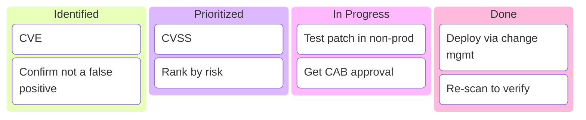

# Vulnerability Assessment

## Overview

A vulnerability assessment answers one question at scale: "where are we weak?" A scanner checks systems against a database of known flaws, misconfigurations, and missing patches, then produces a ranked list. The goal is *breadth and coverage* — find as many known issues as possible — not proof that any one of them is exploitable; that's the job of a penetration test. The work that turns a raw scan into something useful is validation (weeding out false positives) and prioritization (CVSS severity tempered by business context), so limited remediation effort goes to what actually matters.

## Key Concepts

### Vulnerability Scanning Types
- **Network scanning** - identifies open ports, services, and known vulnerabilities
- **Web application scanning** - tests for OWASP Top 10 vulnerabilities
- **Database scanning** - checks for misconfigurations and default credentials
- **Host-based scanning** - scans individual systems (OS, applications, configurations)

### Active vs. Passive
- **Active scanning** sends probes/packets to targets to elicit responses — accurate and current, but generates traffic and can disrupt fragile systems.
- **Passive scanning** observes existing network traffic without probing — zero impact and safe for sensitive/OT environments, but only sees what happens to cross the wire (incomplete). Note: even "active" vulnerability scanning is still *identify*, not *exploit* — don't confuse active scanning with penetration testing.

### Scan Safety and Impact
Scans aren't free of risk — aggressive scanning can crash legacy systems, flood links, or trip IDS alerts. Mitigate with **scan windows** (off-peak timing), throttling, and extra care around **fragile or operational-technology (ICS/SCADA) systems**, where passive or vendor-approved methods are often required. Always scan **with authorization and a defined scope**, and coordinate so defenders aren't chasing your scan as a real attack.

### Credentialed vs. Non-Credentialed Scans
| Type | Access | Depth | False Positives |
|------|--------|-------|-----------------|
| **Credentialed** | With login credentials | Deep (sees patches, configs) | Fewer |
| **Non-credentialed** | Without credentials | Surface-level only | More |

A credentialed (authenticated) scan logs in and reads installed patch levels and configuration directly, so it sees what's truly there rather than guessing from a banner — deeper and far fewer false positives. Non-credentialed scans see only the outside view an unauthenticated attacker would, which is exactly why both perspectives have value: the external view shows what's exposed, the authenticated view shows what's actually missing.

### Agent-Based vs. Network-Based Scanning
- **Network-based** - a central scanner reaches across the network to each target. Simple to centralize, but misses hosts that are offline, firewalled, or roaming (laptops, cloud instances that spin up and down).
- **Agent-based** - a lightweight agent installed on each host scans locally and reports back. Covers mobile/remote and ephemeral assets, no network load, always-authenticated view — at the cost of deploying and maintaining agents.

### Discovery vs. Vulnerability Scanning
A **discovery scan** first finds *what exists* (live hosts, open ports, services) — you cannot assess assets you don't know about, so asset discovery underpins coverage. The **vulnerability scan** then checks those known assets against the flaw database. Unknown/unmanaged assets (shadow IT) are a top reason real scans miss things.

### Cadence and Triggers
Scanning is recurring, not one-off: regularly on a schedule (PCI DSS requires at least **quarterly** plus after significant change), continuously for high-value assets, and event-driven after new deployments or major changes. Stale scan data is nearly as risky as no scan.

### Vulnerability Scoring
- **CVSS** (Common Vulnerability Scoring System) - 0-10 severity rating
  - Base, Temporal, Environmental scores
  - Critical: 9.0-10.0, High: 7.0-8.9, Medium: 4.0-6.9, Low: 0.1-3.9
- **CVE** (Common Vulnerabilities and Exposures) - unique identifier for vulnerabilities (the *which*)
- **NVD** (National Vulnerability Database) - US government repository
- **SCAP** (Security Content Automation Protocol) - the standard/protocol that *automates and combines* vulnerability management, tying together the pieces below:
  - **CVE** names vulnerabilities; **CPE** names platforms (OS/apps/devices); **CVSS** is the 0–10 severity score; **CCE** names configuration issues.

### False Positive vs. False Negative
- **False positive** - scanner flags a vuln that isn't really there → wastes investigation time.
- **False negative** - a real vuln goes *undetected* → far more dangerous. A false negative is the worse of the two.

### Assessment Process
1. Define scope and objectives
2. Identify assets to scan
3. Run vulnerability scans
4. Analyze and validate results (eliminate false positives)
5. Prioritize by risk (CVSS score + business context)
6. Report findings and recommendations
7. Remediate and rescan

## Exam Tips

- Vulnerability scanning **identifies** weaknesses; penetration testing **exploits** them. (Note: a scan still actively probes targets — it is not truly "passive." The real exam distinction is *identify vs. exploit*, not active vs. passive.)
- Credentialed scans give **more accurate** results (deeper view, fewer false positives)
- CVSS provides a **standardized** scoring methodology
- Always get **authorization** before scanning
- Regular scanning is required by many compliance frameworks (PCI DSS)

## Common Traps

- **Scan vs. pentest:** if the answer hinges on *finding/listing* known weaknesses → vulnerability scan. If it hinges on *exploiting* them to prove impact → penetration test.
- **Credentialed vs. non-credentialed:** credentialed (authenticated) scans see installed patches and configs, so they are deeper and produce *fewer* false positives. Non-credentialed scans see only what an outsider sees.
- **CVE vs. CVSS:** CVE is the *identifier* for a specific vulnerability; CVSS is the *severity score* (0–10). Don't swap them.

## Diagrams

### Vulnerability Remediation — Kanban

**Takeaway:** Vuln flow: **identify (CVE) → confirm (false-positive check) → prioritize (CVSS) → patch via change management → verify (re-scan)**.

## Related Topics

- [Penetration Testing](Penetration%20Testing.md) - next step after identifying vulnerabilities
- [Risk Management](../01-security-and-risk-management/Risk%20Management.md) - vulnerabilities feed risk assessment
- [Domain 7 - Security Operations](../07-security-operations/00%20Domain%207%20-%20Security%20Operations.md) - operational scanning
