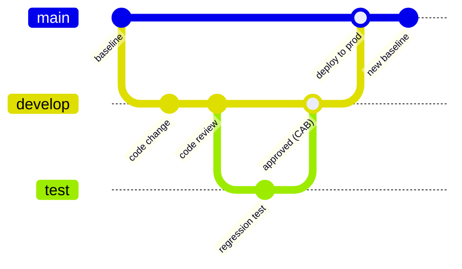

# Change and Configuration Management

## Overview

Change and configuration management is the discipline of controlling how IT systems get modified so the environment stays in a known, documented, good state. Change management governs the *process* — every modification is requested, reviewed, approved, and recorded — while configuration management governs the *state*, tracking what each system is supposed to look like. The two matter because unauthorized or untested changes are a leading cause of both outages and security incidents: if you don't know what changed, you can't troubleshoot it, defend it, or roll it back. The recurring exam themes are the approval gate (nothing reaches production without sign-off) and separation of duties (the person who writes a change is not the person who deploys it).

### The canonical workflow (memorize this shape)

A developer writes code, submits it for **code review**, gets **approval**, and then a **different employee deploys** it to production. Two signals scream "change management":

1. **Approval gate** — nothing reaches production without sign-off.
2. **Separation of duties** — whoever *deploys* is not whoever *wrote* the change (least privilege: developers shouldn't push straight to prod).

If a question describes write → review → approve → *someone else* deploys, the answer is **change management**, keyed on those two signals.

## Key Concepts

### Change Management Process
1. **Request** - submit a change request (RFC)
2. **Review** - evaluate impact, risk, and resources
3. **Approve/Reject** - Change Advisory Board (CAB) decides
4. **Implement** - make the change in a controlled manner
5. **Test / validate** - verify the change works as intended: confirm the **new functionality** AND run **regression testing** (did it break anything that worked before?)
6. **Document** - record the change and results
7. **Rollback plan** - have a plan if the change fails

### Change Types
- **Standard** - pre-approved, low-risk, routine (e.g., password reset)
- **Normal** - follows the full change process (full **CAB** review)
- **Emergency** - expedited due to urgency; fast-tracked through the **ECAB (Emergency Change Advisory Board)** rather than the full CAB, but **still documented**

> **CAB vs ECAB:** the **CAB (Change Advisory Board)** reviews and approves **normal** changes; the **ECAB** is a smaller group that fast-tracks **urgent/emergency** changes (e.g., a critical zero-day patch) outside the normal window.

### Configuration Management
- **Configuration Item (CI)** - any component that needs to be managed
- **Configuration Baseline** - documented, approved state of a system
- **CMDB** (Configuration Management Database) - repository of all CIs and relationships
- **Configuration audits** - verify systems match baselines

### Patch Management
1. Monitor for new patches/vulnerabilities
2. Assess relevance and urgency
3. Test patches in non-production environment
4. Deploy patches with change management
5. Verify successful deployment
6. Document and report

**Patch-status detection methods:**
- **Agent-based** - installed software on the host reports its patch status back
- **Agentless** - a remote scanner queries the host; nothing is installed (use when you want status across thousands of endpoints without deploying software)
- **Passive** - infers patch level by observing network traffic (no scan, no agent)

### Key Concepts
- **Separation of environments** - development, testing/staging, production
- **Least privilege** - developers should not have production access
- **Version control** - track all changes to code and configurations
- **Immutable infrastructure** - replace rather than modify (cloud pattern)

## Exam Tips

- **All changes** must go through change management (even emergency ones are documented after)
- **CAB** (Change Advisory Board) reviews and approves changes
- **Baselines** are the known-good state to revert to
- Patches should be tested in a **non-production** environment first
- Unauthorized changes are a leading cause of outages and security incidents

## Common traps

These look-alikes are *parts of* or unrelated to change management, not the process itself:

- **Code review** — a single *step within* change management (one person inspects another's code). Not the whole process.
- **Regression testing** — verifying a new change **didn't break existing functionality**. A test *type* that answers "did I break anything?", not a release process.
- **Fuzzing** — a security *testing technique* that sends **malformed/random input** to surface crashes and bugs. Not a release process.

## Diagrams

### Change Management / SCM — Git Graph

> Git graphs show branching/versioning — mirrors secure dev + change control.

**Takeaway:** Change flows: develop → review → test (regression) → **CAB approval** → deploy → update baseline. A *different* person deploys (separation of duties). SCM = version control of it all.

## Related Topics

- [Security Operations Concepts](Security%20Operations%20Concepts.md)
- [Domain 8 - Software Development Security](../08-software-development-security/00%20Domain%208%20-%20Software%20Development%20Security.md) - SDLC change management
- [Incident Response](Incident%20Response.md) - unauthorized changes may indicate incidents
