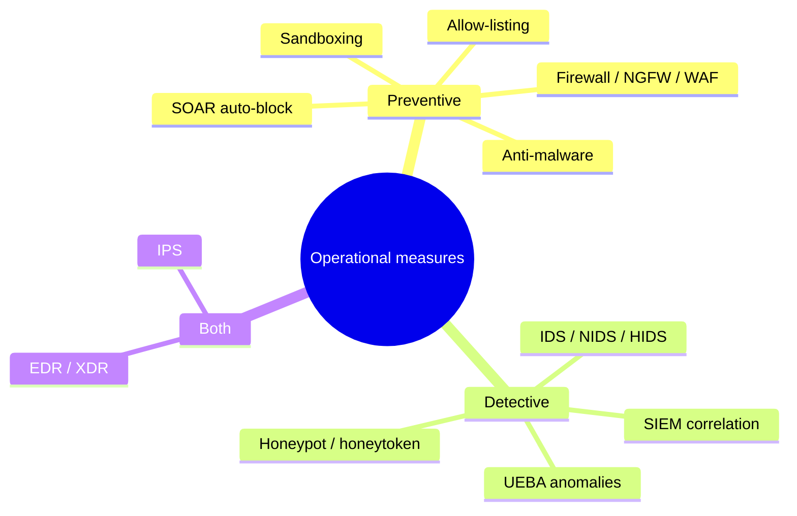
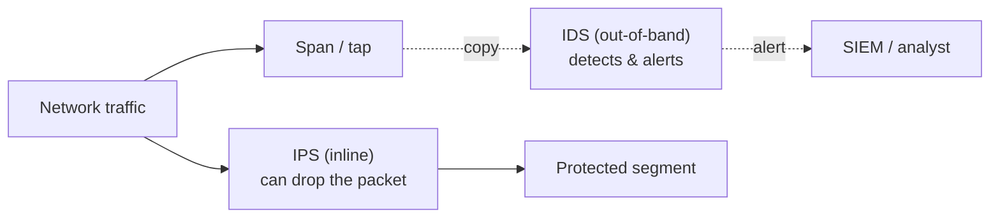

# Detective and Preventive Measures

## Overview

This note is the toolbox of operational defenses you run day to day: the boxes and software that block bad traffic, spot intrusions, isolate suspicious code, lure attackers, and tie all the responses together. The exam's framing is the control-function pairing — most of these tools are either **preventive** (stop it happening: firewall, allow-listing, anti-malware) or **detective** (notice it happened: IDS, honeypot), and a few do both. The recurring discriminators are small but sharp: IDS *detects* while IPS *blocks*; allow-listing beats deny-listing; a honeypot is legal enticement, not entrapment; sandboxing isolates rather than scans. Get the function and the one-line distinction right and most questions fall over.

## Key Concepts

### Firewalls (the preventive gatekeeper)

A firewall enforces a traffic policy between zones (e.g., internet ↔ DMZ ↔ internal). Generations, simplest to richest:

| Type | Inspects | Notes |
|------|----------|-------|
| **Packet filter** | Header only (IP, port, protocol) | Fast, stateless, no session awareness |
| **Stateful inspection** | Tracks connection **state** | Knows a reply belongs to a request you allowed |
| **Proxy (application gateway)** | Full **application-layer** content | Terminates and re-originates the session; hides internal hosts |
| **Next-Gen Firewall (NGFW)** | App-ID, user-ID, IPS, TLS inspection | Deep inspection + integrated threat prevention |
| **WAF (Web Application Firewall)** | HTTP/S app logic | Stops SQLi/XSS; protects web apps specifically |

Default posture should be **deny-by-default** (implicit deny): permit only what's explicitly allowed. Egress rules matter as much as ingress (see egress monitoring).

### IDS vs IPS (the core discriminator)

- **IDS (Intrusion Detection System)** — **detects** and alerts. It sits *out of band* (often on a span/tap), so it watches a copy of traffic. Worst case it stays silent; it does not block.
- **IPS (Intrusion Prevention System)** — **prevents**. It sits **inline**, so it can drop the malicious packet — but a false positive now blocks legitimate traffic, and it's a potential bottleneck/point of failure.

Detection methods (apply to both):

- **Signature / knowledge-based** — matches known patterns. Low false positives, but blind to novel/zero-day attacks.
- **Anomaly / behavior-based** — flags deviation from a learned baseline. Catches the unknown, but more false positives and needs a clean baseline.
- **Heuristic** — rules/logic inferring malicious intent.

Placement: **HIDS/HIPS** protect a single host (see file/process changes); **NIDS/NIPS** watch a network segment. A NIDS can't see *inside* encrypted traffic without decryption.

### Allow-listing vs deny-listing

- **Allow-listing (whitelisting)** — only explicitly approved programs/IPs/domains run; everything else is denied by default. Stronger, because it stops the *unknown* — but high maintenance.
- **Deny-listing (blacklisting)** — block known-bad, permit the rest. Easier to run but misses anything new.

Allow-listing is the more secure posture and the usual "correct" answer when a stem asks which prevents unknown/zero-day software from running.

### Anti-malware

Endpoint and gateway anti-malware blends several detection styles, mirroring IDS: **signature** (known hashes/patterns — useless against novel malware until updated), **heuristic/behavioral** (watch for malware-like actions — catches new variants), and increasingly **ML/AI** models. Keep signatures current, but lean on behavioral detection for fileless and zero-day threats. **EDR/XDR** extend this with continuous recording and response (see Security Operations Concepts).

### Sandboxing

A **sandbox** runs untrusted code in an **isolated** environment so it can't touch the real system, letting you observe what it does (dynamic/behavioral analysis). It's how modern anti-malware and email gateways "detonate" suspicious attachments before delivery. Key idea: sandboxing **isolates and observes**; it doesn't match a signature. Note that sophisticated malware uses **sandbox-evasion** (sleeping, checking for a real user) to look benign while detonated.

### Honeypots and honeynets

- **Honeypot** — a decoy system with no production purpose, made attractive to lure attackers so you can study their methods and detect intrusions early. Any interaction with it is suspicious by definition (low false positives).
- **Honeynet** — a whole network of honeypots simulating a realistic environment.
- **Honeytoken** — a fake credential, file, or record planted so that *any* access to it signals compromise.

Legally this is **enticement** (making an already-willing attacker's act easier to catch) — **legal**. It is **not entrapment** (inducing someone to commit a crime they wouldn't have) — **illegal**. Don't place a honeypot to trap people who'd otherwise never attack.

### AI/ML-based tools

Machine learning shows up across this toolbox: anomaly detection in IDS/UEBA, malware classification, alert prioritization in the SIEM, and triage in SOAR. Strength: detecting novel/behavioral threats and cutting analyst noise. Weaknesses to keep in mind for the exam: training-data quality drives results, models produce false positives, they can be **evaded or poisoned** (adversarial input), and they're often opaque ("black box"). AI augments analysts; it does not remove the need for human judgment.

### SOAR (the orchestration layer)

**SOAR (Security Orchestration, Automation, and Response)** automates incident-response workflows across many tools using **playbooks**: when the SIEM alerts, SOAR can auto-enrich with threat intel, open a ticket, isolate the endpoint via EDR, and block the IP at the firewall — in seconds, consistently. It addresses analyst overload and slow manual response. Remember the split: **SIEM detects, SOAR responds.**

### Third-party / managed security services

Not everyone runs their own 24/7 SOC. Outsourced options:

- **MSSP (Managed Security Service Provider)** — runs security tooling/monitoring for you (firewalls, SIEM, alerting).
- **MDR (Managed Detection and Response)** — a vendor provides detection *and* active response as a service.

These shift operational load but **never transfer accountability** — the data owner remains responsible for risk. Govern them with clear SLAs and right-to-audit clauses.

## Common traps / easily confused

- **IDS vs IPS.** IDS detects/alerts (out-of-band, can't block); IPS prevents/blocks (inline). The verb in the stem decides it.
- **Signature vs anomaly detection.** Signature catches **known** (low false positives, blind to zero-day); anomaly catches **unknown** (more false positives, needs a baseline).
- **Allow-listing vs deny-listing.** Allow-list = deny-by-default, stronger, stops unknowns; deny-list = block known-bad, misses new threats.
- **Sandboxing vs honeypot.** Sandbox **isolates untrusted code** to observe it safely; honeypot is a **decoy to lure attackers**. Both isolate, different goals.
- **Honeypot = enticement (legal), not entrapment (illegal).** Luring a willing attacker is fine; inducing an unwilling one is not.
- **SIEM vs SOAR.** Detect vs respond/automate.
- **MSSP/MDR don't transfer accountability.** You can outsource the work, not the responsibility.
- **HIDS vs NIDS.** Host-based watches one system; network-based watches a segment and can't read encrypted payloads without decryption.

## Exam Tips

- **IPS is inline and blocks; IDS is out-of-band and only alerts.**
- **Anomaly/behavior-based** detection is the answer for **zero-day / novel** threats; **signature-based** for known threats with low false positives.
- **Allow-listing** is the stronger control and the usual answer for blocking unknown software.
- A **honeypot** is legal **enticement**; placing it must not become **entrapment**.
- **Sandboxing** = run untrusted code in isolation to analyze behavior.
- **SOAR** = automate the response playbook *after* the SIEM detects.
- Outsourcing to an **MSSP/MDR** keeps **accountability** with you.

## Diagrams

### Preventive vs Detective Measures

> Taxonomy of the toolbox by control function — a few tools do both.

### IDS vs IPS Placement

> The verb decides it — IDS sees a copy (out-of-band); IPS sits in the path (inline).

**Takeaway:** IDS out-of-band can only alert; IPS inline can block but a false positive now drops legit traffic and it is a potential bottleneck.

## Related Topics

- [Logging and Monitoring](Logging%20and%20Monitoring.md) - SIEM, egress monitoring, threat intel feeds
- [Security Operations Concepts](Security%20Operations%20Concepts.md) - EDR/XDR/MDR, malware types, SOC
- [Incident Response](Incident%20Response.md) - these tools detect and contain
- [Investigations and Evidence](Investigations%20and%20Evidence.md) - entrapment vs enticement
- [Firewalls Detail](../04-communication-and-network-security/Firewalls%20Detail.md) - firewall types in depth
