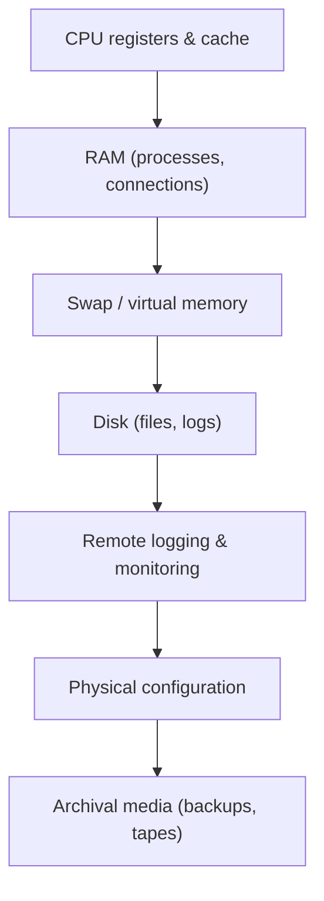

# Digital Forensics

## Overview

Digital forensics is the process of collecting, preserving, analyzing, and presenting digital evidence in a way that holds up in court. The whole discipline is built around one goal: **integrity**. Every technique here — write blockers, hashing, chain of custody, working on a copy — exists to prove that the evidence at trial is identical to what was on the system and was never altered in handling. On the exam, when a question pits "speed" or "convenience" against "preserving evidence," the evidence-preserving answer almost always wins.

## Key Concepts

### First Step at a Scene
**Secure the scene** before collecting anything - protect it from contamination or alteration. This rests on **Locard's Exchange Principle**: *every contact leaves a trace* - a perpetrator always brings something to the scene and takes something away, so an unsecured scene risks destroying or adding traces.

### Forensic Process
1. **Identification** - recognize potential evidence sources
2. **Collection/Acquisition** - gather evidence properly
3. **Preservation** - protect evidence integrity
4. **Analysis** - examine evidence for relevant information
5. **Presentation** - report findings in understandable format

### Evidence Collection Principles
- **Order of Volatility** (most volatile first):
  1. CPU registers and cache
  2. RAM (running processes, network connections)
  3. Swap/virtual memory
  4. Disk (files, logs)
  5. Remote logging and monitoring
  6. Physical configuration
  7. Archival media (backups, tapes)

### Evidence Integrity
- **Chain of Custody** - documents who handled evidence, when, and what they did
- **Hash verification** - MD5/SHA hash of evidence at collection; verify hasn't changed
- **Write blockers** - prevent modification when imaging drives
- **Bit-for-bit imaging** - exact copy of storage media (not just files)
- Work on the **copy**, never the original

### Forensic Analysis Types
- **Media analysis** - examining storage devices
- **Network forensics** - analyzing captured network traffic
- **Memory forensics** - analyzing RAM dumps
- **Malware analysis** - static and dynamic analysis of malicious code
- **Mobile forensics** - extracting data from mobile devices
- **Cloud forensics** - investigating cloud-hosted evidence

### Legal Considerations
- Evidence must be **admissible** in court
- Must follow proper **procedures** or evidence can be excluded
- **Expert witness** - qualified to give opinions on evidence
- **eDiscovery** - electronic discovery for civil litigation

## Exam Tips

- Always follow **order of volatility** (most volatile data collected first)
- **Chain of custody** must be maintained or evidence may be inadmissible
- Never work on the **original** evidence - always use a verified copy
- **Write blockers** are essential when imaging drives
- Hash values prove evidence integrity (before and after analysis)

## Common traps

- **Order of volatility ≠ order of importance.** You collect the *most volatile* data first (registers/cache, then RAM) because it disappears soonest — not because it's the most valuable.
- **eDiscovery is not forensics.** eDiscovery is the legal process of identifying and producing electronic records for civil litigation; forensics is the technical examination of evidence. A question about producing emails for a lawsuit is eDiscovery.
- **Imaging copies bits, not files.** A forensic image is a bit-for-bit copy of the whole medium (including slack and deleted space); copying the visible files is not a forensic image.
- **Hashing proves integrity, not confidentiality.** It shows the evidence wasn't altered; it does nothing to encrypt or hide it.

## Diagrams

### Order of Volatility

> Collect most volatile first — it disappears soonest, not because it matters most.

**Takeaway:** Order of volatility is *not* order of importance. Work on a verified bit-for-bit copy, never the original; hash to prove integrity.

## Related Topics

- [Incident Response](Incident%20Response.md) - forensics during incident handling
- [Investigations and Evidence](Investigations%20and%20Evidence.md) - legal framework
- [Data Retention and Destruction](../02-asset-security/Data%20Retention%20and%20Destruction.md) - evidence preservation vs. destruction
