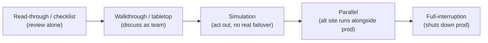

# Disaster Recovery Testing and Exercises

## Overview

A disaster recovery plan you've never tested is a hypothesis, not a plan. Testing is how you find the broken phone numbers, the backup that won't restore, and the procedure step that assumes a person who left the company — *before* a real disaster forces you to find them the hard way. This note covers two things the (ISC)² outline pulls out explicitly: the **execution phases** of recovering from a disaster (response, personnel, communications, assessment, restoration, training, lessons learned) and the **ladder of test types** (read-through → walkthrough → simulation → parallel → full-interruption), ordered from cheapest/lowest-risk to most realistic/most disruptive. The exam reliably asks you to match a described exercise to its type and to know which test risks disrupting production.

## Key Concepts

### DRP execution phases

When a disaster is declared, recovery follows a recognizable sequence (these map to the DRP's documented components):

1. **Response / activation** — recognize the event, **declare a disaster**, and activate the plan. A pre-defined declaration authority and criteria matter so no one wastes time debating whether to pull the trigger.
2. **Personnel and notification** — call out the recovery team and notify stakeholders, usually via a **call tree** (cascading notification list). **Safety of people comes first**, always, before any asset recovery.
3. **Communications** — keep internal teams, management, customers, regulators, and the public informed through pre-planned channels. Assume primary comms (email, phones) may be down — have out-of-band methods.
4. **Assessment** — evaluate the damage and scope: what's down, what's salvageable, what must be recovered first (driven by the BIA's prioritization).
5. **Restoration / recovery** — execute recovery procedures: bring up the alternate site or rebuild, restore data from backups, validate functionality. Recover the **most critical systems first**, per RTO.
6. **Return to normal (fail-back)** — once the primary is safe, migrate back. Counter-intuitively, move the **least critical systems back first** to test the restored primary before betting the crown jewels on it.
7. **Training, awareness, and lessons learned** — train staff on their roles ahead of time, and after any activation or test, capture what went wrong and **feed improvements back into the plan**.

### The DR test ladder (memorize the order)

Tests escalate in realism, cost, and risk of disrupting production. From least to most disruptive:

| Test | What happens | Disrupts production? | Cost/risk |
|------|--------------|----------------------|-----------|
| **Read-through / Checklist** | Team members individually **review the plan/checklist** for accuracy and currency | No | Lowest |
| **Walkthrough / Tabletop (structured walk-through)** | Team **meets and talks through** the plan against a scenario, role by role | No | Low |
| **Simulation** | Team **acts out** a scenario and practices response steps, but does **not** fail over real production systems | No (controlled) | Medium |
| **Parallel** | Recovery systems are brought up at the alternate site and run **alongside** production; results compared — **production keeps running** | No (runs in parallel) | High |
| **Full-interruption** | Production is **actually shut down** and operations cut over to the recovery site for real | **Yes** | Highest — most realistic, most dangerous |

Mnemonic for the order: **Read → Walk → Simulate → Parallel → Full.** The two that involve standing up recovery systems are parallel and full-interruption; only **full-interruption stops production** (the riskiest, requiring management sign-off — a botched one *causes* the outage it was meant to prevent).

### Matching scenarios to test types

The exam describes an exercise and asks its name. Cues:

- "Each member reviews the plan on their own for accuracy" → **read-through / checklist**.
- "The team gathers in a room and talks through their roles for a scenario" → **walkthrough / tabletop**.
- "We role-play the response and practice steps without touching production" → **simulation**.
- "We bring up the alternate site and run it next to production, comparing output" → **parallel**.
- "We shut down the data center and fail over for real" → **full-interruption**.

### Why and how often to test

- **Catch the gaps cheaply** — testing surfaces stale contacts, untested backups, undocumented dependencies, and capacity shortfalls before a real event does.
- **Validate backups by restoring them** — a backup is only proven when a test restore succeeds; this is itself a recovery test.
- **Test on a schedule and after major change** — at least annually, and after significant infrastructure or organizational changes. Start low on the ladder and climb as the plan matures.
- **Document results and update the plan** — the output of every test is a lessons-learned record and concrete plan edits. An untested or unmaintained plan drifts into uselessness.
- **Plan maintenance** — keep the DRP current (contacts, systems, RTOs) as a living document, not a binder on a shelf.

### Relationship to BCP exercises

DR testing sits inside the broader BCP testing program. BCP exercises validate that the *business* keeps running (people, processes, facilities); DR tests validate that *IT* recovers. The same test ladder vocabulary applies to both. Lessons learned feed both the DRP and the BCP.

## Common traps / easily confused

- **Read-through vs walkthrough.** Read-through (checklist) = individuals **review** the document on their own; walkthrough/tabletop = the team **meets and discusses** a scenario together. Read-through is the least involved.
- **Simulation vs parallel.** Simulation **acts out** the response without standing up real recovery systems; parallel **actually brings up** the alternate site alongside (still-running) production.
- **Parallel vs full-interruption.** Both stand up recovery systems; only **full-interruption shuts down production**. Parallel keeps production live, so it's safer.
- **Full-interruption is the most realistic AND the most dangerous** — it needs explicit management approval because it can cause a real outage.
- **Order of the ladder.** Read → Walk → Simulate → Parallel → Full (cheap/safe → costly/risky).
- **Fail-back order.** Recover **most critical first** during the disaster; move **least critical back first** when returning to normal (test the primary on something expendable).
- **People before assets.** Life safety is the first priority in any DR response.
- **A backup isn't valid until a test restore proves it.**

## Exam Tips

- Memorize the test order and which disrupt production: only **full-interruption** stops production; **parallel** runs alongside it.
- "Read on your own" = **checklist/read-through**; "talk it through in a room" = **tabletop/walkthrough**.
- **Full-interruption** = most realistic, highest risk, needs management approval.
- DR execution order: **declare → notify (call tree) → communicate → assess → restore → return to normal → lessons learned.**
- **Safety of people first**; recover **most critical systems first**, fail **least critical back first**.
- Validate **backups by restoring** them; **document lessons learned** and update the plan.
- Test **at least annually** and after major changes; the DRP is a **living document**.

## Diagrams

### The DR Test Ladder

> Ordered cheapest/safest to costliest/riskiest — only the last one stops production.

**Takeaway:** Read → Walk → Simulate → Parallel → Full. Parallel and full both stand up recovery systems, but only full-interruption shuts down production (needs management sign-off).

## Related Topics

- [Disaster Recovery](Disaster%20Recovery.md) - recovery sites, backups, RAID, metrics
- [Business Continuity Planning](../01-security-and-risk-management/Business%20Continuity%20Planning.md) - BIA, RTO/RPO, BCP exercises
- [Incident Response](Incident%20Response.md) - lessons-learned discipline
- [High Availability and System Resilience](High%20Availability%20and%20System%20Resilience.md) - designing to avoid the disaster
