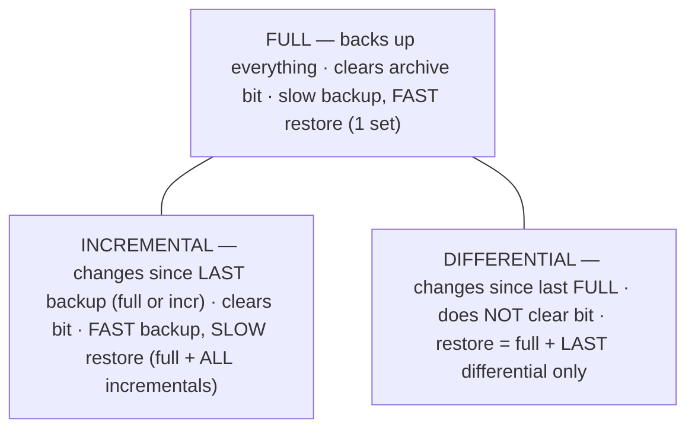
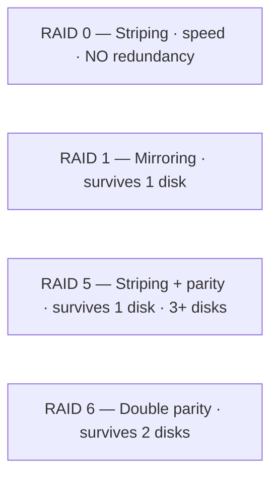

# Disaster Recovery

## Overview

Disaster recovery (DR) is about restoring IT systems and operations after a disruptive event — fire, flood, hardware failure, ransomware. The Disaster Recovery Plan (DRP) is the *tactical* component that sits inside the broader, *strategic* Business Continuity Plan (BCP): BCP keeps the business running, DRP gets the technology back. Most of this topic is comparison work — recovery sites, backup types, RAID levels, and the recovery-timeline metrics — so the exam rewards knowing the trade-offs (speed vs. cost, backup speed vs. restore speed) rather than any single definition.

## Key Concepts

### DRP vs. BCP
- **BCP** = keeping the business running (strategic, Domain 1)
- **DRP** = restoring IT after failure (tactical, Domain 7)
- DRP is a subset of BCP

### Disaster Types
- **Natural** - floods, earthquakes, hurricanes, fire
- **Human-caused** - sabotage, terrorism, accidents
- **Technical** - hardware failure, software bugs, power outage
- **Environmental** - HVAC failure, chemical spill

### Recovery Strategies (recap from BCP)
| Strategy | Recovery Time | Cost |
|----------|--------------|------|
| Hot site | Minutes-hours | Highest |
| Warm site | Hours-days | Medium |
| Cold site | Days-weeks | Lowest |
| Cloud recovery | Minutes-hours | Variable |
| Mobile site | Varies | Medium |
| Reciprocal agreement | Varies | Low (mutual agreement) |

#### Recovery site composition (what each actually contains)

Think of the fixed sites as a ladder of "how much is already in the building."

- **Cold** = the **shell only**: space, **power, HVAC, and comms wiring** — but **no equipment and no data**. Cheapest, slowest (days–weeks) because you must rack, configure, and restore everything after declaring a disaster.
- **Warm** = cold **plus hardware and network connectivity** already in place, but the **data is not current** (it's restored from backups). Middle cost, recovery in hours–days.
- **Hot** = **fully equipped plus near-real-time replicated data**. Most expensive, fastest (minutes–hours) — you essentially flip a switch.
- **Mobile** = a portable shell, stocked as cold or warm; its defining trait is **portability**, not readiness level (see below).
- **Mirror (redundant) site** = a **full, real-time duplicate** of the primary running in parallel — instant failover, the **most expensive** option. (A hot site is fast but you still cut over to it; a mirror site is already live as a twin.)

Notice that even a *cold* site lists **power and HVAC** in its definition. That is the exam point: **all recovery sites depend fundamentally on power and cooling.** Equipment and data are what vary between tiers; power and cooling are the constant.

#### Mobile site — the "data center on wheels"

A mobile site is a **self-contained data center built into a shipping container, trailer, or truck** — racks, networking, storage, HVAC, power distribution, and UPS all bolted in. You typically don't own it: you contract it from a DR vendor on a retainer, and they deliver and connect it when you declare a disaster. The defining trait is **portability**, not its readiness level — it can be stocked as cold (empty) or warm (some equipment).

Typical users are organizations that are remote or spread out (oil, mining, pipelines), field operations, disaster-relief efforts, or retail chains with many branches — and any regional disaster where nearby fixed sites have also been knocked out.

Common form factors: a **20- or 40-foot shipping container** (the industry default, weatherproof, ships by truck or rail) or a **semi-truck trailer** towed up to your site. A van fits only a tiny 1–2 rack setup; a car cannot hold racks, cooling, or power at all. The canonical image is "a data center in a shipping container on the back of a truck."

#### Why power and cooling are the real bottleneck

Servers are tiny and dense — a single server is a flat 1U or 2U "pizza box" (1U = 1.75 inches), and one ~42U rack holds 20–40 of them. **Space is rarely the constraint; power and cooling are.** One rack draws roughly **5–15 kW** (high-density up to 30–50 kW), and a packed 40-foot container can pull **100 kW up to ~1 MW** — comparable to powering hundreds of homes from one box. Every watt of compute becomes heat, so **cooling adds roughly 30–50% on top** (measured by **PUE** = total power ÷ IT power; lower is better, with the best fixed data centers near 1.1).

This is exactly why power and HVAC appear in the cold-site definition: without them the facility — or the trailer — is a useless empty shell no matter how much hardware you cram in. Powering a mobile site is the easy half (bolt on a bigger diesel generator plus UPS); **cooling is the hard part**. A portable AC won't do — real units use **CRAC/CRAH** precision cooling or **in-row** units with **hot/cold aisle containment**, and because AC only *moves* heat rather than destroying it, the heat must be rejected outside via roof condensers, an external chiller, or free cooling in cold climates. High-density loads push toward liquid cooling. Mobile recovery is often delivered as **two matched trailers: one IT container and one power/cooling container.**

#### Server form factors (so the hardware terms don't trip you)

Everything scales up from a familiar PC:

```
A PC                       →  flatten its guts into a tray  =  1 server (1U "pizza box", ~4.4 cm thick)
A network rack             →  same metal frame, filled with servers  =  server rack (42U ≈ 1.9 m, 20–40 servers)
Many racks in rows         →  a data center
A few racks in a container →  a mobile site
```

A **server is essentially a flattened PC** — same parts (CPU, RAM, storage, NIC), just wider, flatter, more powerful, and managed remotely. A **server rack** is the same frame as a network rack, filled with servers instead of switches. Two server styles to keep straight:

- **Rack server** ("pizza box") — a complete, self-contained server in a flat 1U/2U case with its own power, cooling, and NICs; stacks horizontally.
- **Blade server** — a slim server-card with **no** power, cooling, or networking of its own; it slots vertically into a shared **chassis** that provides those. Higher density, named for its thin blade-like shape.

### Backup Strategies
| Type | What's Backed Up | Speed | Restore Time |
|------|-----------------|-------|--------------|
| **Full** | Everything | Slowest backup | Fastest restore |
| **Incremental** | Changes since last backup (any type) | Fastest backup | Slowest restore (need all incrementals) |
| **Differential** | Changes since last full backup | Medium | Medium (need last full + last differential) |

### Off-site Data Strategies (exam terms)
- **Electronic vaulting** - **bulk transfer of database backups** (whole files/batches) to an **off-site** recovery location, periodically. Answer to "under what method are database backups bulk transferred off-site?"
- **Remote journaling** - transfers the **transaction logs/journals** (not the whole DB) off-site, more frequently → smaller RPO than vaulting.
- **Remote mirroring** - a live, real-time copy of the database maintained off-site (most expensive, smallest RPO).

### Tape Rotation (GFS)
- **Grandfather-Father-Son (GFS)** - the classic tape-reuse scheme. Daily backups = **Son**, weekly = **Father**, monthly = **Grandfather**. It balances **retention against media cost** by reusing the most frequent tapes soonest and keeping older ones longer.

### Backup Best Practices
- **3-2-1 Rule** - 3 copies, 2 different media, 1 offsite
- **Validate backups with periodic test restores** - a backup is only good if it actually restores; pair with checksums to confirm integrity
- Test restores regularly
- Encrypt backups
- Protect backup media to same level as source data
- Consider RPO when choosing backup frequency

### RAID Levels
| Level | Description | Fault Tolerance | Minimum Disks |
|-------|-------------|-----------------|---------------|
| RAID 0 | Striping (no redundancy) | None | 2 |
| RAID 1 | Mirroring | 1 disk failure | 2 |
| RAID 5 | Striping with parity | 1 disk failure | 3 |
| RAID 6 | Striping with double parity | 2 disk failures | 4 |
| RAID 10 | Mirroring + striping | 1 disk per mirror | 4 |

### High Availability Concepts
- **Failover** - automatic switch to backup system
- **Clustering** - multiple systems acting as one; if a node fails the others take over (failover)
- **Load balancing** - distributing traffic across servers
- **Redundancy** - duplicate components (power, network, servers)

#### Spares (replacement readiness)
- **Cold spare** - sits on the shelf; must be **installed** before use (slowest)
- **Warm spare** - installed and standby, but requires a **manual switch-over**
- **Hot spare** - live and **automatically** takes over on failure (fastest)

#### Reliability metrics (don't confuse with RTO/RPO)
- **MTBF** (Mean Time Between Failures) - average uptime between failures; a **reliability** measure (higher is better)
- **MTTR** (Mean Time To Repair) - average time to fix a failed component (lower is better)
- These are **measured averages** of hardware behavior; **RTO/RPO/MTD** are **tolerances** the business sets. Don't swap them.

### Failure Modes
- **Fail-safe** - prioritizes **life safety**; defaults **open/unlocked** (doors unlock on a fire alarm so people can exit). "Fail-open" = available/unlocked.
- **Fail-secure** - prioritizes **asset protection**; defaults **locked/denied** (doors lock, data stays protected). "Fail-closed" = blocked/locked.
- **Fail-soft** - on failure the system keeps running in a **degraded/reduced mode** instead of shutting down completely.
- Match to the question: is **life** or the **asset** being prioritized?

### DRP Key Components
A disaster recovery plan typically documents: **response** (declaration/activation), **personnel and notification** (who is called, call trees), **communications**, **assessment** (damage/impact), **restoration** (recovery procedures), and **training plus lessons-learned**.

## Exam Tips

- **RAID 0** provides NO fault tolerance (performance only)
- **RAID 5** is most common for balanced performance and redundancy
- **Incremental** backup = fastest backup, slowest restore
- **Full** backup = slowest backup, fastest restore
- **Reciprocal agreements** are the cheapest but least reliable DR option
- Test backups by **restoring** them, not just running them

## Diagrams

### Backup Types — What Each Captures



**Takeaway:** **Incremental** = fast backup / slow restore (needs full + every incremental). **Differential** = slower backup / fast restore (full + last one). The archive bit is the tell: full & incremental clear it; differential doesn't.

### RAID Levels



**Takeaway:** RAID 5 survives 1 disk, RAID 6 survives 2. RAID = availability, NOT a backup.

### Recovery Timeline — Gantt

> Gantt shows durations on a timeline — good for RTO/WRT fitting inside MTD.

```mermaid
gantt
    title Disaster Recovery — must fit inside MTD
    dateFormat HH:mm
    axisFormat %H:%M
    section Disruption
    Incident occurs (RPO = data lost before this) :milestone, m1, 00:00, 0m
    section Recovery
    RTO - restore systems/infrastructure :a1, 00:00, 5h
    WRT - verify data and resume work :a2, after a1, 3h
    section Constraint
    MTD - max tolerable downtime (8h) :crit, a3, 00:00, 8h
```



**Takeaway:** **RTO + WRT must be ≤ MTD.** RPO = how much data you can lose (gap before the incident).

## Related Topics

- [Business Continuity Planning](../01-security-and-risk-management/Business%20Continuity%20Planning.md) - DRP falls under BCP
- [Security Operations Concepts](Security%20Operations%20Concepts.md) - operational resilience
- [Data Retention and Destruction](../02-asset-security/Data%20Retention%20and%20Destruction.md) - backup retention
