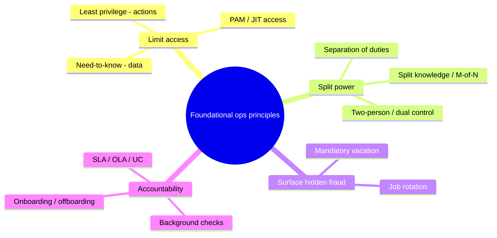

# Foundational Security Operations Principles

## Overview

These are the administrative controls that govern *who can do what* in daily operations, and they exist for one overriding reason: to stop any single person from having enough access — or enough unchecked time — to commit and conceal fraud or error. Need-to-know and least privilege keep access small; separation of duties and two-person control split dangerous power across people; job rotation and mandatory vacation make hidden wrongdoing surface; privileged account management puts a fence around the most dangerous accounts; SLAs hold service levels accountable. The exam tests these as precise one-line discriminators (least privilege vs need-to-know, job rotation vs mandatory vacation, separation vs dual control), so the value is in crisp definitions and knowing which control answers which scenario.

## Key Concepts

### Need-to-know vs least privilege

Both shrink access, but along different axes:

- **Need-to-know** governs **data/information**: you get access only to the specific information required for your task, even within a clearance level. A Top Secret clearance does not grant every Top Secret document — only those you need to know.
- **Least privilege** governs **rights/permissions/actions**: you get the minimum permissions (and only for as long as) needed to do the job. It's the broader principle; need-to-know is essentially least privilege applied to information.

Tie-in: **privilege creep** is the slow accumulation of rights as people change roles without old access being revoked — the enemy of least privilege, caught by periodic **access reviews/recertification**.

### Separation of duties (SoD)

Split a sensitive process so **no single person can complete it alone**. The classic example: the person who *requests* a payment cannot also *approve* it; the developer who *writes* code cannot also *deploy* it to production. SoD makes fraud require **collusion** (two people conspiring), which is harder and riskier for the wrongdoers. It's a *preventive* control.

### Two-person control / dual control / M of N

A stricter cousin of SoD: a single critical action **requires two (or more) authorized people acting together** at the same time — launching a missile, opening a vault, recovering a root key. **Split knowledge** is the related idea where no one person holds the whole secret (each holds half a combination); **M-of-N control** generalizes it (any *M* of *N* key-holders must combine their shares). SoD splits *different steps* across people; dual control requires *two people for the same step*.

### Job rotation

Periodically move people between roles. Two benefits: it **detects** fraud/errors (a successor inherits and may spot a predecessor's wrongdoing) and it **cross-trains** staff so no single person is irreplaceable (reducing the risk of a knowledge monopoly). It's primarily a *detective* control with a continuity bonus.

### Mandatory vacation

Force employees in sensitive roles to take time **away** (typically a continuous block, e.g., one to two weeks) during which **someone else covers their duties**. Ongoing fraud often requires constant tending — falsified records, suppressed alerts — so an enforced absence lets a substitute surface what's hidden. It's a *detective* control. Distinguish from job rotation: rotation **moves people between jobs over time**; mandatory vacation **removes one person temporarily** so a fill-in can find irregularities.

### Privileged Account Management (PAM)

Admin/root/service accounts are the highest-value targets because they bypass normal controls, so they get special handling beyond ordinary least privilege:

- **Inventory and minimize** privileged accounts; avoid shared admin logins.
- **Vaulting and check-out** of privileged credentials (passwords retrieved per use, then rotated).
- **Just-in-time (JIT) access** — elevate only for the moment needed, then revoke (standing privilege is the risk).
- **Session recording and enhanced logging** of privileged activity for accountability.
- **MFA** on all privileged access.
- Separate admin accounts from daily-use accounts (don't browse email as domain admin).

PAM is least privilege + monitoring concentrated on the accounts that can do the most damage.

### Supporting operational practices

- **Service Level Agreements (SLAs)** — a contract defining measurable service expectations (uptime %, response/resolution times, support hours) and remedies/penalties for missing them. They make outsourced or internal service levels **accountable and enforceable**. Related: **OLA** (Operational Level Agreement — internal, between teams) and **UC/UA** (Underpinning Contract with an external supplier).
- **Background checks / screening** before granting access to sensitive roles.
- **NDAs and acceptable use policies** as conditions of access.
- **Onboarding/transfer/offboarding** discipline — provision least privilege on entry, re-baseline on transfer (kill privilege creep), and revoke promptly on exit.

## Common traps / easily confused

- **Least privilege vs need-to-know.** Least privilege limits **actions/permissions**; need-to-know limits access to **information**. Need-to-know is least privilege applied to data.
- **Separation of duties vs two-person/dual control.** SoD splits **different steps** of a process so one person can't finish it alone (preventive, defeated only by collusion). Dual control requires **two people for the same single action**.
- **Job rotation vs mandatory vacation.** Both detect fraud by forcing a substitute in. Rotation **moves people between roles over time** (plus cross-training); mandatory vacation **forces a temporary absence** so a fill-in surfaces hidden activity.
- **Split knowledge vs dual control.** Split knowledge = no one holds the whole secret; dual control = two people must act together. Often combined.
- **Preventive vs detective among these.** Separation of duties and least privilege/PAM = **preventive**; job rotation and mandatory vacation = **detective**.
- **Privilege creep** is the failure mode of least privilege over time; **access recertification** is the fix.
- **SLA vs OLA.** SLA is the service commitment (often with an external party); OLA is the internal team-to-team agreement that supports it.

## Exam Tips

- "Access only to the data you need" = **need-to-know**; "minimum permissions" = **least privilege**.
- A process no single person can complete alone = **separation of duties**; fraud then needs **collusion**.
- One action requiring two people together = **dual / two-person control**.
- "Detect a fraud being actively maintained" → **mandatory vacation**; "rotate staff to detect and cross-train" → **job rotation**.
- Admin/root accounts → **PAM** (vaulting, JIT, session recording, MFA, separate accounts).
- **SLA** is the answer for measurable, enforceable service expectations.
- Watch for **privilege creep**; remediate with periodic **access reviews/recertification**.

## Diagrams

### Foundational Operations Principles

> Grouped by the job each control does — limiting access, splitting power, surfacing fraud.

**Takeaway:** SoD and least privilege/PAM are *preventive*; job rotation and mandatory vacation are *detective*. Need-to-know limits data; least privilege limits actions.

## Related Topics

- [Security Operations Concepts](Security%20Operations%20Concepts.md) - where these were first introduced
- [Change and Configuration Management](Change%20and%20Configuration%20Management.md) - SoD in the deploy pipeline
- [Personnel Security](../01-security-and-risk-management/Personnel%20Security.md) - screening, onboarding/offboarding
- [Authorization and Accountability](../05-identity-and-access-management/Authorization%20and%20Accountability.md) - least privilege in access control
