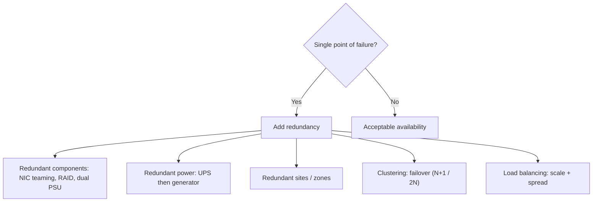
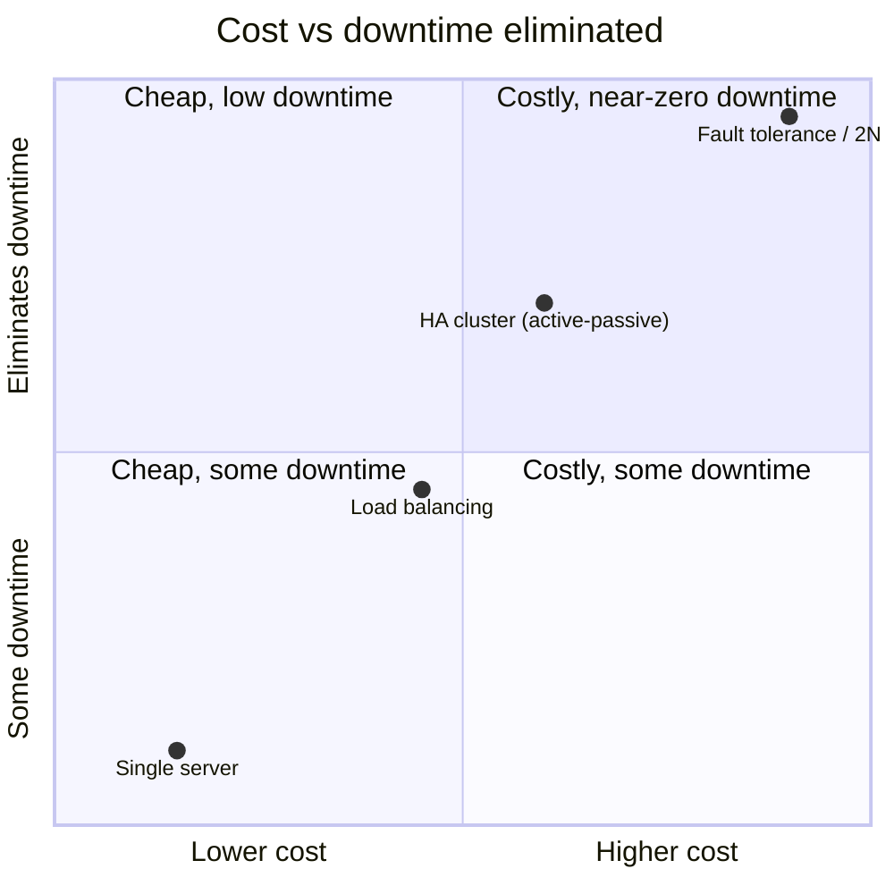

# High Availability and System Resilience

## Overview

Disaster recovery is what you do *after* something breaks; resilience is engineering so that a single failure never becomes an outage in the first place. High availability (HA) keeps a service reachable despite failed components by building in redundancy, automatic failover, and graceful degradation. This note is the "design it not to fall over" side of operations — redundancy, clustering, load balancing, fault tolerance, quality of service, and the supporting power/environmental controls — alongside the metrics that quantify it. The exam tests the vocabulary distinctions (HA vs fault tolerance, clustering vs load balancing, MTBF vs MTTR vs the business's RTO/RPO) and one durable idea: redundancy removes **single points of failure**, but it costs money, so you spend it where availability requirements justify it.

## Key Concepts

### Availability, HA, and fault tolerance

- **Availability** is the proportion of time a service is usable, often quoted in "nines": **99.9%** ≈ 8.8 hours of downtime per year, **99.999%** ("five nines") ≈ 5 minutes per year. More nines costs exponentially more.
- **High availability** designs the system to *minimize* downtime through redundancy and fast failover — there may be a brief interruption during cutover.
- **Fault tolerance** is stricter: the system keeps running through a component failure with **no interruption at all** (e.g., RAID 1, redundant power supplies, ECC memory). Fault tolerance aims for zero downtime; HA aims for very little.

### Eliminating single points of failure (SPOF)

A **single point of failure** is any one component whose failure takes down the whole service. Resilience is largely the hunt for SPOFs and the addition of redundancy:

- **Redundant components** — dual power supplies, **multiple NICs (NIC teaming)**, redundant disks (RAID), redundant network paths.
- **Redundant power** — **UPS** bridges short outages and conditions power; **generators** carry long ones; **dual utility feeds** and **redundant PDUs** remove the supply SPOF.
- **Redundant facilities** — multiple sites / availability zones so one building or region failing doesn't end service.
- **N+1 / N+M / 2N redundancy** — N+1 means one spare beyond the minimum needed; 2N means a fully duplicated parallel system. More redundancy, more cost.

### Clustering vs load balancing (a common mix-up)

Both use multiple servers, but for different primary goals:

- **Clustering** — multiple nodes act as one logical system; if a node fails, the others **take over its work (failover)**. Primary goal: **availability/redundancy**. Can be **active-active** (all nodes serve, sharing load) or **active-passive** (a standby waits to take over).
- **Load balancing** — a load balancer distributes incoming requests across servers. Primary goal: **performance/scalability** (and it also removes a server as a SPOF as a side effect).

In practice they're combined, but if a stem stresses *failover/continued operation*, that's clustering; if it stresses *spreading traffic/scaling*, that's load balancing.

### Replication and storage resilience

- **RAID** provides disk fault tolerance (RAID 1 mirroring survives a disk; RAID 5 survives one disk via parity; RAID 6 survives two). **RAID is availability, not a backup** — it doesn't protect against deletion, corruption, or ransomware.
- **Synchronous replication** writes to primary and replica together (zero data loss, distance-limited by latency); **asynchronous replication** lags slightly (small data-loss window, works over distance). Choose by RPO vs distance.
- **Spares** stage replacement readiness: **cold spare** (on the shelf, must be installed), **warm spare** (installed, manual cutover), **hot spare** (live, automatic takeover).

### Quality of Service (QoS)

**QoS** is the set of network mechanisms that guarantee performance for critical traffic when bandwidth is contended — prioritizing latency-sensitive flows (VoIP, video, control traffic) over bulk transfers. It manages **bandwidth, latency, jitter, and packet loss** so that important services stay usable under load. In a resilience context, QoS is how you keep priority services responsive during partial degradation or a traffic surge; it's availability/performance assurance at the network layer, not a confidentiality control.

### Resilience metrics (don't confuse with business tolerances)

- **MTBF (Mean Time Between Failures)** — average uptime between failures of a repairable component; a **reliability** measure (higher is better).
- **MTTF (Mean Time To Failure)** — same idea for non-repairable items (you replace, not repair).
- **MTTR (Mean Time To Repair/Restore)** — average time to fix a failed component (lower is better).

These are **measured averages of hardware behavior**. Contrast with **RTO/RPO/MTD**, which are **tolerances the business sets** (how much downtime/data loss is acceptable). The exam loves to swap them: MTBF/MTTR describe the equipment; RTO/RPO/MTD describe the requirement.

### Graceful failure and trusted recovery

- **Fail-soft (fail-degraded)** — on failure, keep running in a reduced mode rather than dying completely (drop non-essential functions, preserve the core).
- **Fail-safe** vs **fail-secure** — on failure, default to **life safety** (open/unlocked) or to **asset protection** (closed/locked) respectively; pick by whether **people** or the **asset** is prioritized.
- **Trusted recovery** — after a crash, the system must return to a **secure state**, not an exploitable one. A **fail-secure** software state denies access on failure rather than defaulting open.

## Common traps / easily confused

- **HA vs fault tolerance.** HA minimizes downtime (brief cutover allowed); fault tolerance tolerates a failure with **no interruption**.
- **Clustering vs load balancing.** Clustering = failover/availability (nodes cover for each other); load balancing = distribute traffic/scale. Often combined.
- **MTBF/MTTR vs RTO/RPO/MTD.** Measured hardware averages vs business-set tolerances. Don't swap them.
- **RAID is not a backup.** It survives disk failure but not deletion, corruption, or ransomware.
- **Synchronous vs asynchronous replication.** Synchronous = zero data loss but distance-limited; asynchronous = small RPO gap but works far away.
- **Active-active vs active-passive cluster.** Active-active shares load across live nodes; active-passive keeps a standby idle until failover.
- **QoS is performance assurance**, not security — it prioritizes critical traffic, it doesn't protect confidentiality.
- **Fail-safe vs fail-secure.** Life safety (open) vs asset protection (closed).

## Exam Tips

- **Single point of failure** is the thing redundancy exists to remove — name it and add N+1/2N.
- **Fault tolerance = no downtime**; **HA = minimal downtime** with failover.
- "Nodes take over for a failed node" = **clustering**; "spread requests across servers" = **load balancing**.
- **MTBF** (uptime between failures) and **MTTR** (repair time) are **measured**; **RTO/RPO/MTD** are **business tolerances**.
- **RAID ≠ backup**; replication choice (sync/async) is driven by **RPO vs distance**.
- **QoS** guarantees performance for priority traffic (VoIP) under contention.
- **UPS** for short outages, **generator** for long ones.

## Diagrams

### Eliminating Single Points of Failure

> Resilience is the hunt for SPOFs and the redundancy added to remove them.

### Availability Approaches — Cost vs Downtime

> Trade-off: more nines costs exponentially more; fault tolerance aims for zero downtime.

**Takeaway:** HA minimizes downtime (brief cutover); fault tolerance tolerates a failure with no interruption. Clustering = failover; load balancing = scale.

## Related Topics

- [Disaster Recovery](Disaster%20Recovery.md) - recovery after failure, RAID, spares, sites
- [Business Continuity Planning](../01-security-and-risk-management/Business%20Continuity%20Planning.md) - RTO/RPO/MTD tolerances
- [Network Performance and Traffic Management](../04-communication-and-network-security/Network%20Performance%20and%20Traffic%20Management.md) - QoS detail
- [Disaster Recovery Testing and Exercises](Disaster%20Recovery%20Testing%20and%20Exercises.md) - validating resilience
