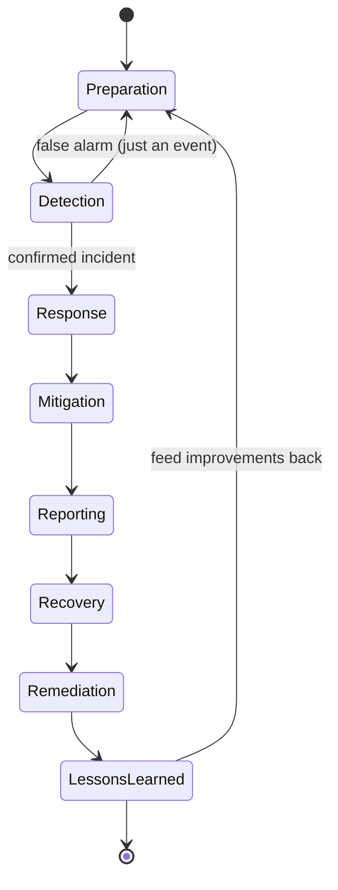
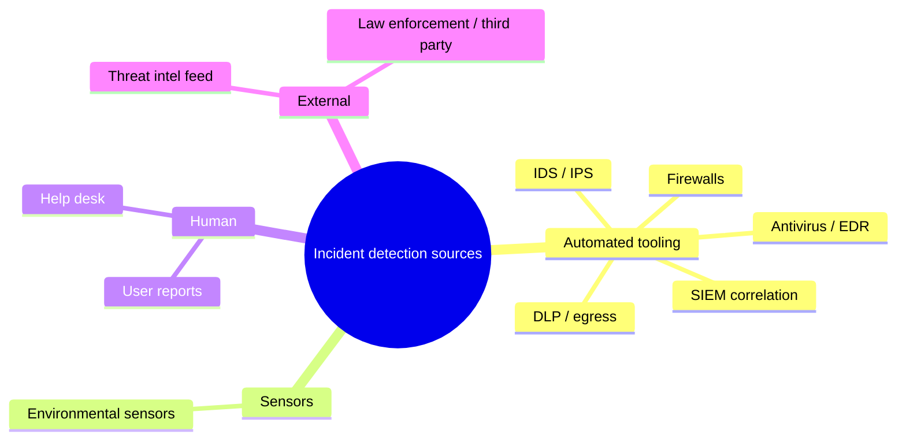

# Incident Response

## Overview

Incident response is the structured, pre-planned approach to handling a security incident from first detection through recovery and lessons learned. The point of structure is to keep a stressed team making good decisions under pressure: knowing the phase order ahead of time stops people from skipping containment, destroying evidence, or forgetting to notify the right parties. The exam tests the *order* of the phases and a few hard rules — contain before you eradicate, and people's safety before anything else.

## Key Concepts

### Incident Response Phases (NIST SP 800-61)
1. **Preparation** - develop plans, train team, acquire tools
2. **Detection and Analysis** - identify and confirm an incident
3. **Containment, Eradication, and Recovery**
   - **Containment** - limit the damage (short-term and long-term)
   - **Eradication** - remove the root cause (malware, vulnerability)
   - **Recovery** - restore systems to normal operation
4. **Post-Incident Activity** - lessons learned, report, improve

### (ISC)² Incident Management Lifecycle (seven steps)

The (ISC)² CBK breaks response into a finer-grained sequence than NIST's four phases. Know the order and what each step does:

1. **Detection** - identify that something is wrong (SIEM/IDS/DLP alert, user report); triage an *event* into a confirmed *incident*.
2. **Response** - activate the IR team and begin structured handling.
3. **Mitigation (containment)** - **stop the bleeding**: isolate the host, block the IP, disable the account. Short-term containment buys time; long-term containment stabilizes before eradication.
4. **Reporting** - notify the right parties (management, legal, regulators, customers). Reporting runs **throughout**, driven by legal deadlines (GDPR = 72 hours).
5. **Recovery** - restore systems from known-good backups/images and validate they're clean before returning to production.
6. **Remediation (eradicate root cause)** - fix the underlying weakness so it can't recur: patch the vuln, remove the malware/backdoor, close the misconfiguration.
7. **Lessons Learned** - analyze the incident and the response; produce a report and concrete improvements that feed back into **Preparation**.

> **Mitigation vs remediation:** mitigation/containment limits damage *now* (isolate the box); remediation removes the *root cause* so it won't recur (patch the flaw). Containing without remediating leaves the door open.

### Incident Response Team (IRT/CSIRT)
- Cross-functional team (security, IT, legal, HR, communications, management)
- Should have clear roles and authority
- Management must support with resources and authority
- Regular training and tabletop exercises

### Incident Classification
- **Event** - any observable occurrence (not necessarily bad)
- **Alert** - notification that warrants investigation
- **Incident** - confirmed security violation or threat
- Triage based on severity, scope, and impact

### Key Incident Response Concepts
- **First responder** - preserve the scene, don't alter evidence
- **Chain of custody** - documented handling of evidence
- **Containment strategy** - balance damage limitation with evidence preservation
- **Communication plan** - who to notify (management, legal, regulators, customers)
- Regulatory breach notification requirements (GDPR = 72 hours)

### Indicators of Compromise (IoCs)
- Unusual network traffic patterns
- Unexpected system changes
- Unknown processes or services
- Failed login attempts
- Data exfiltration patterns

### Common Detection Sources
SIEM, IDS/IPS, DLP, antivirus/EDR, firewalls, environmental sensors, and **user reports**.

## Exam Tips

- **Preparation** is the most important phase (done before incidents happen)
- **Containment** comes before eradication (stop the bleeding first)
- **Lessons learned** is critical - prevents repeating mistakes
- **Safety of people** always comes first during any incident
- Know breach notification requirements for different regulations

## Common traps

- **Event vs. incident.** An *event* is any observable occurrence (a login, a packet); an *incident* is a confirmed violation or imminent threat. Most events are never incidents.
- **Containment before eradication before recovery.** Stop the spread first, then remove the root cause, then restore. Jumping to "rebuild the server" before containing leaves the attacker active.
- **Don't pick "shut it down immediately" if evidence matters.** Containment must balance stopping damage against preserving evidence; pulling the plug can destroy volatile RAM evidence.
- **NIST's four phases bundle containment, eradication, and recovery into one phase.** Other models (e.g., SANS) list six steps. If answer choices differ in count, check which framework the question names.

## Diagrams

### Incident Response — State Diagram

> State diagrams show how a process moves between phases (and loops back).

**Takeaway:** Detect → Respond → **Mitigate/Contain** → Report → Recover → **Remediate (root cause)** → Lessons Learned (loops back to Preparation). Event ≠ incident.

### Detection Sources

> Where the first signal of an incident actually comes from — not just tooling.

**Takeaway:** Detection is not only the SIEM — a user report is one of the most common (and earliest) sources. Triage the event before declaring an incident.

## Related Topics

- [Digital Forensics](Digital%20Forensics.md) - investigation during/after incidents
- [Investigations and Evidence](Investigations%20and%20Evidence.md) - legal aspects
- [Business Continuity Planning](../01-security-and-risk-management/Business%20Continuity%20Planning.md) - if incident escalates to disaster
- [Log Management and Monitoring](../06-security-assessment-and-testing/Log%20Management%20and%20Monitoring.md) - detection source
