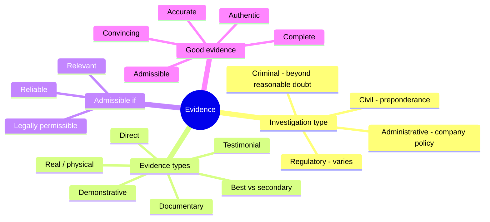

# Investigations and Evidence

## Overview

This topic covers the legal and procedural side of investigations: what kind of investigation you're running, what counts as evidence, and what makes that evidence usable in a proceeding. The key idea is that the *type* of investigation sets the rules — a criminal case demands the highest standard of proof and the strictest evidence handling, while an internal HR investigation runs on company policy. Get the investigation type right and the rest (standard of proof, whether you need a warrant, how carefully evidence must be handled) follows from it.

## Key Concepts

### Investigation Types
| Type | Purpose | Standard of Proof |
|------|---------|------------------|
| **Criminal** | Prosecute a crime | Beyond a reasonable doubt |
| **Civil** | Resolve disputes, seek damages | Preponderance of the evidence |
| **Regulatory** | Verify compliance | Varies by regulation |
| **Administrative** | Internal HR/policy violation | Company policy |

### Types of Evidence
| Type | Description | Strength |
|------|-------------|----------|
| **Real/Physical** | Tangible objects (hardware, printouts) | Strong |
| **Direct** | Testimony based on a witness's own five senses (no inference needed) | Variable |
| **Documentary** | Written records, logs, contracts | Strong (with authentication) |
| **Testimonial** | Witness statements | Variable |
| **Demonstrative** | Used to illustrate (charts, models) | Supporting |
| **Best Evidence** | Original document preferred over copies | Strongest |
| **Secondary** | Copies when original unavailable | Weaker |

### Evidence Admissibility Requirements
- **Relevant** - must relate to the case
- **Reliable** - obtained through sound methods
- **Sufficient** - enough to support the claim
- **Authentic** - proven to be genuine (chain of custody)
- **Legally obtained** - proper authorization (warrants for law enforcement)

The three core criteria that make evidence **admissible**: **Relevant**, **Reliable** (competent), and legally **Permissible** (lawfully obtained).

### Five Qualities of Good Evidence
**Authentic, Accurate, Complete, Convincing, Admissible.** (Distinct from the admissibility criteria above — this is the broader checklist for evidence that will actually persuade.)

### MOM (investigative motive analysis)
To tie a suspect to a crime, establish **Motive, Opportunity, and Means (MOM)** - why they did it, the chance to do it, and the capability/tools to do it.

### Key Legal Concepts
- **Entrapment** - inducing someone to commit a crime they wouldn't otherwise (illegal)
- **Enticement** - making a crime easier to detect (legal - honeypots)
- **Search and seizure** - Fourth Amendment protections (law enforcement needs warrants)
- **Due process** - fair treatment through normal judicial processes
- **Liability** - legal responsibility for actions or inactions
- **Negligence** - failure to exercise due care

### Ethics of Investigation
- Protect privacy rights of individuals
- Follow organizational policies
- Involve legal counsel early
- Document everything
- Don't exceed your authority

## Exam Tips

- **Entrapment** is illegal; **enticement** is legal (honeypots = enticement)
- **Criminal** cases require the highest standard of proof (beyond reasonable doubt)
- **Best evidence rule** - always present the original when possible
- Chain of custody must be **unbroken** for evidence to be admissible
- Private organizations generally don't need warrants for internal investigations

## Common traps

- **Entrapment vs. enticement.** Entrapment *induces* someone to commit a crime they wouldn't have otherwise (illegal); enticement makes an already-willing offender's crime easier to catch (legal — honeypots).
- **Standard of proof by case type.** Criminal = beyond a reasonable doubt (highest); civil = preponderance of the evidence (more likely than not). Don't swap them.
- **"Best evidence" means the original, not the strongest argument.** The best evidence rule prefers the original document over a copy.
- **Warrants are a law-enforcement constraint.** Fourth Amendment search-and-seizure rules bind *government* investigators; a private employer investigating its own systems generally does not need a warrant.

## Diagrams

### Investigations and Evidence

> Taxonomy: the investigation type sets the standard of proof; the rest follows from it.

**Takeaway:** Criminal demands the highest proof (beyond reasonable doubt) and strictest handling; "best evidence" means the original document, not the strongest argument.

## Related Topics

- [Digital Forensics](Digital%20Forensics.md) - technical investigation
- [Incident Response](Incident%20Response.md) - investigations follow incidents
- [Compliance and Legal Issues](../01-security-and-risk-management/Compliance%20and%20Legal%20Issues.md) - legal framework
- [Laws and Regulations](../01-security-and-risk-management/Laws%20and%20Regulations.md)
