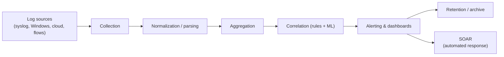

# Logging and Monitoring

## Overview

Logging is recording what happened; monitoring is watching those records (and live signals) for trouble. Operations lives or dies on this pair: without good logs you can't detect an attack, hold anyone accountable, or prove what occurred afterwards — and without monitoring, the logs just pile up unread. This note is the operational deep dive. It assumes you already know *what* a log is and focuses on the machinery that makes logging trustworthy and useful at scale: centralizing and normalizing logs in a SIEM, watching data *leaving* the network (egress monitoring), feeding the whole thing with threat intelligence, and adding behavior analytics (UEBA) on top. The exam reliably tests the supporting disciplines — central collection, tamper protection, synchronized time, retention — more than raw definitions, because those are what separate logs that survive a courtroom from logs an attacker quietly edited.

## Key Concepts

### Why centralize logs

Leaving logs on each host is the default and the weakest option. The moment an attacker lands on a box, the local log is theirs to edit or delete — and the host that's compromised is exactly the one whose log you most need to trust. Shipping logs to a central, separate system the instant they're written gives you four things at once:

- **Tamper resistance** — the attacker on the host can't reach the copy already off the box.
- **Correlation** — events from firewall, endpoint, and authentication server only tell a story when they sit side by side.
- **Availability and retention** — a single place to apply retention policy, search, and back up.
- **Survivability** — if the host is wiped or rebuilt, its history still exists.

Write-once / **WORM** storage (or append-only stores) hardens this further: even an admin can't rewrite history.

### SIEM — the correlation engine

A **SIEM (Security Information and Event Management)** is the single tool that collects logs enterprise-wide, **correlates** them, and **alerts** in real time. Two halves are baked into the name: **SIM** (security *information* management — long-term storage, retention, reporting/compliance) and **SEM** (security *event* management — real-time collection, correlation, alerting). Its pipeline is worth memorizing:

1. **Collection** — agents or collectors pull/receive logs from every source (syslog, Windows Event Log, cloud APIs, network flows).
2. **Normalization / parsing** — convert wildly different formats into one common schema so a "username" field means the same thing whether it came from a VPN or a domain controller. Without normalization you cannot correlate.
3. **Aggregation** — combine duplicate/related entries to cut volume.
4. **Correlation** — apply rules (and increasingly ML) across sources: a failed-login burst *plus* a successful login *plus* a new outbound connection becomes one alert, not three noisy ones.
5. **Alerting and dashboards** — surface what matters to analysts; feed SOAR for automated response.
6. **Retention** — store for the policy/legal window, then dispose securely.

> **SIEM vs SOAR:** SIEM **detects** (collect, correlate, alert). SOAR **responds** (orchestrates and automates the playbook after the alert). They sit next to each other; don't pick SIEM when the stem asks for *automated response*.

### Tuning: false positives, false negatives, and clipping

A SIEM that alerts on everything trains analysts to ignore it (alert fatigue). Tuning balances two errors: a **false positive** (alert with no real incident — wastes time) and a **false negative** (a real incident with no alert — the dangerous one). A **clipping level** is a fixed threshold below which events are ignored (e.g., only alert after the 3rd failed login) — a *non-statistical* data-reduction method, as opposed to statistical **sampling** of a representative subset.

### Continuous monitoring

Continuous monitoring (NIST **SP 800-137**) is maintaining ongoing awareness of your security posture rather than checking it once a year. In practice it blends automated vulnerability scanning, configuration/compliance checks, log analysis, and real-time alerting into a steady feed so drift and new exposures surface quickly. The point is currency: a control verified in January tells you nothing about June. It underpins ongoing authorization (RMF) — security state is watched perpetually instead of re-assessed only at re-authorization.

### Egress (and ingress) monitoring

Most monitoring instinctively watches what comes *in*. **Egress monitoring** watches what goes *out*, and it's where you catch the things that matter most after a breach: **data exfiltration**, malware **command-and-control (C2)** beacons, and policy violations. Tools and signals:

- **DLP (Data Loss Prevention)** inspects outbound content for sensitive data (PII, card numbers, "confidential" markings) and blocks or alerts.
- **Outbound firewall / proxy rules and web filtering** restrict where hosts may talk; unexpected destinations or protocols stand out.
- **Watching for covert channels and tunneling** — data hidden in DNS queries, ICMP payloads, or steganography, and **encrypted exfil** to unknown endpoints.
- **Network flow analysis** — a workstation suddenly uploading gigabytes at 3 a.m. is an egress red flag even if the content is encrypted.

The mental model: ingress monitoring stops attackers getting in; egress monitoring stops your data getting out (and catches the attacker who's already in).

### Threat intelligence feeds

Threat intelligence is curated knowledge about adversaries that you *feed into* your monitoring so it can recognize known-bad faster. Operationally it shows up as:

- **Feeds of IoCs** (malicious IPs, domains, file hashes) auto-imported into the SIEM/firewall/EDR to flag matches.
- **STIX/TAXII** — the standard format (STIX) and transport protocol (TAXII) for sharing structured threat intel between organizations and tools.
- **Sharing communities** — **ISACs** (sector-specific Information Sharing and Analysis Centers), commercial vendors, government feeds, OSINT.

Recall the durability point: **IoCs** are the easily-changed "what" of an attack; **TTPs** are the harder-to-change "how." Feeds heavy on IoCs go stale fast; detections anchored to TTPs (mapped to **MITRE ATT&CK**) last longer. Good intel is **actionable**, not just interesting.

### UEBA — behavior analytics

**UEBA (User and Entity Behavior Analytics)** baselines what *normal* looks like for each user and device, then flags **anomalies** — a finance clerk suddenly touching source-code repos, an account logging in from two countries an hour apart, a server beaconing to a new host. It catches what signature rules miss: **insider threat**, **compromised/abused credentials**, and slow low-and-slow activity that never trips a fixed threshold. Where a SIEM rule asks "did this known-bad pattern occur?", UEBA asks "is this different from this entity's normal?" Modern SIEM/XDR platforms increasingly fold UEBA in.

### Time synchronization (the glue)

None of the above works if clocks disagree. **NTP** keeps every device on a common reference so the SIEM can stitch events into one timeline, forensic timelines hold up, and Kerberos/certificate validity windows behave (Kerberos rejects tickets past ~5 minutes of skew). Skewed clocks scramble the order of events and are themselves an attacker tactic to hide a sequence. Treat synchronized time as a prerequisite for correlation, not a nicety.

### Retention and disposal

Keep logs long enough to investigate incidents and satisfy law/regulation, then dispose of them securely. Too short and you lose evidence of a breach that's discovered months later (dwell time is often long); too long and you carry storage cost and discovery/privacy liability. **Circular overwrite** (oldest entries overwritten when a log fills) silently destroys evidence unless logs are shipped/archived first — the fix is larger buffers plus central aggregation before rotation.

## Common traps / easily confused

- **SIEM vs SOAR.** SIEM detects and alerts; SOAR automates the response playbook. "Automatically contain the host across our tools" → SOAR.
- **Egress vs ingress monitoring.** Egress watches outbound (exfiltration, C2) — the post-breach catch; ingress watches inbound intrusions. DLP is primarily an egress control.
- **IoC vs TTP.** IoC = easily-changed indicators (IP/hash/domain); TTP = durable attacker behavior. TTP-based detection ages better.
- **UEBA vs signature detection.** UEBA flags deviation from a learned baseline (good for insiders/compromised accounts); signature/correlation rules match known patterns.
- **Normalization vs aggregation.** Normalization = converting formats into one schema (enables correlation); aggregation = collapsing duplicate events (cuts volume). Different jobs.
- **Clipping level vs sampling.** Clipping = non-statistical threshold to ignore low-level events; sampling = statistical representative subset.
- **Logging ≠ monitoring.** Recording events isn't the same as reviewing them. A reviewed log detects; an unreviewed log only provides after-the-fact evidence.

## Exam Tips

- Centralize logs to a **separate** system immediately — protects integrity and enables correlation.
- **Time sync (NTP)** is the prerequisite for any cross-system correlation or forensic timeline.
- A SIEM's distinctive value is **correlation across sources**, not just storage.
- **Egress monitoring / DLP** is the answer for catching **data exfiltration**.
- Threat intel must be **actionable**; share it via **STIX/TAXII** and **ISACs**.
- **UEBA** = anomaly-from-baseline; best fit for **insider threat** and **compromised accounts**.
- Continuous monitoring = **NIST SP 800-137**; supports ongoing authorization.

## Diagrams

### SIEM Pipeline

> How raw logs become a single actionable alert — flowchart of the SIEM stages.

**Takeaway:** Normalization (one schema) is what makes correlation possible. SIEM ends at the alert; SOAR is the responder bolted on after.

## Related Topics

- [Security Operations Concepts](Security%20Operations%20Concepts.md) - SOC, threat intel tiers, malware
- [Detective and Preventive Measures](Detective%20and%20Preventive%20Measures.md) - the sensors that feed monitoring
- [Incident Response](Incident%20Response.md) - monitoring is the detection source
- [Log Management and Monitoring](../06-security-assessment-and-testing/Log%20Management%20and%20Monitoring.md) - assessment-side view of logging
- [Digital Forensics](Digital%20Forensics.md) - logs as evidence
