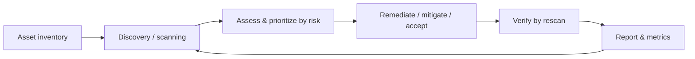

# Patch and Vulnerability Management

## Overview

Vulnerability management is the continuous loop of finding weaknesses, deciding which matter, and fixing or otherwise treating them before an attacker exploits them. Patch management is the operational engine that delivers most of those fixes. The two are joined at the hip but not identical: you can have a vulnerability with no patch available, and you can apply patches that aren't security-driven at all. The exam's themes are the **process order** (discover → assess/prioritize → remediate → verify, on a repeating cadence), the discipline of **testing patches before production**, prioritizing by **risk rather than raw count** (CVSS plus exploitability and asset value), and knowing the legitimate treatment options when you *can't* just patch.

## Key Concepts

### Vulnerability management lifecycle

A continuous cycle, not a one-time project:

1. **Asset inventory** — you can only manage vulnerabilities on assets you know exist. This is the prerequisite step people skip.
2. **Discovery / scanning** — run authenticated and unauthenticated vulnerability scans on a regular cadence and after major changes. Tie to threat intel for newly weaponized CVEs.
3. **Assessment / prioritization** — rank findings by risk, not just severity. Inputs: **CVSS** base score, whether an exploit is **in the wild / has a known exploit**, asset criticality and exposure (internet-facing vs internal), and compensating controls already present.
4. **Remediation** — patch, reconfigure, or apply a workaround. Route fixes through **change management**.
5. **Verification** — rescan to confirm the fix actually landed and didn't regress. "Deployed" is not "fixed" until verified.
6. **Reporting and metrics** — track open vulns, time-to-remediate, recurring issues; feed back into the cycle.

### Vulnerability treatment options (when patching isn't the move)

Not every vulnerability gets patched immediately; the legitimate, risk-based choices:

- **Remediate** — fix it fully (patch, upgrade, reconfigure). Preferred.
- **Mitigate** — reduce risk without fully fixing (a virtual patch on a WAF/IPS, firewall rule, disabling a feature) when a patch is unavailable, can't be tested in time, or would break a critical app.
- **Accept** — formally accept the residual risk (low impact, costly fix) with **risk-owner sign-off** and documentation; revisit later.
- **Transfer** — shift impact (e.g., insurance) — rare for a single vuln but valid conceptually.

The exam point: when a critical system **can't be patched** (legacy/medical/OT), the answer is usually a **compensating/mitigating control**, not "ignore it" and not "patch anyway and break it."

### Patch management process

1. **Identify** — monitor vendor advisories, CVE feeds, and your scanner for relevant patches.
2. **Assess / prioritize** — relevance and urgency (a remotely-exploitable internet-facing flaw jumps the queue).
3. **Test in a non-production environment** — the cardinal rule. Untested patches cause outages and can break dependencies; balance this against the urgency of an actively exploited flaw.
4. **Deploy via change management** — staged rollout (rings/pilot groups) limits blast radius; have a **rollback plan**.
5. **Verify** — confirm the patch installed and the vulnerability is closed (rescan).
6. **Document and report** — record what was patched, where, and the result.

**Patch-status detection methods:**

- **Agent-based** — software on the host reports its own patch state (good for roaming/remote endpoints).
- **Agentless** — a remote scanner queries hosts; nothing installed (good for scale and devices you can't put agents on).
- **Passive** — infers patch level by observing network traffic (no scan, no agent).

### Emergency and zero-day patching

A **zero-day** is a vulnerability with no vendor patch yet (and possibly active exploitation). When a critical patch *is* released for an actively exploited flaw, normal testing windows compress: route it through the **Emergency Change Advisory Board (ECAB)** for expedited approval — fast-tracked, but **still documented**. Until a patch exists, fall back to **mitigations** (IPS/WAF virtual patch, segmentation, disabling the affected feature).

### Scanning nuances and pitfalls

- **Authenticated (credentialed) scans** see far more (installed software, missing patches) and produce fewer false positives than **unauthenticated** scans, which only see the external surface.
- **Vulnerability scan vs penetration test** — a scan *identifies* potential weaknesses (broad, automated, no exploitation); a pen test *exploits* them to prove impact (narrow, manual, validates). Don't conflate them.
- **Scanners produce false positives** — validate before declaring an emergency, and false negatives mean a clean scan isn't proof of safety.
- **Configuration/compliance scanning** (against CIS/STIG baselines) is part of the same operational picture as vulnerability scanning.
- **Patching is the most effective single control** for known vulnerabilities — most breaches exploit flaws for which a patch already existed.

## Common traps / easily confused

- **Vulnerability management vs patch management.** Vuln management is the full find→assess→treat→verify loop (patching is one treatment); patch management is the delivery process for fixes.
- **Vulnerability scan vs penetration test.** Scan = identify (automated, no exploitation); pen test = exploit to validate impact (manual).
- **Severity (CVSS) ≠ priority.** Prioritize by risk = severity **+ exploitability + exposure + asset value**. A medium CVSS on an internet-facing crown-jewel can outrank a "critical" on an isolated box.
- **"Deployed" ≠ "remediated."** Verify by rescanning; patches fail to apply or get rolled back.
- **Can't patch a critical system → mitigate/compensating control**, not ignore and not break-it-anyway.
- **Test before production** — but an actively exploited zero-day patch may justify the **ECAB** fast-track (still documented).
- **Authenticated scans** find more than unauthenticated ones; a clean unauthenticated scan isn't reassurance.

## Exam Tips

- Order: **inventory → scan → prioritize (by risk) → remediate → verify (rescan)** — repeat continuously.
- **Test patches in non-production first**; deploy through **change management** with a rollback plan.
- Treatment options: **remediate, mitigate, accept (with sign-off), transfer.**
- Unpatchable critical system → **compensating/mitigating control**.
- **CVSS** measures severity; combine with **exploitability and exposure** for true priority.
- **Scan = find, pen test = exploit.** Authenticated scans see more.
- Most exploited vulnerabilities **already had a patch** — patching is the highest-value fix.

## Diagrams

### Vulnerability Management Lifecycle

> A continuous loop, not a one-time project — note it cycles back to scanning.

**Takeaway:** Inventory is the skipped prerequisite. "Deployed" is not "fixed" until the rescan verifies it. Prioritize by risk (CVSS + exploitability + exposure + asset value), not raw severity.

## Related Topics

- [Change and Configuration Management](Change%20and%20Configuration%20Management.md) - patches deploy through change control / ECAB
- [Resource Protection and Media Management](Resource%20Protection%20and%20Media%20Management.md) - asset inventory feeds scanning
- [Logging and Monitoring](Logging%20and%20Monitoring.md) - threat intel flags weaponized CVEs
- [Vulnerability Assessment](../06-security-assessment-and-testing/Vulnerability%20Assessment.md) - scanning techniques in depth
- [Penetration Testing](../06-security-assessment-and-testing/Penetration%20Testing.md) - validating exploitability
