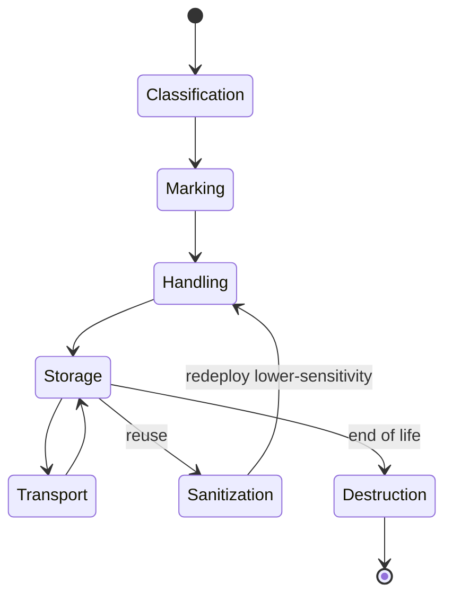

# Resource Protection and Media Management

## Overview

Resource protection is the operational discipline of safeguarding the assets that store and process information — physical media (tapes, disks, USB drives), hardware, and the data on them — across their whole life. The throughline is that information stays sensitive no matter where it physically lives: a backup tape carries the same classification as the production database, so it earns the same protection in transit, in storage, and at end of life. The exam concentrates on the **media lifecycle** (mark it, handle it, store it, transport it, then sanitize and destroy it) and on the precise sanitization terms — clearing vs purging vs destruction — because those carry real legal and data-remanence consequences.

## Key Concepts

### The media management lifecycle

Media moves through predictable stages; controls attach at each:

1. **Acquisition / classification** — when media is put into service, it inherits the **classification of the most sensitive data it will hold**. That label drives every later decision.
2. **Marking / labeling** — physically and logically label media with its classification and handling caveats so anyone touching it knows the rules. Unlabeled media defaults to the highest-risk assumption.
3. **Handling** — restrict who can touch it (least privilege), log custody for sensitive media, and avoid unnecessary copies.
4. **Storage** — store at the protection level the data demands: access-controlled, environmentally suitable (temperature/humidity for tape), and ideally a separate **offsite** location for backups (per 3-2-1). Encrypt data at rest on portable media so a lost device isn't a breach.
5. **Transport** — sensitive media in transit needs encryption, tamper-evident packaging, tracked couriers, and a documented chain of custody. Most "lost backup tape" breaches happen here.
6. **Reuse / sanitization** — before media is repurposed to a lower-sensitivity context, sanitize it to the appropriate level (see below).
7. **Disposal / destruction** — at end of life, destroy per policy and **document it** (a destruction certificate), because you may have to prove the data is gone.

### Data remanence and sanitization (the key exam terms)

**Data remanence** is residual data left on media after a naive delete or format — the reason "I deleted the files" is never a safe answer. Deleting a file typically removes only the pointer, not the data. NIST SP 800-88 frames sanitization in three escalating levels:

| Level | What it does | Media reusable? | When |
|-------|--------------|-----------------|------|
| **Clear** | Overwrite with logical techniques (e.g., overwrite all addressable space) | Yes, within the org | Media stays in the same control environment |
| **Purge** | Render recovery infeasible even with lab techniques — **cryptographic erase**, **degaussing** (magnetic only), firmware secure-erase | Often yes | Media leaves the org or goes to lower sensitivity |
| **Destroy** | Physically obliterate — **shred, disintegrate, pulverize, incinerate** | No | Highest sensitivity / end of life |

Critical specifics the exam likes:

- **Degaussing** uses a strong magnetic field to wipe magnetic media (HDDs, tapes). It does **nothing to SSDs/flash** (no magnetic domains) and destroys a hard drive's servo tracks, so the drive is unusable afterward.
- **SSDs resist overwriting** (wear leveling moves data around), so **cryptographic erase** (destroy the encryption key so ciphertext is unrecoverable) or **physical destruction** is preferred for flash.
- **Cryptographic erase / crypto-shredding** is fast and ideal for cloud and self-encrypting drives: destroy the key, and the data is effectively gone without touching every block.
- **Overwriting** works for magnetic disks but takes time and can miss reallocated/bad sectors.
- Match the method to the **media type** and the **data sensitivity**: higher sensitivity and media leaving your control push toward purge or destroy.

### Hardware and software asset management

You can't protect what you don't know you have. Asset management maintains an accurate, current **inventory** of hardware and software — the foundation for patching, license compliance, vulnerability scanning, and incident scoping (you can't tell if a compromised host matters if it isn't inventoried).

- **Hardware inventory** — track devices from procurement through disposal; tag and account for them; reconcile regularly. Unaccounted hardware is both a security gap and a remanence risk at disposal.
- **Software inventory / licensing** — know what's installed (allow-listing depends on it), avoid unlicensed/unsupported software, and spot shadow IT.
- **Configuration baselines / CMDB** — tie assets to their approved state (see change management).
- **Provisioning and decommissioning** — securely image/harden on the way in; **sanitize and remove from inventory** on the way out.

### Protecting other operational resources

- **Cloud and virtual resources** — the same lifecycle applies, but destruction is logical: you rely on the provider's media handling plus **crypto-erase**, since you can't physically shred their disks. Snapshots and backups can outlive the data you "deleted" — track them.
- **Mobile media and endpoints** — encrypt by default; manage with MDM; the easiest media to lose is the most important to encrypt.
- **Spare and decommissioned equipment** — sanitize *before* it leaves the building (resale, RMA, recycling, donation).

## Common traps / easily confused

- **Clear vs purge vs destroy.** Clear = overwrite, reusable in-house; purge = make lab-recovery infeasible (degauss/crypto-erase/secure-erase); destroy = physical obliteration. Sensitivity and where the media goes pick the level.
- **Degaussing doesn't work on SSDs.** No magnetic domains in flash. Degaussing also renders an HDD unusable.
- **SSD/flash → crypto-erase or destroy**, not overwrite (wear leveling). Magnetic → overwrite/degauss are valid.
- **Deleting/formatting ≠ sanitizing.** Both leave **data remanence**; only sanitization removes the data.
- **Classification follows the media.** A backup tape carries the source data's classification — protect it the same in storage and transit.
- **Destruction must be documented.** A certificate of destruction is the proof; "we threw it away" isn't.
- **Asset inventory is a prerequisite**, not paperwork — patching, allow-listing, and incident scoping all depend on it.

## Exam Tips

- Media inherits the **classification of the most sensitive data** it holds — mark and handle accordingly.
- Memorize the trio: **Clear** (overwrite, reuse), **Purge** (degauss/crypto-erase, infeasible to recover), **Destroy** (physical). NIST **SP 800-88**.
- **Degaussing** = magnetic media only; useless on SSDs and ruins the HDD.
- **SSD/cloud** → **cryptographic erase** (destroy the key) or physical destruction.
- "I deleted/formatted it" is wrong — that's **data remanence**.
- Most media breaches occur **in transit**: encrypt + chain of custody.
- Accurate **asset inventory** underpins patching, scanning, and incident response.

## Diagrams

### Media Management Lifecycle

> State diagram of media from acquisition to destruction — controls attach at each stage.

**Takeaway:** Media inherits the classification of the most sensitive data it holds. Most breaches happen in transport; end-of-life destruction must be documented (certificate).

## Related Topics

- [Data Retention and Destruction](../02-asset-security/Data%20Retention%20and%20Destruction.md) - data lifecycle and sanitization detail
- [Data Classification](../02-asset-security/Data%20Classification.md) - classification that media inherits
- [Disaster Recovery](Disaster%20Recovery.md) - backup media storage and rotation
- [Change and Configuration Management](Change%20and%20Configuration%20Management.md) - CMDB, baselines, provisioning
- [Patch and Vulnerability Management](Patch%20and%20Vulnerability%20Management.md) - inventory drives patching
