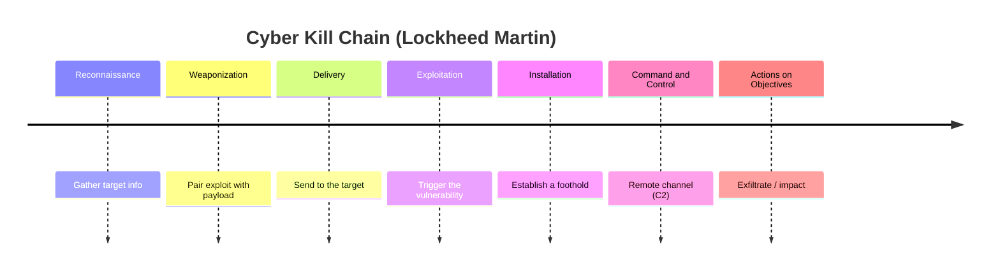
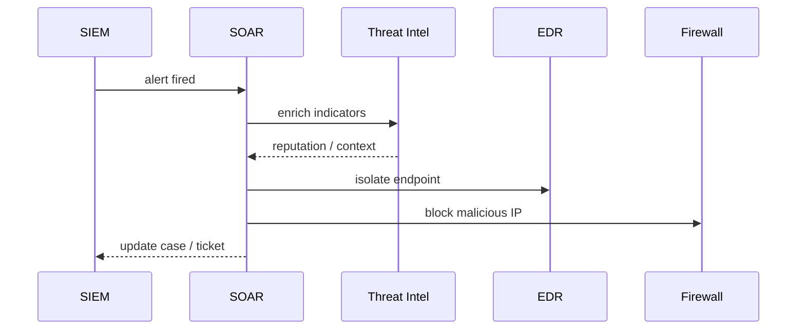

# Security Operations Concepts

## Overview

This note is the grab-bag of core day-to-day security operations principles: the administrative controls that prevent fraud (need-to-know, least privilege, separation of duties, job rotation, mandatory vacations), the people and tooling that watch for trouble (the SOC, threat intelligence), the malware you're watching for, and supporting practices like endpoint hardening and time synchronization. Many of these are tested as one-line discriminators — what distinguishes a worm from a virus, or job rotation from mandatory vacations — so the trade is precise definitions over deep prose.

## Key Concepts

### Operational Security Principles
- **Need to Know** - access only to what's required for the task
- **Least Privilege** - minimum permissions necessary
- **Separation of Duties** - prevent fraud through divided responsibilities
- **Job Rotation** - detect irregularities by rotating staff
- **Mandatory Vacations** - detect fraud when someone else covers

### Security Operations Center (SOC)
- Centralized team monitoring security 24/7
- Uses SIEM, EDR, threat intelligence
- Tiers: L1 (triage), L2 (investigation), L3 (advanced/hunt)
- SOC analysts monitor, detect, and escalate

### Threat Intelligence
- **Strategic** - high-level trends for executives
- **Tactical** - TTPs (Tactics, Techniques, Procedures) for defenders
- **Operational** - specific campaign details
- **Technical** - IoCs (Indicators of Compromise) for detection tools
- Sources: OSINT, ISACs, commercial feeds, dark web monitoring

**IOC vs TTP:** an **IOC** is the *"what"* of an attack - hashes, IPs, domains - and is **easy for an attacker to change**. A **TTP** is the *"how"* - attacker behavior/methodology - and is **harder to change**, so detections built on TTPs are more durable.

**Threat hunting:** **proactively** searching the environment for threats that are **already inside** (hypothesis-driven), instead of waiting for an alert to fire. This is the L3 SOC activity.

### Cyber Kill Chain (Lockheed Martin)
The stages of an intrusion, in order: **Reconnaissance → Weaponization → Delivery → Exploitation → Installation → Command & Control (C2) → Actions on Objectives.** Breaking any link disrupts the attack.

### Malware Types
| Type | Description |
|------|-------------|
| **Virus** | Requires host program; self-replicating |
| **Worm** | Self-replicating; no host needed; spreads via network |
| **Trojan** | Disguised as legitimate software |
| **Ransomware** | Encrypts data; demands payment |
| **Spyware** | Monitors user activity |
| **Rootkit** | Hides at OS/kernel level |
| **Logic Bomb** | Triggers on a specific condition |
| **Backdoor** | Bypasses normal authentication |
| **Fileless Malware** | Lives in memory; no file on disk |
| **Botnet** | Network of compromised machines controlled remotely |

### Endpoint Security
- **Anti-malware/EDR** (Endpoint Detection and Response)
- **Host-based firewall** and IDS/IPS
- **Application whitelisting/allowlisting**
- **Full disk encryption**
- **Patch management**
- **Mobile Device Management (MDM)**

### Detection & Response Tooling (EDR / XDR / MDR / UEBA / SOAR)
- **EDR** (Endpoint Detection and Response) - detects and responds to threats **on endpoints**
- **XDR** (Extended Detection and Response) - **correlates across** endpoint + network + cloud + email (broader than EDR)
- **MDR** (Managed Detection and Response) - a **vendor runs** detection/response for you (a service, not a product tier)
- **UEBA** (User and Entity Behavior Analytics) - **baselines** normal user/device behavior and flags **anomalies** (insider threat, compromised accounts)
- **SOAR** (Security Orchestration, Automation, and Response) - **automates** incident-response workflows across multiple security tools (playbooks tie the tools together)

### Operational Defenses (allow-listing vs sandboxing vs honeypot)
- **Allow-listing / whitelisting** - only approved programs run; **deny by default** (stronger than blocklisting)
- **Sandboxing** - run **untrusted code in isolation** so it can't touch the real system
- **Honeypot** - a **decoy** system to lure and study attackers (legal **enticement**, not entrapment)

### Logging, Monitoring & SIEM
- **SIEM** (Security Information and Event Management) - centrally **aggregates and correlates** logs from many sources for **real-time analysis, alerting, and dashboards**. It's the single tool to "collect, correlate, and alert enterprise-wide."
- **Centralize logs** (vs leaving them on each host) to protect them from **local tampering**, enable **cross-system correlation**, and support **retention/analysis**.
- **Log normalization** - converting logs from different formats into one **common format** so they can be correlated.
- **Circular overwrite** - when a log fills, the **oldest entries are overwritten**; the risk is **losing evidence** if logs aren't shipped/archived first (fix: larger logs + central aggregation/archival before rotation).
- **Log retention and disposal** - governed by **retention policy + legal/regulatory requirements**: keep long enough for investigation/compliance, then **dispose securely**.
- **Clipping level** - a fixed **threshold** below which events are ignored/not recorded (e.g., alert on failed logins only after the 3rd). It is a **non-statistical** data-reduction method; **sampling** (a representative subset) is the **statistical** alternative. A stem asking to reduce audited data *non-statistically* → **clipping level**.

### Physical Operations
- **Media management** - tracking and destroying media
- **Asset management** - inventory of all hardware/software
- **Service Level Agreements (SLAs)** - performance expectations
- **Duress code** - a secret signal (e.g., a special PIN entered under threat) that **silently indicates coercion**; **life safety is the priority** over the asset being protected

### Time Synchronization (NTP)
- **NTP (Network Time Protocol)** synchronizes device clocks across a network to a common reference.
- **Why it's security-critical:**
  - **Log correlation** - matching events across systems requires consistent timestamps (a SIEM can't stitch a timeline if clocks drift).
  - **Forensic timelines** - reconstructing "what happened when" during an incident depends on accurate, agreed time.
  - **Certificate / Kerberos validity** - certs have valid-from/valid-to windows, and Kerberos rejects tickets when clock skew exceeds the allowed limit (default ~5 min).
  - **Attack detection** - skewed clocks hide or scramble the sequence of malicious activity.

## Exam Tips

- SOC operates 24/7 and is the first line of detection
- **Worms** spread without user interaction (unlike viruses)
- **Rootkits** are hardest to detect (kernel-level hiding)
- **Application whitelisting** is stronger than blacklisting
- Threat intelligence should be **actionable**, not just informational

## Common traps

- **Virus vs. worm.** A virus needs a host program and usually user action to spread; a worm is self-contained and spreads across the network on its own.
- **Job rotation vs. mandatory vacations.** Both detect fraud by forcing someone else into the role — but job rotation moves people between jobs over time, while mandatory vacations force a *temporary* absence so a substitute can surface hidden wrongdoing.
- **Separation of duties vs. least privilege.** Separation of duties splits a sensitive task across people so no one can complete it alone; least privilege limits how much access one person has. Related, not the same.
- **Allowlisting vs. blocklisting.** Allowlisting (whitelisting) permits only known-good and is stronger; blocklisting (blacklisting) blocks known-bad and misses anything new.
- **Rootkit vs. fileless malware.** Rootkits hide at the OS/kernel level; fileless malware lives in memory with no file on disk. Both evade detection, by different means.

## Diagrams

### Cyber Kill Chain

> The ordered stages of an intrusion — breaking any link disrupts the attack.

### SOAR Automated Response

> Actor exchange after a SIEM alert — SIEM detects, SOAR orchestrates the playbook.

**Takeaway:** SIEM **detects** (collect, correlate, alert); SOAR **responds** (automates the playbook across tools). Don't pick SIEM when the stem asks for automated response.

## Related Topics

- [Incident Response](Incident%20Response.md) - SOC escalates to IR team
- [Log Management and Monitoring](../06-security-assessment-and-testing/Log%20Management%20and%20Monitoring.md) - SOC's primary data source
- [Change and Configuration Management](Change%20and%20Configuration%20Management.md)
- [Personnel Security](../01-security-and-risk-management/Personnel%20Security.md)
