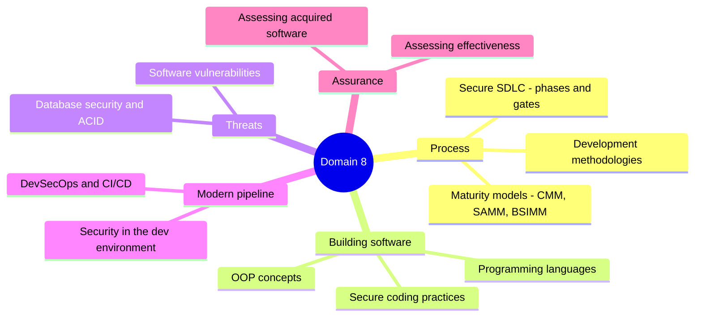

# Domain 8 - Software Development Security (10%)

Covers secure software development practices, common vulnerabilities, and database security.

---

## Topics Checklist

- [ ] [Secure SDLC](Secure%20SDLC.md)
- [ ] [Development Methodologies](Development%20Methodologies.md)
- [ ] [Software Development Maturity Models](Software%20Development%20Maturity%20Models.md)
- [ ] [Programming Languages and Concepts](Programming%20Languages%20and%20Concepts.md)
- [ ] [OOP Concepts](OOP%20Concepts.md)
- [ ] [Software Vulnerabilities and Attacks](Software%20Vulnerabilities%20and%20Attacks.md)
- [ ] [Secure Coding Practices](Secure%20Coding%20Practices.md)
- [ ] [Database Security](Database%20Security.md)
- [ ] [ACID Properties](ACID%20Properties.md)
- [ ] [DevSecOps and CI-CD](DevSecOps%20and%20CI-CD.md)
- [ ] [Security in the Development Environment](Security%20in%20the%20Development%20Environment.md)
- [ ] [Assessing Software Security Effectiveness](Assessing%20Software%20Security%20Effectiveness.md)
- [ ] [Assessing Acquired Software Security](Assessing%20Acquired%20Software%20Security.md)

---

## Domain Summary

This domain focuses on:

- **SDLC** - integrating security into every phase of development
- **Vulnerabilities** - understanding common software flaws (OWASP Top 10)
- **Database security** - protecting data stores
- **Secure coding** - writing code that resists attacks
- **DevSecOps** - embedding security in modern development pipelines
- **Maturity models** - measuring how disciplined the dev process is (CMM/CMMI, SAMM, BSIMM, IDEAL)
- **Development environment** - securing repositories, pipelines, signing keys, and toolchains
- **Effectiveness & acquisition** - assessing security via logging/risk/acceptance testing, and managing COTS/open-source/supply-chain risk

---

## Diagrams

### Domain 8 at a Glance
The major themes of software development security and where each note fits.

## Key Relationships

- Threat modeling from [Domain 1 - Security and Risk Management](../01-security-and-risk-management/00%20Domain%201%20-%20Security%20and%20Risk%20Management.md)
- Cryptographic implementation from [Domain 3 - Security Architecture and Engineering](../03-security-architecture-and-engineering/00%20Domain%203%20-%20Security%20Architecture%20and%20Engineering.md)
- Software testing from [Domain 6 - Security Assessment and Testing](../06-security-assessment-and-testing/00%20Domain%206%20-%20Security%20Assessment%20and%20Testing.md)
- Change management from [Domain 7 - Security Operations](../07-security-operations/00%20Domain%207%20-%20Security%20Operations.md)
- Application attacks overlap with [Domain 4 - Communication and Network Security](../04-communication-and-network-security/00%20Domain%204%20-%20Communication%20and%20Network%20Security.md)

---
