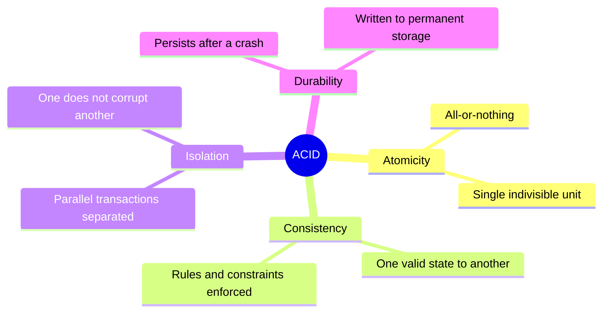

# ACID Properties

## Overview

ACID = the four properties guaranteed by reliable database transactions. CISSP tests precise definitions — they are commonly confused (especially Atomicity vs Isolation).

## The Four Properties

### Atomicity
- **All-or-nothing**
- If any part of a transaction fails, the entire transaction is rolled back
- The transaction is treated as a single, indivisible unit
- **Trigger phrase:** "all-or-nothing" / "single indivisible unit"

### Consistency
- The database moves from **one valid state to another**
- All defined rules (constraints, cascades, triggers) are enforced
- **Trigger phrase:** "valid state to another" / "rules enforced"

### Isolation
- **Parallel transactions are separated from each other**
- The effects of one transaction don't corrupt another running in parallel
- Until a transaction completes, its effects are invisible to other transactions
- **Trigger phrase:** "transactions in parallel are separated" / "effects of one don't corrupt another"
- **Classic trap:** a stem about parallel transactions not corrupting each other is **Isolation, NOT Atomicity**

### Durability
- Committed transactions **persist even after system failure**
- Data is written to permanent storage (typically disk + transaction log)
- **Trigger phrase:** "persist after crash" / "survives failure"

## Quick mapping

| Trigger phrase | Property |
|---|---|
| "all-or-nothing" | Atomicity |
| "moves from one valid state to another" | Consistency |
| "parallel transactions separated, don't corrupt each other" | **Isolation** (not Atomicity) |
| "committed transactions persist after failure" | Durability |

## Common Trap

The exam loves to confuse **Atomicity** with **Isolation**. They sound similar:
- **Atomicity** = within ONE transaction, everything happens or nothing does
- **Isolation** = between MULTIPLE PARALLEL transactions, they don't see each other's intermediate states

**Memorization trick:**
- **A**tomic = **A**ll or nothing (one transaction, indivisible)
- **I**solation = **I**ndependence between concurrent transactions

## Diagrams

### The Four ACID Properties
Each property branches to its one-line trigger phrase for fast recall.

## Related Topics

- [Database Security](Database%20Security.md)
- [Secure SDLC](Secure%20SDLC.md)
- [CRAM-SHEET](../../practice/sheets/CRAM-SHEET.md)
