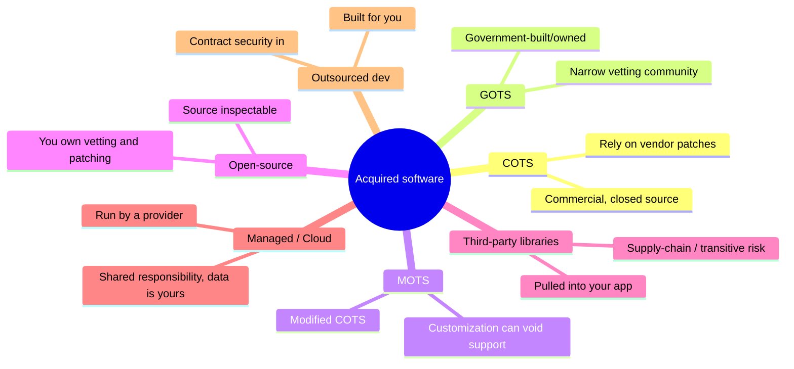

# Assessing Acquired Software Security

## Overview

Most organizations buy or borrow far more software than they write — commercial products, open-source libraries, cloud services, outsourced components. (ISC)² makes "assess the security impact of acquired software" its own objective because **you inherit the risk of code you did not write but chose to run**. The governing principle: acquiring software does not transfer away the *risk*, only some of the *work*. You remain accountable for vetting it, demanding security in the contract, and protecting your own data on top of it. The exam's favorite levers here are the **shared responsibility model**, the **software supply chain / SBOM**, and the distinctions among COTS, GOTS, open-source, and managed services.

## Categories of Acquired Software

| Type | What it is | Key risk |
|------|-----------|----------|
| **COTS** | **Commercial off-the-shelf** — finished product sold to the public | Closed source; you can't inspect it; reliant on vendor patches |
| **GOTS** | **Government off-the-shelf** — built for/owned by a government org | Custom, narrower vetting community; still inherited risk |
| **MOTS** | **Modified off-the-shelf** — COTS customized for you | Customization can void support / introduce flaws |
| **Open-source** | Source is public and inspectable | *You* own vetting and patching; transitive dependencies |
| **Third-party libraries/components** | Code pulled into your app | Supply-chain & dependency risk; known-vulnerable versions |
| **Managed services / Cloud (SaaS/PaaS/IaaS)** | Software run by a provider | Shared responsibility; you still own your data |
| **Outsourced/contract development** | Someone else builds it for you | Quality, IP, backdoors, must contract security in |

### COTS vs open-source — the trade
- **COTS**: you cannot see the source, so you trust the vendor's process and depend on them for patches. Vetting is largely *vendor assessment* and testing the black box.
- **Open-source**: the source is inspectable (a transparency advantage), **but the responsibility to review, monitor, and patch falls entirely on you** — "many eyes" is not automatic, and unmaintained projects are a real hazard. Free to acquire is not free to own.

## The Software Supply Chain

The supply chain is every external piece your software depends on — libraries, frameworks, build tools, container base images, and the vendors' own dependencies (transitive). Compromise anywhere upstream flows downstream to you.

- **Why it matters** — a single poisoned dependency or malicious update can compromise everyone who installs it. **SolarWinds** (a trusted update weaponized) and **dependency-confusion / typosquatting** attacks are the canonical examples.
- **Transitive dependencies** — you may directly use 10 libraries that pull in 500 more; your real attack surface is the whole tree, not just what you chose by name.

### SBOM (Software Bill of Materials)
An **SBOM** is a formal, machine-readable **inventory of every component and dependency** in a piece of software — its "ingredients list."
- Enables you to answer "**am I affected?**" within minutes when a new vulnerability (e.g., the next Log4Shell) drops, instead of guessing.
- Supports license compliance and provenance tracking.
- Increasingly **required by procurement/regulation** (e.g., US executive direction on software supply-chain security). Standard formats: **SPDX, CycloneDX**.

### Supply-chain mitigations
- **SBOM** for visibility into what you actually run.
- **SCA (Software Composition Analysis)** to continuously flag known-vulnerable and badly-licensed dependencies.
- **Dependency pinning + integrity verification** (hashes/lockfiles) and **trusted internal registries** to resist tampering/confusion attacks.
- **Code signing verification** of acquired binaries and updates (verify origin + integrity).
- **Vendor security assessment** before purchase and on an ongoing basis.

## Managed Services and Cloud: Shared Responsibility

When you consume software as a service, security splits between you and the provider, and the line moves with the service model.

- **Shared responsibility model** — the provider secures *the infrastructure/the platform*; **you remain responsible for your data, identities, access configuration, and how you use the service.** The split shifts: **IaaS** = you own the most (OS upward); **SaaS** = you own the least, but **never zero** — data classification, access control, and configuration are always yours.
- **The data is always your responsibility** — outsourcing the software never outsources accountability for protecting the data in it. This is the single most tested cloud line.
- **Provider assurance** — verify the provider through independent attestations (**SOC 2 / ISO 27001**, audit reports), not just their marketing.
- **Contracts and SLAs** — security requirements, breach notification, data location/sovereignty, right-to-audit, and exit/data-return must be **written into the contract**.

## Acquisition Governance: Contract Security In

Across every category, the recurring exam answer for "how do you manage acquired-software risk" is **make security a contractual requirement and assess the vendor**:

- **Vendor / third-party risk assessment** before and during the relationship.
- **Security requirements, SLAs, and right-to-audit clauses** in contracts.
- **Acceptance testing** of acquired software before deployment (don't trust, verify — see [Assessing Software Security Effectiveness](Assessing%20Software%20Security%20Effectiveness.md)).
- **Patch/EOL planning** — know the vendor's support lifecycle; unsupported software is unpatchable risk.

## Common traps / easily-confused

| Confusion | Resolution |
|-----------|------------|
| COTS vs GOTS | COTS = commercial/public; GOTS = government-owned/built |
| Open-source = safer (many eyes)? | Source is *visible*, but **you own vetting/patching**; unmaintained = risk |
| Does acquiring software transfer risk? | No — you **inherit** the risk; only some work is offloaded |
| Cloud: who secures the data? | **Always you**, regardless of service model |
| SBOM purpose | Inventory of components → answer "am I affected" fast |
| Library vs API (acquired) | Library = code pulled *into* your app; API = interface to an external service |
| Biggest supply-chain example | **SolarWinds** (poisoned trusted update) |

## Exam Tips

- Acquiring software **inherits risk** — manage it with **vendor assessment + security requirements in contracts/SLAs**.
- **COTS = commercial, GOTS = government, MOTS = modified;** open-source shifts **vetting and patching onto you**.
- **Shared responsibility:** provider secures the platform; **you always own your data, access, and configuration** — most in IaaS, least (but never none) in SaaS.
- **SBOM** = component inventory; it answers "**am I affected**" when a new dependency CVE lands (Log4Shell). Formats: SPDX, CycloneDX.
- **SCA, dependency pinning, code-signing verification, and SBOM** are the supply-chain controls; **SolarWinds** is the textbook attack.
- Verify providers via **SOC 2 / ISO 27001**, not marketing claims.

## Diagrams

### Categories of Acquired Software
You inherit the risk of every category; the branch labels show each one's key risk.

## Related Topics

- [Secure SDLC](Secure%20SDLC.md) - COTS/GOTS, supply-chain summary
- [Security in the Development Environment](Security%20in%20the%20Development%20Environment.md) - dependency integrity, code signing
- [Supply Chain Risk Management](../01-security-and-risk-management/Supply%20Chain%20Risk%20Management.md)
- [Assessing Software Security Effectiveness](Assessing%20Software%20Security%20Effectiveness.md) - acceptance testing of acquired software
- [Virtualization Cloud and Distributed Computing](../03-security-architecture-and-engineering/Virtualization%20Cloud%20and%20Distributed%20Computing.md) - shared responsibility model
