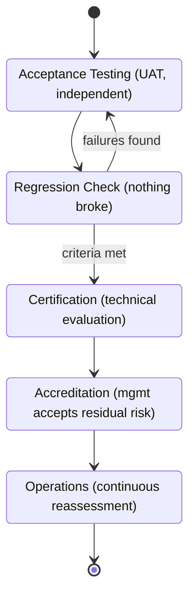

# Assessing Software Security Effectiveness

## Overview

Building security in is half the job; the other half is *proving it works and keeping it working*. (ISC)² lists "assess the effectiveness of software security" as a distinct objective, and it breaks into three threads: **auditing and logging of changes** (can you see and account for what happened to the software?), **risk analysis and mitigation** (do you understand the residual risk and have you treated it?), and **acceptance testing** (does an independent party confirm it meets requirements before it goes live?). The unifying idea is *assurance through evidence* — you do not declare software secure, you demonstrate it.

## Auditing and Logging of Changes

You cannot assess what you cannot see. Auditing the software and its change history provides the evidence trail for accountability, forensics, and verifying that the process was actually followed.

- **Change auditing** — every change to code, configuration, and the build should be **logged with who, what, when, and why**. This is where [Software Configuration Management](Security%20in%20the%20Development%20Environment.md) and version control pay off: the commit history *is* an audit trail.
- **Accountability & non-repudiation** — tie changes to authenticated identities (and signed commits) so a change cannot be plausibly denied.
- **Detecting unauthorized change** — logs and integrity monitoring catch modifications that bypassed the approved process (a backdoor slipped in, an out-of-band hotfix).
- **Application/runtime logging** — the *running* software must also log security-relevant events (authentication, authorization failures, input validation rejections, errors). "Insufficient logging and monitoring" is itself an OWASP Top 10 weakness — you cannot detect or investigate an attack you never recorded.
- **Protect the logs** — logs must be tamper-resistant and access-controlled, or an attacker erases their own tracks. Centralize them (e.g., a SIEM) away from the system that generates them.

Key framing: auditing/logging supports the **detective** and **accountability** functions, and is the raw material every effectiveness assessment depends on.

## Risk Analysis and Mitigation

Effectiveness is measured against risk: not "is there any flaw" (there always is) but "is the *residual* risk acceptable to management."

- **Identify and rank** software risks — threat modeling, vulnerability findings (SAST/DAST/SCA), penetration test results, and abuse cases feed a prioritized risk picture.
- **Risk-based prioritization** — fix in order of risk (likelihood × impact), not in order of discovery. Severity scoring (e.g., **CVSS**) helps rank, but business context decides.
- **Mitigation / treatment** — apply the standard options: **mitigate** (fix/add controls), **transfer** (insurance, contractual), **accept** (formally, with sign-off), or **avoid** (drop the risky feature). A documented decision to accept residual risk is itself a valid, exam-correct outcome.
- **Residual risk and management acceptance** — after controls, the leftover risk is **residual risk**, and **management formally accepts it** (this is the *accreditation/authorization* step — management accepts the risk; see [Secure SDLC](Secure%20SDLC.md)).
- **Continuous reassessment** — risk changes as new vulnerabilities surface in dependencies and as the threat landscape shifts; effectiveness assessment is ongoing, not a one-time gate.

## Acceptance Testing

Acceptance testing answers: **does the software meet its agreed requirements (including security requirements) well enough to be accepted into production?** It is typically performed by or on behalf of the customer/business, independent of the developers who wrote it.

- **UAT (User Acceptance Testing)** — end users / business owners validate the software does what they need in realistic conditions before sign-off.
- **Security acceptance criteria** — security requirements defined back in the requirements phase become *pass/fail gates* here: no unresolved critical vulnerabilities, required controls present and working, compliance obligations met.
- **Regression testing** — re-run existing tests after changes/fixes to confirm a new change (or a security patch) did **not break previously working functionality or reintroduce an old flaw**. Critical because security fixes are themselves changes.
- **Independence** — acceptance testing should be done by someone other than the original developer (separation of duties); developers testing only their own work miss their own blind spots.
- **Verification vs validation** — **verification** = "did we build it *right* / to spec?"; **validation** = "did we build the *right thing* / does it meet the real need?" Acceptance testing leans on **validation**.

After successful acceptance testing, the **certification** (technical evaluation against requirements) and **accreditation** (management authorization to operate, accepting residual risk) decisions are made.

## Common traps / easily-confused

| Confusion | Resolution |
|-----------|------------|
| Verification vs validation | Verification = built it right (to spec); validation = built the right thing (meets need) |
| Certification vs accreditation | Certification = technical evaluation; accreditation = management's formal authorization (accepts risk) |
| Residual risk owner | **Management** formally accepts residual risk — not the dev team |
| Acceptance test by developer? | No — independence; acceptance/UAT is by the customer/business, not the author |
| Regression testing purpose | Confirms a change/fix didn't break or reintroduce something — not a search for new features |
| Fix order | By **risk/severity**, not order of discovery |

## Exam Tips

- **Logging and auditing of changes** = the evidence trail for accountability, forensics, and detecting unauthorized change; **protect the logs** from tampering.
- "**Insufficient logging and monitoring**" is an OWASP Top 10 weakness — absence of logs is itself a finding.
- After mitigation, **residual risk** remains and **management formally accepts it** (accreditation/authorization).
- **Regression testing** ensures a change/patch didn't break existing functionality or reintroduce a fixed bug.
- **UAT** is performed by users/business owners; acceptance testing should be **independent** of the developers.
- **Verification = to spec; validation = to need.** **Certification = technical; accreditation = management sign-off.**

## Diagrams

### From Acceptance Testing to Authorization
The gate sequence: independent acceptance testing, then technical certification, then management accreditation accepting residual risk.

## Related Topics

- [Secure SDLC](Secure%20SDLC.md) - certification, accreditation, lifecycle phases
- [Security in the Development Environment](Security%20in%20the%20Development%20Environment.md) - change auditing and SCM
- [Software Testing Methods](../06-security-assessment-and-testing/Software%20Testing%20Methods.md) - test techniques
- [Risk Management](../01-security-and-risk-management/Risk%20Management.md) - risk treatment, residual risk
- [Change and Configuration Management](../07-security-operations/Change%20and%20Configuration%20Management.md)
