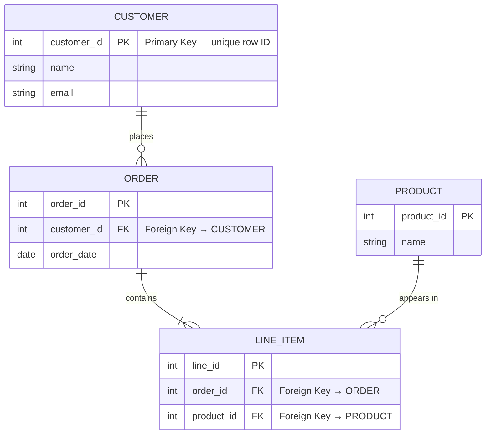

# Database Security

## Overview

Databases concentrate an organization's most valuable data in one place, which makes them a prime target and a heavily tested topic. Protection comes from three angles: access controls and design (views, stored procedures, least privilege), encryption (at rest and in use), and integrity rules (keys, referential integrity, ACID transactions). The exam leans hard on a few precise distinctions — inference vs aggregation, polyinstantiation, and the fact that in-memory data is "data in use" that disk encryption does not protect.

## Key Concepts

### Database Types
- **Relational (RDBMS)** - tables with rows and columns (SQL) - Oracle, PostgreSQL, MySQL
- **NoSQL** - flexible schema (document, key-value, graph) - MongoDB, Redis, Neo4j
- **Data Warehouse** - analytical, historical data (OLAP)
- **Data Lake** - raw, unstructured data storage
- **Distributed Database** - data stored across **multiple databases but logically connected**; the user sees a **single entity** though it physically spans many interconnected parts over a network. (Distinct from *hierarchical/relational/normalized*, which describe **structure**, not physical distribution.)

### Relational Database Concepts
- **Primary Key** - unique identifier for each row
- **Foreign Key** - links to another table's primary key
- **Referential Integrity** - ensures foreign key relationships are valid
- **Normalization** - reducing redundancy (1NF, 2NF, 3NF)
- **Views** - virtual tables that restrict what users see
- **Stored Procedures** - pre-compiled queries (help prevent SQL injection)
- **Cardinality vs Degree** - **Cardinality = number of ROWS**; **Degree = number of COLUMNS**.
- **Cell** - the **row × column intersection** = a single **field**. (Row = tuple/record; column = attribute.)
- **Concurrency control / locking** - manages **simultaneous access** so transactions don't corrupt data or read inconsistent values (one transaction **locks** a record so others wait) - this is the mechanism that enforces **Isolation** (ACID).

### Database Security Controls
| Control | Description |
|---------|-------------|
| **Views** | Limit what data users can see |
| **Stored Procedures** | Controlled data access; prevent direct SQL |
| **Encryption** | TDE (Transparent Data Encryption), column-level encryption |
| **Access Controls** | Grant/Revoke permissions on objects |
| **Auditing** | Track who accessed what data |
| **Masking** | Hide sensitive data from unauthorized users |
| **Polyinstantiation** | Different data at different classification levels (prevents inference) |

### Memory-Resident (In-Memory) Databases
- **What it is** - a database that stores data **primarily in RAM** (not on disk) for very fast access. Examples: **Redis, SAP HANA, Memcached**. Used for caching, real-time analytics, and trading systems.
- **Volatility** - RAM is **volatile**: data is **lost on power loss/reboot** unless **persistence** is added (snapshots, write-ahead logs, replication). An **availability/durability** concern.
- **Security implications:**
  - Sensitive data sits **unencrypted in memory while in use** - exposed via **memory dumps**, **cold-boot attacks**, or **malware reading process memory**.
  - **Cold-boot attack** - RAM briefly retains data after power-off; an attacker chills/re-reads the chips to recover keys or data.
  - Disk / "data at rest" encryption does **NOT** protect data living in RAM - you need **memory protection, encryption-in-use, and access controls**.
  - **Data-state tie-in** - an in-memory DB is **data in use** (in memory), the **hardest of the three states** (at rest / in transit / in use) to protect. See [Data States and Handling](../02-asset-security/Data%20States%20and%20Handling.md).
- **Persistence / durability mechanisms** - the RAM-volatility "lose everything on power loss" risk is **real but engineered around**. Production in-memory DBs pair a **fast RAM working copy** with a **durable disk-backed copy**:
  1. **Snapshots / savepoints** - periodically write a full copy of in-memory data to disk (**SAP HANA savepoints**, **Redis RDB snapshots**); on restart, reload the last snapshot. You lose only changes **since the last snapshot**.
  2. **Transaction logs / write-ahead logs (WAL)** - every change is appended to a disk log before/as it's applied in memory; after a crash, **replay the log on top of the last snapshot** to rebuild exact state. **Snapshot + log = near-zero data loss.**
  3. **Replication / clustering** - data mirrored to other nodes in real time; if one node loses power, another already has it in RAM (**high availability**).
  4. **Battery-backed / persistent memory** - UPS, battery-backed RAM, or **NVDIMMs** (non-volatile memory) let RAM survive a power blip long enough to flush to disk.
  - **Danger case** - when persistence is **misconfigured or disabled**: e.g., **Redis used purely as a cache with NO persistence WILL lose all data on restart** - fine if it's just a cache rebuildable from the source DB, **catastrophic if treated as the system of record**.
  - **CIA / DR framing** - persistence protects **availability/durability**; it ties to **RPO** (how much data you can afford to lose drives snapshot/log frequency).
  - **Net** - in-memory DB = fast RAM working copy + durable disk-backed copy; the volatility risk is solved via **snapshots + logs + replication**; danger only when persistence is off/misconfigured or a cache is wrongly treated as permanent storage.

### Database Connectivity / APIs
- **ODBC** (Open Database Connectivity) - a **standard API/mechanism that lets application code retrieve data from a database** regardless of the DBMS behind it (acts as a proxy between the app and the database). The answer to "standard that provides a mechanism for code to access data in a database."
- **JDBC** (Java Database Connectivity) - the Java equivalent of ODBC.
- **ADO / OLE DB** - Microsoft data-access layers.
- Don't confuse with **IDE** (development environment), **OWASP** (security project), or **TCO** (total cost of ownership) — common distractors.

### Database Attacks
- **SQL Injection** - manipulating queries through input
- **Inference** - deriving sensitive data from non-sensitive data
- **Aggregation** - combining non-sensitive data to reveal sensitive information
- **Data Mining Abuse** - using analytics to find sensitive patterns

### Aggregation, Inference, and Polyinstantiation (high-value trio)
These three are the most tested database-confidentiality concepts; the exam loves to make you tell aggregation from inference.
- **Aggregation** - **collecting many individually-harmless facts** until the *combined set* is sensitive. The data is all authorized; the **whole reveals more than the parts**. Example: phone-book entries are public, but the full directory of an entire covert agency is sensitive in bulk.
- **Inference** - **deducing** something you're not cleared to see from things you *can* see, using logic/reasoning. The sensitive value is **never directly read** — it's *inferred*. Example: noticing a manager and an unannounced acquisition target dine together repeatedly and concluding a deal is imminent.
- **One-line split:** **aggregation = combine/collect data**; **inference = reason/deduce** the hidden fact. Aggregation is about *quantity*; inference is about *logic*.
- **Controls:**
  - **Polyinstantiation** - store **different data at different classification levels under the same key**, so a low-clearance user querying a "secret" record sees a plausible cover value instead of a tell-tale blank — defeats **inference** in multilevel-secure databases.
  - **Database partitioning / compartmentalization**, **cell suppression**, and **noise/perturbation** also reduce inference/aggregation risk.
  - **Context- and content-dependent access control** - decide access based on *what* is being combined or the *sequence* of queries, not just the single row.

### Data Warehousing and Analytics
- **Data warehouse** - a large repository that **consolidates data from many operational sources** for analysis and reporting (**OLAP**), kept separate from the live transactional systems (**OLTP**). Because it concentrates data from everywhere, it is a **prime aggregation-risk target**.
- **ETL** (Extract, Transform, Load) - the process that pulls data from sources, cleans/normalizes it, and loads it into the warehouse. A point where **data classification and masking** should be enforced.
- **Data mart** - a smaller, subject-specific slice of a warehouse for one department.
- **Data lake** - stores **raw, unstructured** data (schema-on-read), vs the warehouse's structured, schema-on-write model.
- **Data mining** - discovering **patterns/correlations** in large data sets. Security concern: it can **surface sensitive relationships** (an inference/aggregation engine), and **metadata** about the discovered patterns may itself be sensitive.
- **Knowledge Discovery in Databases (KDD)** - the broader process of turning raw data into useful knowledge, of which data mining is a step.

### Database Integrity Concepts
- **Entity Integrity** - every table has a primary key (no null PKs)
- **Referential Integrity** - foreign keys reference valid primary keys
- **Semantic Integrity** - data values are logical and correct
- **ACID Properties** (transactions):
  - **Atomicity** - all or nothing
  - **Consistency** - valid state to valid state
  - **Isolation** - transactions don't interfere
  - **Durability** - committed changes persist

## Exam Tips

- **In-memory DB** (Redis/SAP HANA) = data in RAM for speed; **volatile** (lost on power-off) and exposes sensitive **data in use** (cold-boot / memory-dump risk); disk encryption doesn't protect it
- **Polyinstantiation** prevents inference in multi-level secure databases
- **Aggregation** = combining allowed data to learn disallowed information
- **Inference** = deducing sensitive data from non-sensitive data
- **ACID** guarantees transaction reliability
- **Views** and **stored procedures** are key database security controls
- SQL injection is prevented by parameterized queries and stored procedures

## Diagrams

### Relational Database Model — Entity Relationship Diagram

> Best diagram for showing tables, keys, and relationships at a glance.

**Takeaway:** Row = tuple/record · Column = attribute · **PK** uniquely identifies a row · **FK** references another table's PK (referential integrity). `||--o{` = one-to-many.

## Related Topics

- [Software Vulnerabilities and Attacks](Software%20Vulnerabilities%20and%20Attacks.md) - SQL injection
- [Data Classification](../02-asset-security/Data%20Classification.md) - data protection levels
- [Secure Coding Practices](Secure%20Coding%20Practices.md)
- [Cryptography](../03-security-architecture-and-engineering/Cryptography.md) - database encryption
