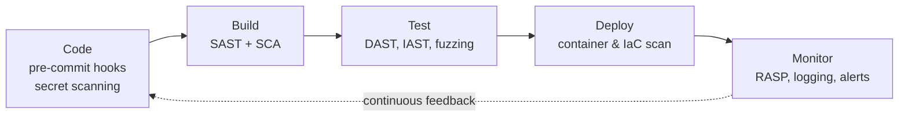

# DevSecOps and CI/CD

## Overview

Integrating security practices into DevOps workflows and continuous integration/continuous delivery pipelines.

## Key Concepts

### DevSecOps Principles
- **Shift left** - integrate security early in the development process
- **Automate** security testing in the pipeline
- **Everyone is responsible** for security (not just the security team)
- **Continuous feedback** - fast security feedback loops
- **Infrastructure as Code (IaC)** - manage infrastructure through version-controlled code

### CI/CD Pipeline Security
| Stage | Security Activity |
|-------|------------------|
| **Code** | IDE security plugins, pre-commit hooks, secret scanning |
| **Build** | SAST (Static Application Security Testing), dependency scanning (SCA) |
| **Test** | DAST (Dynamic Application Security Testing), IAST, fuzzing |
| **Deploy** | Configuration scanning, container scanning, IaC security |
| **Monitor** | Runtime protection, RASP, logging, alerting |

### Deployment Strategies
- **Canary deployment** - release a change to a **small subset** of users/servers first to **catch problems before a full rollout** (limits the blast radius).
- **Blue-green** - run two environments and switch traffic over once the new one is verified.

### Container Security
- Scan container images for vulnerabilities
- Use minimal base images (reduce attack surface)
- Don't run containers as root
- Sign and verify images
- Use container-specific security tools
- Implement network policies between containers

### Infrastructure as Code (IaC) Security
- Version control for infrastructure configurations
- Scan IaC templates for misconfigurations (Terraform, CloudFormation)
- Immutable infrastructure (replace, don't patch)
- Secrets management (vault, not hardcoded)

### Software Composition Analysis (SCA)
- Identify open-source components and their vulnerabilities
- Track licenses for compliance
- Software Bill of Materials (SBOM)
- Continuous monitoring for new vulnerabilities in dependencies

### Key Tools Categories
- **SAST** - static code analysis (finds bugs in source code)
- **DAST** - dynamic testing (finds bugs at runtime)
- **IAST** - interactive testing (instruments running code)
- **RASP** - Runtime Application Self-Protection (protects in production)
- **SCA** - Software Composition Analysis (checks dependencies)
- **Secret scanning** - detects hardcoded credentials and keys

## Exam Tips

- **Shift left** = do security earlier in the process (cheaper to fix)
- **SAST** runs on source code (no running application needed)
- **DAST** runs against a running application
- Container images should be scanned before deployment
- IaC allows security to be codified and version-controlled
- SBOM provides transparency into software components

## Diagrams

### CI/CD Pipeline with Shift-Left Security
Each stage has its own automated security control embedded in the pipeline.

## Related Topics

- [Secure SDLC](Secure%20SDLC.md) - DevSecOps is modern secure SDLC
- [Software Testing Methods](../06-security-assessment-and-testing/Software%20Testing%20Methods.md) - SAST, DAST in the pipeline
- [Change and Configuration Management](../07-security-operations/Change%20and%20Configuration%20Management.md) - automated change management
- [Supply Chain Risk Management](../01-security-and-risk-management/Supply%20Chain%20Risk%20Management.md) - SCA and SBOM
