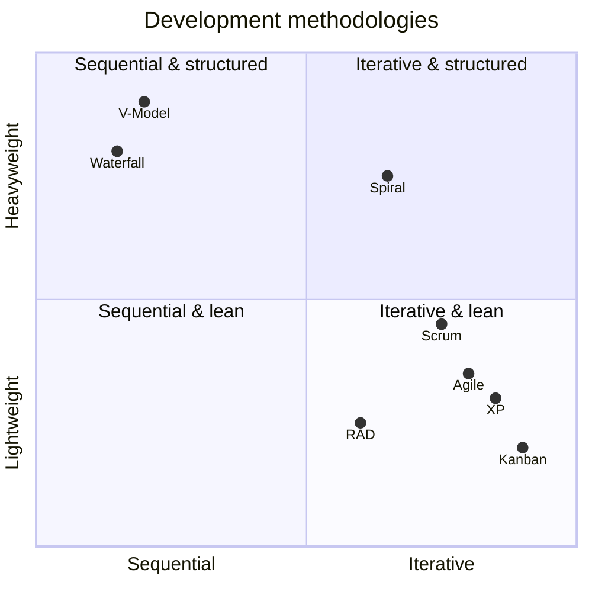

# Development Methodologies

## Overview

Focused comparison of software development methodologies, distinct from [Secure SDLC](Secure%20SDLC.md) which covers SDLC phases broadly. CISSP tests precise definitional distinctions between these methodologies — especially the Agile family (Agile / Scrum / Sprint) and the iterative-vs-sequential split.

## Methodology Comparison

### Waterfall
- **Sequential, linear phases** (requirements → design → implementation → testing → deployment → maintenance)
- Rigid — each phase must complete before next begins
- Security gates between phases
- **Best for:** stable, well-defined requirements
- **Worst for:** complex environments with changing requirements

### V-Model
- Sequential like Waterfall, but with **parallel testing** at each development phase
- Each development phase has a corresponding test phase
- More structured testing than Waterfall but still rigid

### Agile
- **Iterative + self-organizing teams**
- Flexible, adaptive to changing requirements
- Security integrated into each iteration
- **Trigger phrase:** "iterative + self-organizing teams" / "complex environment"
- **Best CISSP answer when stem says "complex environment"** (more comprehensive than Scrum specifically)

### Scrum
- **Specific Agile flavor** with sprints + ceremonies (stand-up, planning, review, retrospective)
- Subset of Agile
- **Scrum Master** = the **facilitator** who removes impediments and keeps the process running — **not a traditional boss/manager**.
- **Trap:** When question asks for "best methodology in complex env," answer is **Agile** (Scrum is too specific). When question asks about "fixed-duration intervals delivering specific features," answer is **Sprint** (Scrum's mechanism).

### Sprint
- **Fixed-duration development interval** (typically 2 weeks but not always)
- Promises delivery of a very specific set of features
- Part of Scrum
- **Trigger phrase:** "fixed-duration development interval" / "two weeks" / "specific set of features"

### Spiral
- **Risk-driven iterations** — risk analysis at each cycle
- Quadrants: planning, risk analysis, engineering, evaluation
- Each iteration produces a more complete prototype
- **Trigger phrase:** "risk-driven" / "risk analysis each iteration"

### Rapid Application Development (RAD)
- Emphasis on **rapid prototyping**
- Allows project to be **reset by adding/changing/removing features at clearly defined points**
- Less rigorous than other methods
- **Trigger phrase:** "reset by allowing features to be added, changed, or removed at clearly defined points"
- Security can be overlooked in pursuit of speed

### Extreme Programming (XP)
- **Pair programming + frequent releases + test-driven development**
- Customer integrated into team
- Refactoring continuously

### Kanban
- **Continuous flow, no fixed iterations**
- Visualize work, limit work-in-progress
- Pull-based rather than push-based

### DevOps
- **Development + Operations merged**
- Fast deployment, continuous integration
- Shared responsibility for production

### DevSecOps
- **DevOps + Security embedded throughout**
- "Shift left" — security earlier in pipeline
- **Trigger phrase for "cross-team collaboration":** DevSecOps is the modern CISSP answer (NOT co-location which is dated)

### Prototyping
- Build a mockup to clarify requirements
- Not production-ready
- Often a precursor to other methodologies

## CISSP Trigger-phrase quick map

| Question phrase | Answer |
|---|---|
| "Iterative + self-organizing teams" | **Agile** |
| "Best for complex environments" | **Agile** (not Scrum) |
| "Fixed-duration interval, ~2 weeks, specific features" | **Sprint** |
| "Risk-driven iterations" | **Spiral** |
| "Allow reset by adding/removing features at defined points" | **RAD** |
| "Sequential phases, rigid" | **Waterfall** |
| "Sequential with parallel testing" | **V-Model** |
| "Pair programming + frequent releases" | **XP** |
| "Continuous flow, no iterations" | **Kanban** |
| "Cross-team collaboration, modern" | **DevSecOps** |

## Compiled vs Interpreted Languages (exam definitional trap)

- **Compiled** = source is translated **ahead of time** into machine code (or bytecode) before running. Examples: **C, C++, Fortran**; **Java** compiles to bytecode run by the JVM.
- **Interpreted** = source is executed **line-by-line at runtime** by an interpreter, no separate compile step. Examples: **VBScript, JavaScript, Python, Perl, PHP**.
- Exam trap: asked for "an example of an interpreted language" among C++/VBScript/Java/Fortran → **VBScript** (the other three are compiled).

## Common Confusion

- **Scrum vs Agile:** Scrum is a subset of Agile. When question asks for broader methodology, answer is Agile. When question asks about a specific framework with sprints/ceremonies, answer is Scrum.
- **Sprint vs Scrum:** Sprint is the fixed-duration interval; Scrum is the framework that uses sprints.
- **Iterative vs Sequential:** Iterative (Agile, Spiral, RAD) vs Sequential (Waterfall, V-Model).

## Exam Tips

- Read for the *specific* trigger phrase in the question
- If "complex environment" → Agile (not Scrum)
- If "fixed duration, two weeks, specific features" → Sprint
- If "risk analysis each iteration" → Spiral
- DevSecOps for cross-team collaboration (modern CISSP)

## Diagrams

### Methodology Trade-off Map
Sequential vs iterative on the x-axis; process rigidity (heavyweight vs lightweight) on the y-axis.

## Related Topics

- [Secure SDLC](Secure%20SDLC.md)
- [DevSecOps and CI-CD](DevSecOps%20and%20CI-CD.md)
- [CMMI Levels](../03-security-architecture-and-engineering/CMMI%20Levels.md)
- [CRAM-SHEET](../../practice/sheets/CRAM-SHEET.md)
