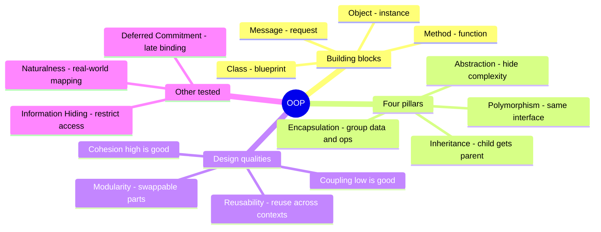

# OOP Concepts

## Overview

Object-Oriented Programming (OOP) concepts that CISSP tests as direct vocabulary mappings. Each term has a specific "trigger phrase" the question stem uses — memorizing the mapping is more efficient than re-reading prose explanations.

General CISSP / CBK framing throughout. Where some study sources use unusual labels for specific phrases, that's noted briefly but the primary definitions follow standard CISSP doctrine.

## Key Concepts — Direct CISSP Mappings

### Encapsulation
- **Trigger phrase:** "data structure (or operation's functionality) grouped into one entity"
- The data and the operations that act on it are bundled together
- External code can only interact through the defined interface
- **Trap:** confused with abstraction; encapsulation = *grouped together*, abstraction = *hidden complexity*

### Abstraction
- **Trigger phrase:** "hiding internal complexity / exposing simple interface"
- Allows a user to interact with an object without knowing how it works internally
- Provides a generalised view

### Modularity
- **Trigger phrase:** "redefine internal components of an object without changing other parts of the system"
- Code organised into independent, swappable modules
- Each module can be modified without breaking the others
- Separation of concerns; autonomous components that cooperate

### Reusability
- **Trigger phrase:** "use the same object in different contexts / applications"
- Code or objects can be used in multiple places without rewriting

### Naturalness
- **Trigger phrase:** "map object-oriented analysis, design, and modeling to business needs and solutions" / "real-world mapping"
- OOP models the real world naturally because real-world entities are objects
- **Classic trap:** easily mistaken for Reusability. Naturalness = mapping design to the real-world business domain; Reusability = reusing code across contexts

### Cohesion
- **Trigger phrase:** "how strongly related the elements within a module are"
- **High cohesion = good** (module does one thing well)
- Low cohesion = bad (module does too many unrelated things)

### Coupling
- **Trigger phrase:** "how dependent modules are on each other"
- **Low coupling = good** (modules independent)
- High coupling = bad (changing one breaks others)

### Polymorphism
- **Trigger phrase:** "same interface, different implementations"
- Methods with the same name behave differently depending on the object

### Deferred Commitment
- **Trigger phrase:** "delay binding / late binding / delay decisions about specific implementation until execution"
- The runtime resolution mechanism — same call can resolve to different implementations depending on context
- Enables flexibility in design

### Inheritance
- **Trigger phrase:** "a child object inherits properties from a parent object"
- Allows code reuse and hierarchical relationships
- Subclass inherits attributes and methods from parent class
- Can override (polymorphism) or extend parent behavior

### Information Hiding
- **Trigger phrase:** "details of object internals are hidden from external code"
- Related to encapsulation but distinct: encapsulation = grouping; information hiding = restricting access
- Implementation: private members, accessor methods (getters/setters)
- Goal: prevent external code from depending on internal representation

## Core OOP Vocabulary (foundational definitions)

These appear less often as direct test questions but provide the vocabulary context for OOP questions.

### Object
- An instance of a class — contains both data (attributes) and behavior (methods)
- The fundamental unit of OOP

### Class
- A blueprint/template that defines the structure (attributes) and behavior (methods) of objects
- "Type" definition; objects are instances of classes

### Instance
- A specific occurrence of a class
- Creating an instance = instantiation
- Each instance has its own state (attribute values)

### Method
- A function/procedure that belongs to a class
- Operates on the object's data
- Invoked via message passing

### Message
- A request from one object to another to invoke a method
- The mechanism by which objects communicate in OOP
- "Calling a method" = "sending a message" in OOP terminology

### Attribute (Field / Property / State)
- Data stored within an object
- Defines the object's state at any moment

### Behavior
- What the object does — defined by its methods
- The active aspect of an object (contrast with attributes which are passive state)

### Instantiation
- Process of creating a new object from a class
- `new ClassName()` in most languages

## Quick comparison: easily-confused pairs

| Pair | Distinction |
|---|---|
| Encapsulation vs Abstraction | Encapsulation = *grouped together*; Abstraction = *complexity hidden* |
| Encapsulation vs Information Hiding | Encapsulation = *bundle data + methods*; Information Hiding = *restrict access to internals* |
| Modularity vs Deferred Commitment | Modularity = *redefine internal components without affecting others*; Deferred Commitment = *delay binding decisions until late* |
| Modularity vs Reusability | Modularity = *independent units*; Reusability = *use the same thing in different places* |
| Reusability vs Naturalness | Reusability = *technical code reuse*; Naturalness = *business-domain mapping* |
| Cohesion vs Coupling | Cohesion = *within-module strength*; Coupling = *between-module dependency* |
| Polymorphism vs Inheritance | Polymorphism = *same interface, different behavior*; Inheritance = *child gets parent attributes/methods* |
| Object vs Class | Class = *blueprint/template*; Object = *instance of a class* |
| Method vs Message | Method = *the function itself*; Message = *the request to invoke a method* |

## Exam Tips

- These appear as straight definition questions — memorize the trigger phrases
- Read the question for the EXACT noun/verb being asked about, not just "OOP benefit"
- When in doubt between **Encapsulation** and **Abstraction**, ask: "Are they being put TOGETHER (encapsulation), or being HIDDEN (abstraction)?"
- When in doubt between **Reusability** and **Naturalness**, ask: "Is this about reusing code (reusability), or about modeling real-world business (naturalness)?"
- When in doubt between **Modularity** and **Deferred Commitment**: ask "is the question about *components that can be swapped without affecting others* (Modularity) or about *delaying the binding/implementation decision until later* (Deferred Commitment)?"
- **Polymorphism** = same interface, different implementations. Often confused with overloading (same name, different parameters) and overriding (subclass replaces parent method).
- For "what is the active entity that does the work" → **Method** (or the **Object** itself); for "the act of asking an object to do something" → **Message**.

## Reverse trigger-phrase map (use as flashcards)

| If question asks for... | Answer |
|---|---|
| Grouping data + operations | Encapsulation |
| Hiding internal complexity | Abstraction |
| Restricting external access to internals | Information Hiding |
| Autonomous cooperating objects | Modularity |
| Redefining internal components without affecting others | Modularity |
| Delay binding / late binding decisions | Deferred Commitment |
| Using same object in different contexts | Reusability |
| Mapping OO design to real-world business | Naturalness |
| Same interface, different implementations | Polymorphism |
| Child inherits from parent | Inheritance |
| How strongly module elements relate | Cohesion |
| How dependent modules are on each other | Coupling |
| Blueprint that defines structure + behavior | Class |
| Specific instance of a class | Object / Instance |
| Function belonging to a class | Method |
| Request from one object to another | Message |

## Diagrams

### OOP Concept Map
The tested terms grouped into building blocks, the four pillars, and design quality measures.

## Related Topics

- [Secure SDLC](Secure%20SDLC.md)
- [Secure Coding Practices](Secure%20Coding%20Practices.md)
- [CRAM-SHEET](../../practice/sheets/CRAM-SHEET.md)
- [Development Methodologies](Development%20Methodologies.md)
