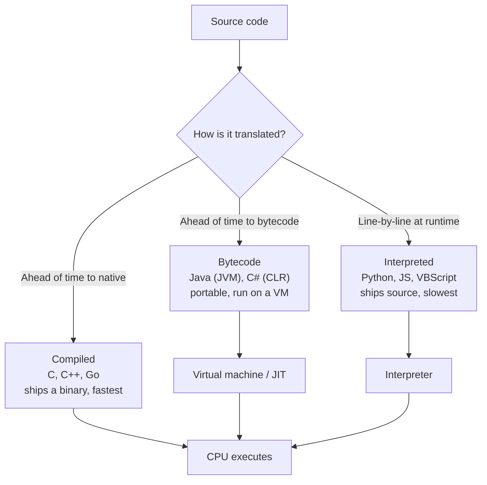

# Programming Languages and Concepts

## Overview

CISSP does not ask you to write code, but it does ask you to classify it. The high-value ideas here are: the **generations** of programming languages (1GL through 5GL), the difference between **compiled, interpreted, and bytecode** execution, and the security consequences of each — chiefly that source you can read is easier to audit but also easier to steal, and that the further you are from raw machine code the more a runtime stands between your program and the hardware. There is also a small but reliably tested vocabulary set: assembler vs compiler vs interpreter, library vs API, and what "runtime" actually means.

## Language Generations

Each generation moves further from the machine and closer to human language — more **abstraction**, less direct hardware control.

| Generation | Name | What it is | Example |
|-----------|------|-----------|---------|
| **1GL** | Machine language | Raw binary (1s and 0s) the CPU executes directly | machine code |
| **2GL** | Assembly language | Mnemonics mapped to machine instructions; needs an **assembler** | x86 ASM |
| **3GL** | High-level language | Human-readable, portable, structured | C, C++, Java, Python |
| **4GL** | Very high-level / domain-specific | Closer to natural language, declarative; report/DB query and rapid dev | SQL, MATLAB |
| **5GL** | Constraint/logic-based | You state the *problem/constraints*; the system figures out *how* | Prolog, AI/expert-system languages |

Trend to remember: **higher generation number = more abstraction, less direct machine control.** 1GL/2GL are *machine-dependent* (tied to a specific CPU); 3GL and above are *machine-independent* (portable, need translation).

## How Code Runs: Compiled vs Interpreted vs Bytecode

This is the most tested distinction in the note.

### Compiled
- Source is translated **ahead of time** into native machine code by a **compiler**, producing a standalone executable.
- Runs fast; the source is **not shipped** (only the binary), which protects intellectual property.
- Examples: **C, C++, Fortran, Go**.
- Security angle: attackers get a binary to reverse-engineer, not readable source — harder to inspect, but also harder for *defenders* to audit. Compiled binaries are where buffer-overflow/memory-safety flaws live.

### Interpreted
- Source is executed **line-by-line at runtime** by an **interpreter**; no separate compiled executable.
- The **source code ships with the program** and is readable/modifiable — easier to audit, but exposes logic and is easier to tamper with.
- Slower than compiled.
- Examples: **JavaScript, Python, Perl, PHP, VBScript, Ruby**.
- Exam trap: asked for an *interpreted* language among C++ / Fortran / Java / **VBScript** → **VBScript** (the others compile).

### Bytecode (the hybrid)
- Source is compiled **ahead of time** into an intermediate **bytecode** (not native machine code), which a **virtual machine / runtime** then executes (interpreting or JIT-compiling it).
- Portable: "compile once, run anywhere" — the same bytecode runs on any platform that has the VM.
- Examples: **Java** (bytecode on the **JVM**), **C#/.NET** (CIL/MSIL on the **CLR**).
- Security angle: bytecode is fairly easy to *decompile* back toward source, so **obfuscation** is often applied to protect logic.

| Property | Compiled | Bytecode | Interpreted |
|----------|----------|----------|-------------|
| When translated | Ahead of time → native | Ahead of time → bytecode | At runtime, per line |
| Ships source? | No (binary only) | No (bytecode) | Yes |
| Portability | Low (per platform) | High (any VM) | High (any interpreter) |
| Speed | Fastest | Middle | Slowest |
| Example | C, C++ | Java, C# | Python, JS, VBScript |

## Runtime, JIT, and Garbage Collection

- **Runtime / runtime environment** — the software layer that supports a program *while it executes* (the JVM, the .NET CLR, the Python interpreter, V8 for JavaScript). It provides services like memory management and security enforcement. "Runtime" also just means "the period during which the program is running" (contrast **compile time**).
- **JIT (Just-In-Time) compilation** — a runtime compiles hot bytecode to native machine code *on the fly* for speed, blending interpreted portability with compiled performance.
- **Garbage collection** — the runtime automatically reclaims memory no longer in use. **Managed/memory-safe languages** (Java, C#, Go, Python) do this, which largely eliminates the manual memory bugs (use-after-free, leaks, buffer overflows) that plague **C/C++** where the programmer manages memory by hand. This is why "use a memory-safe language" is a standard secure-coding recommendation.

## Toolchain and Building-Block Vocabulary

| Term | What it does |
|------|-------------|
| **Assembler** | Translates **assembly (2GL)** mnemonics into machine code |
| **Compiler** | Translates **high-level source** into machine code (or bytecode) ahead of time |
| **Interpreter** | Executes high-level source **directly, line-by-line**, at runtime |
| **Linker** | Combines compiled object files + libraries into one executable |
| **Library** | Reusable external code pulled **into** your program (you call it) |
| **API** | An **interface** to an external service/component you call across a boundary |
| **SDK** | A bundle of tools, libraries, and docs for building on a platform |
| **Mobile code** | Code downloaded and executed on the client (Java applets, ActiveX, JavaScript) — sandbox it |

**Library vs API** is a recurring distractor: a **library** is code you incorporate *into* your application; an **API** is a defined *interface* through which you talk to a separate service or component. "Using external code *inside* my app" = a library.

## Common traps / easily-confused

| Confusion | Resolution |
|-----------|------------|
| Compiled vs interpreted | Compiled = translated ahead of time to a binary; interpreted = run line-by-line, source ships |
| Java: compiled or interpreted? | **Both** — compiled to **bytecode**, then run/interpreted by the **JVM** |
| Higher generation = better? | No — higher = more abstract/declarative, not "superior"; 3GL is still the workhorse |
| Library vs API | Library = code *in* your app; API = *interface* to another component |
| Assembler vs compiler | Assembler = 2GL→machine; compiler = high-level→machine |
| Source readable = more secure? | More *auditable*, but also exposes logic/IP — a double edge |

## Exam Tips

- **1GL = machine, 2GL = assembly, 3GL = high-level (C/Java), 4GL = SQL-like, 5GL = logic/AI (Prolog).**
- **Compiled** ships a binary (protects source, fast); **interpreted** ships readable source (auditable, slower).
- **Java compiles to bytecode that runs on the JVM** — the canonical hybrid; C#/.NET is the same pattern on the CLR.
- Among C++/Fortran/Java/VBScript, the **interpreted** one is **VBScript**.
- **Memory-safe (garbage-collected) languages** prevent the manual-memory bugs that haunt C/C++.
- A **library** lives inside your app; an **API** is an interface to something outside it.

## Diagrams

### How Source Code Runs
The three execution models and what reaches the machine in each.

## Related Topics

- [Development Methodologies](Development%20Methodologies.md) - has the compiled-vs-interpreted exam trap
- [OOP Concepts](OOP%20Concepts.md) - object-oriented language constructs
- [Secure Coding Practices](Secure%20Coding%20Practices.md) - memory safety, APIs
- [Software Vulnerabilities and Attacks](Software%20Vulnerabilities%20and%20Attacks.md) - mobile code, memory bugs
- [CRAM-SHEET](../../practice/sheets/CRAM-SHEET.md)
