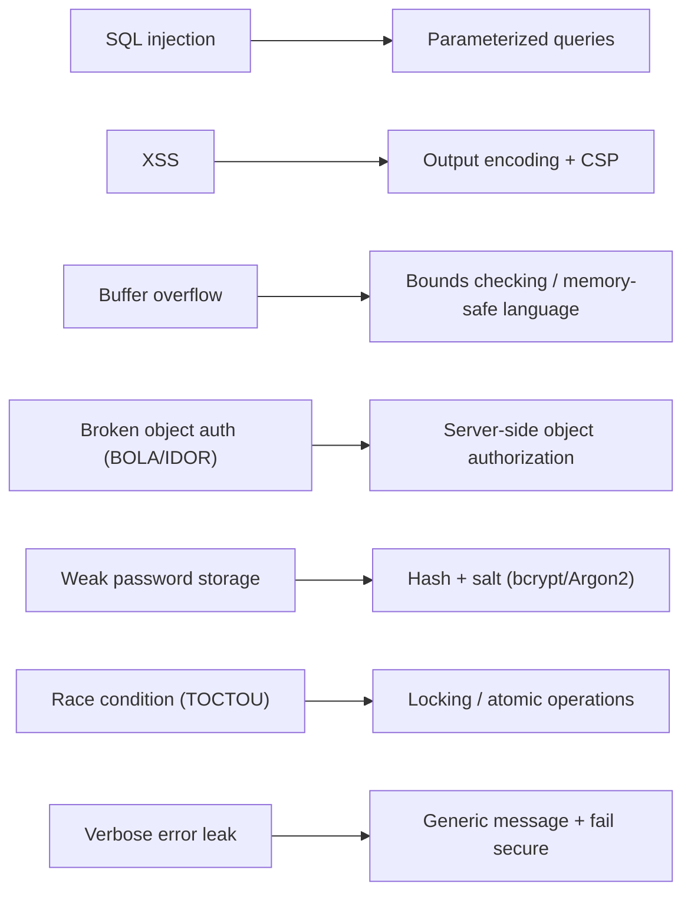

# Secure Coding Practices

## Overview

Secure coding is the developer-side counterpart to the vulnerability list: the habits that stop those flaws from ever reaching production. The unifying principle is "never trust input and fail safely" — validate everything on the server, default to denying access when something goes wrong, and lean on established libraries instead of inventing your own crypto or auth. On the exam these show up as "what is the single best control" questions, so know which defense pairs with which flaw (parameterized queries for SQL injection, output encoding for XSS, bounds checking for buffer overflow).

## Key Concepts

### Input Validation
- Validate all input (type, length, format, range)
- **Whitelist/Allowlist** validation preferred over blacklist (accept known good)
- Validate on the **server side** (client-side can be bypassed)
- Sanitize/encode output to prevent XSS
- Use parameterized queries for database access

### Error Handling
- Never expose internal details in error messages (stack traces, SQL queries)
- Log detailed errors internally; show generic messages to users
- **Fail secure** - default to denying access on error
- Handle all exceptions (don't let errors crash with debug info)

### Memory Safety
- **Bounds checking** — verifies input stays within allocated memory limits **before writing**; this is what prevents **buffer overflows**. (Exam distractor watch: bounds checking is a *coding control*, not an 800-53 control-selection process like scoping/tailoring.)
- Use bounds checking on arrays and buffers
- Use safe string functions
- Free allocated memory (prevent leaks)
- Use memory-safe languages where possible (Rust, Go, Java)
- Enable ASLR, DEP, stack canaries

### Authentication and Session Management
- Hash and salt all passwords (bcrypt, scrypt, Argon2)
- Implement proper session management (timeout, regeneration)
- Use established frameworks (don't roll your own crypto or auth)
- Implement MFA where possible

### API Security
- Authentication and authorization on every API call
- Rate limiting to prevent abuse
- Input validation on all API parameters
- Use HTTPS for all API communication
- API keys are not sufficient authentication alone
- **REST vs SOAP:**
  - **REST** = lightweight, typically **JSON**, **stateless** (web/mobile-friendly).
  - **SOAP** = **XML**-based, rigid/standardized, with built-in **WS-Security**.

### API Security — deeper
APIs are the front door of modern apps and a heavily tested topic under "security of APIs."
- **Authentication ≠ API keys** — an API key only *identifies* a caller; it is not strong authentication or authorization on its own. Use **OAuth 2.0 / OpenID Connect** with short-lived, scoped tokens for delegated access.
- **Broken Object Level Authorization (BOLA / IDOR)** — the #1 API risk: the server trusts an object ID from the client without checking the caller actually owns it. Always enforce **object-level authorization on the server** for every request.
- **Mass assignment** — binding client-supplied fields straight to internal objects lets an attacker set fields they shouldn't (e.g., `isAdmin=true`). Bind only an explicit allowlist of fields.
- **Rate limiting / throttling** — protects against abuse, brute force, and resource exhaustion.
- **REST vs SOAP vs GraphQL** — REST = JSON, stateless; SOAP = XML with built-in WS-Security; GraphQL flexibility can enable over-fetching and needs query depth/cost limits.
- Validate every parameter, use HTTPS for all calls, and don't leak data in verbose error responses.

### Secure Coding Standards and Guidelines
"Define and apply secure coding *standards*" means adopting an established reference rather than improvising:
- **OWASP** — Top 10 (awareness), **ASVS** (Application Security Verification Standard — testable requirements), **Proactive Controls**, and the Cheat Sheet Series.
- **SEI CERT Coding Standards** — language-specific secure rules (C, C++, Java).
- **CWE** (Common Weakness Enumeration) — the dictionary of software weakness *types* (a CWE is the class; a CVE is a specific instance in real software).
- **NIST SSDF (SP 800-218)** — secure software development practices framework.
- Standards make "secure" objective and auditable, and feed acceptance criteria and code review checklists.

### Concurrency and Type Safety
- **Race conditions / TOCTOU** — guard shared resources with locking/atomic operations; don't assume state is unchanged between a check and a use.
- **Type safety & safe defaults** — strongly-typed, memory-safe languages and safe integer handling prevent whole classes of overflow/coercion bugs.

### Code Obfuscation
- Making code **hard to read/reverse-engineer** while keeping it **functional** — protects logic/IP. Note: obfuscation is *not* a security control against a determined analyst — it raises effort, it does not provide confidentiality.

### Secure Defaults
- Disable unused features and services
- Change all default passwords and settings
- Deny access by default
- Enable logging and monitoring
- Use least privilege for application service accounts

## Exam Tips

- **Allowlist** (whitelist) validation is stronger than blocklist (blacklist)
- **Server-side** validation is mandatory (client-side is supplementary)
- Never trust user input - validate everything
- Use established, tested libraries for crypto and auth
- "Don't roll your own crypto" is a fundamental principle
- **API keys are not authentication** — use OAuth 2.0 / OIDC with scoped, short-lived tokens
- **BOLA/IDOR** (broken object-level authorization) is the top API risk — authorize every object access server-side
- **CWE = weakness type/class; CVE = specific instance** in a real product
- Adopt an established **standard** (OWASP ASVS, SEI CERT, NIST SSDF) rather than improvising "secure"

## Diagrams

### Flaw to Best-Fit Defense
The exam rewards the precise control paired with each flaw, not a generic "validate input."

## Related Topics

- [Software Vulnerabilities and Attacks](Software%20Vulnerabilities%20and%20Attacks.md) - what secure coding prevents
- [Secure SDLC](Secure%20SDLC.md) - secure coding within the development lifecycle
- [Database Security](Database%20Security.md) - parameterized queries
- [Cryptography](../03-security-architecture-and-engineering/Cryptography.md) - proper implementation
