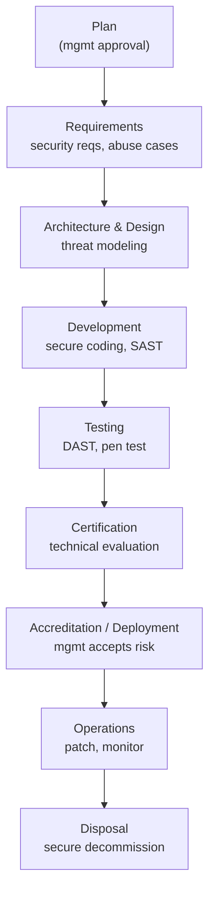

# Secure SDLC

## Overview

Integrating security into every phase of the Software Development Life Cycle rather than bolting it on at the end.

## Key Concepts

### SLC vs SDLC
- **SLC (System Life Cycle)** = the **whole system**, including **hardware, operations, and disposal**.
- **SDLC (Software Development Life Cycle)** = the **software development** portion specifically.

### Full SDLC Phase Sequence
- A fuller phase list the exam may use: **Plan** (+ management approval) → **Requirements** → **Architecture & Design** → **Development** → **Testing** → **Certification** → **Deployment / Accreditation** → **Operations** → **Disposal**.
- **Certification vs Accreditation:**
  - **Certification** = the **technical evaluation** that the system meets its requirements/controls.
  - **Accreditation** = **management's formal authorization** to deploy/operate — management **accepts the risk**.

### SDLC Phases and Security Activities
| Phase | Security Activity |
|-------|------------------|
| **Requirements** | Security requirements, abuse cases, compliance needs |
| **Design** | Threat modeling, security architecture, design review |
| **Implementation** | Secure coding, code review, SAST |
| **Testing** | Security testing, DAST, penetration testing |
| **Deployment** | Configuration hardening, security verification |
| **Maintenance** | Patch management, vulnerability monitoring, incident response |

### Development Methodologies
| Methodology | Description |
|-------------|-------------|
| **Waterfall** | Sequential, linear phases; rigid; security at each gate |
| **Agile** | Iterative sprints; security integrated into each sprint |
| **Spiral** | Risk-driven; risk analysis at each iteration |
| **DevOps** | Development + Operations merged; fast deployment |
| **DevSecOps** | DevOps + Security embedded throughout |
| **RAD** | Rapid prototyping; security can be overlooked |
| **Prototyping** | Build mockups; not production-ready |

### Maturity Models
- **CMM/CMMI** (Capability Maturity Model):
  1. Initial - chaotic, ad hoc
  2. Repeatable/Managed - basic processes
  3. Defined - documented and standardized
  4. Quantitatively Managed - measured and controlled
  5. Optimizing - continuous improvement

- **SAMM** (Software Assurance Maturity Model) - OWASP's security-specific maturity model. **5 business functions:** **Governance, Design, Implementation, Verification, Operations**.
- **BSIMM** (Building Security In Maturity Model) - observational model of real practices
- **SW-CMM (5 stages, in order):** Initial → Repeatable → Defined → Managed → Optimizing.
- **CMM/CMMI** = general **process** maturity; **SAMM** and **BSIMM** = software **security/assurance** maturity specifically.

### Code Review / Fagan Inspection
- **Fagan inspection** = a **formal, structured code review** process (6 steps: **planning → overview → preparation → inspection → rework → follow-up**). Named after Michael Fagan.

### Acquired / Third-Party Software
- **COTS** = **Commercial off-the-shelf** (finished commercial product).
- **GOTS** = **Government off-the-shelf** (custom-built for a government org).
- **Open-source** = source is inspectable, but **you own vetting/patching**.
- **Library** = reusable external code you pull **into** your app (vs an **API**, which is an interface to a service). Using external code **in** your app = a **library**.
- All of these carry **third-party / supply-chain risk**.
- **Acquisition rule:** assess the vendor's security and put **security requirements in contracts/SLAs** — you **inherit their risk**.
- **SaaS / managed services:** **shared responsibility** — you inherit the provider's security but **retain responsibility for your data**.
- **Software supply chain risk** = risk from third-party code/dependencies/build pipeline (e.g., a poisoned library/update — **SolarWinds**). Mitigate with **SBOM, dependency scanning, code signing, vendor assessment**.

### Software Configuration Management (SCM)
- **SCM** = tracking/controlling **versions and changes** to code and artifacts (version control, baselines) so builds are **known and reproducible**.

### Citizen-Developer Risk
- **Citizen developers** = non-professional employees building apps with **low-code/no-code** tools.
- Fast, but often **bypasses security review, testing, and governance**.

### Security Frameworks for Software
- **Microsoft SDL** - Security Development Lifecycle
- **OWASP** - Open Web Application Security Project (guidelines, tools, Top 10)
- **NIST SSDF** - Secure Software Development Framework
- **SAFECode** - Software Assurance best practices

## Exam Tips

- Security should be integrated into **every phase** of the SDLC
- **Spiral** model is inherently risk-driven (risk analysis each cycle)
- **Agile** integrates security through security stories and sprint reviews
- Cost of fixing vulnerabilities increases dramatically in later phases
- CMM Level 5 = continuously optimizing (highest maturity)

## Diagrams

### SDLC Phases with Security Gates
Security is built into every phase; certification (technical) precedes accreditation (management risk acceptance).

## Related Topics

- [Threat Modeling](../01-security-and-risk-management/Threat%20Modeling.md) - key activity in design phase
- [Software Testing Methods](../06-security-assessment-and-testing/Software%20Testing%20Methods.md) - testing phase activities
- [DevSecOps and CI-CD](DevSecOps%20and%20CI-CD.md) - modern development practices
- [Secure Coding Practices](Secure%20Coding%20Practices.md)
