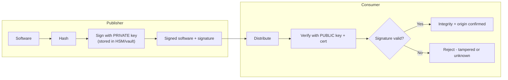

# Security in the Development Environment

## Overview

The code is only as trustworthy as the place it was built. (ISC)² calls out securing the **development ecosystem** itself — the toolsets, IDEs, runtime, source-code repositories, configuration management, and the build/release pipeline — as a domain objective in its own right. The intuition: an attacker who cannot break your *application* may instead break your *factory* (poison a dependency, steal a signing key, tamper with the build) and ship malice straight to every customer with your name on it. This note covers the controls that protect the toolchain, distinct from [DevSecOps and CI-CD](DevSecOps%20and%20CI-CD.md), which focuses on the *testing* activities inside the pipeline.

## The Development Toolset and IDE

The **IDE (Integrated Development Environment)** — VS Code, IntelliJ, Visual Studio — is where developers spend their day, and it is a privileged endpoint: it holds source, credentials, and the ability to execute code.

- **Plugins/extensions are a supply-chain surface** — a malicious or compromised IDE extension runs with the developer's privileges and can exfiltrate source or credentials. Vet and restrict extensions.
- **Secret hygiene** — developers must not paste API keys, passwords, or tokens into source or config that gets committed. Use a **secrets manager / vault**, not hardcoded values.
- **Harden the developer endpoint** — patch the IDE and SDKs, use least-privilege accounts, full-disk encryption; a developer laptop is a high-value target.
- **Don't confuse IDE with other "I-D" terms** — IDE = development environment; **IDEAL** = a maturity-improvement model; **ODBC/JDBC** = database connectivity.

## Source Code and Configuration Management

### Software Configuration Management (SCM)
SCM tracks and controls **versions and changes** to code, build scripts, and artifacts so that any build is **known, reproducible, and auditable**. It establishes **baselines** (a known-good reference point) and records what changed, when, and by whom. SCM is the software-development face of the broader [Change and Configuration Management](../07-security-operations/Change%20and%20Configuration%20Management.md) discipline.

### Securing the code repository (Git, etc.)
The repository is the crown jewels — whoever controls it controls what ships.

- **Access control & least privilege** — restrict who can read, write, and especially who can approve/merge to protected branches.
- **Branch protection & mandatory peer review** — require pull-request review and passing checks before merge; no direct pushes to `main`.
- **Strong authentication / MFA** for repository accounts; rotate and scope access tokens.
- **Secret scanning** — automatically detect credentials accidentally committed; treat any leaked secret as compromised and rotate it.
- **Signed commits** — verify that commits genuinely came from the claimed author, deterring impersonation in the history.
- **Audit logging** — record who changed what; supports both forensics and accountability (see effectiveness assessment).

## CI/CD Pipeline Security

The pipeline is automated infrastructure with broad privileges (it can pull source, build, sign, and deploy to production), which makes it a high-value target. Security here protects the *build process*, complementing the security *testing* covered in [DevSecOps and CI-CD](DevSecOps%20and%20CI-CD.md).

- **Protect pipeline credentials and signing keys** — store them in a vault/HSM, scope them narrowly, never embed them in scripts. A stolen deploy or signing credential is catastrophic.
- **Least-privilege build agents / runners** — isolate and where possible use ephemeral, immutable runners so a compromised job cannot persist or pivot.
- **Integrity of build inputs** — pin and verify dependency versions, use trusted internal artifact registries, and verify the integrity of base images and tools (defends against dependency-confusion and poisoned-update attacks like SolarWinds).
- **Separation of duties & gated promotion** — the person who writes code should not be the sole approver of its release to production; require approvals to promote between environments.
- **Pipeline-as-code under version control** — the pipeline definition itself is reviewed and change-controlled like any other code.

## Application Security Testing in the Pipeline

These automated tests are the "shift left" controls embedded into the build. Know what each one operates on:

| Test | Operates on | Finds |
|------|-------------|-------|
| **SAST** (Static) | **Source code** (no execution) | Insecure code patterns, injection sinks, unsafe APIs |
| **DAST** (Dynamic) | **Running application** (black-box) | Runtime/exposed flaws, misconfig, auth issues |
| **IAST** (Interactive) | **Instrumented running app** | Combines static + dynamic via agents inside the app |
| **SCA** (Software Composition Analysis) | **Dependencies / third-party components** | Known-vulnerable and badly-licensed libraries |
| **Fuzzing** | Running app, malformed/random input | Crashes, memory bugs, unhandled edge cases |
| **RASP** | App **in production** (runtime self-defense) | Blocks attacks live; a control, not a test |

SAST = white-box, early, no running app needed. DAST = black-box, needs a running app. SCA targets the *supply chain* of libraries, not your own code.

## Code Signing

**Code signing** uses the developer/publisher's **private key** to create a **digital signature** over the software; consumers verify it with the corresponding **public key (and certificate)**. It provides:

- **Integrity** — proof the code was not altered since signing (any tampering breaks the signature).
- **Authenticity / origin** — proof of *who* published it.
- **Non-repudiation** — the signer cannot credibly deny releasing it.

It does **not** prove the code is *safe* — a malicious vendor can sign malware. The critical risk is **private-key theft**: a stolen signing key lets an attacker sign malware that the world will trust (a recurring real-world supply-chain attack). Protect signing keys in an **HSM**, restrict access, and use timestamping so signatures remain valid after the cert expires.

## Software-Defined Security

**Software-defined security** means security controls (firewalling, segmentation, policy enforcement, access rules) are defined, provisioned, and managed *in software/code* rather than via fixed hardware appliances — programmatically and centrally, often via APIs. It is what makes security **automatable and version-controlled** in cloud and DevSecOps environments: policy becomes code, deployed and audited like any other artifact. Closely related to **Infrastructure as Code (IaC)** and the broader move to **policy as code**.

## Common traps / easily-confused

| Confusion | Resolution |
|-----------|------------|
| SAST vs DAST | SAST = source, no running app; DAST = running app, black-box |
| SCA vs SAST | SCA = third-party *dependencies*; SAST = *your own* source code |
| Code signing proves safety? | No — it proves integrity + origin, not that the code is benign |
| Biggest code-signing risk | **Private signing key theft** → attacker signs trusted malware |
| Securing the app vs securing the pipeline | The pipeline/repo is itself a target; protect the factory, not just the product |
| SCM vs IDE | SCM = version/change control of artifacts; IDE = the editing environment |

## Exam Tips

- The **development environment itself is in scope** — repositories, pipelines, build agents, and signing keys are attack targets.
- **Code signing = integrity + authenticity + non-repudiation**, using the publisher's **private key**; verify with the public key/cert.
- Protect **signing keys and pipeline credentials in a vault/HSM** — their theft enables trusted-malware supply-chain attacks.
- **SAST = static/source, DAST = dynamic/running, SCA = dependencies, IAST = instrumented, RASP = runtime production defense.**
- Enforce **least privilege, MFA, branch protection, peer review, and secret scanning** on the source repository.
- **Software-defined security / policy as code** = controls expressed in software, enabling automation and version control.

## Diagrams

### Code Signing: Sign and Verify
Private key signs at the publisher; public key/cert verifies at the consumer. Proves integrity and origin, not safety.

## Related Topics

- [DevSecOps and CI-CD](DevSecOps%20and%20CI-CD.md) - testing activities inside the pipeline
- [Secure SDLC](Secure%20SDLC.md) - SCM, frameworks
- [Assessing Acquired Software Security](Assessing%20Acquired%20Software%20Security.md) - dependency and supply-chain risk
- [Change and Configuration Management](../07-security-operations/Change%20and%20Configuration%20Management.md)
- [Supply Chain Risk Management](../01-security-and-risk-management/Supply%20Chain%20Risk%20Management.md)
