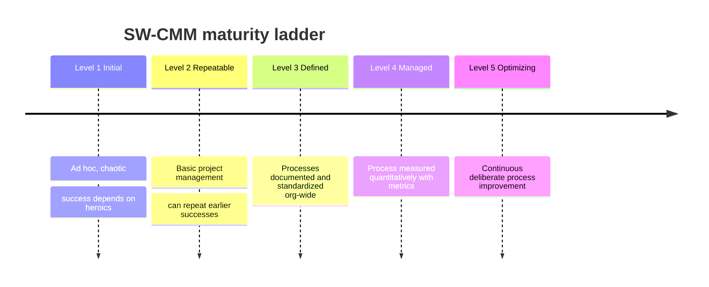

# Software Development Maturity Models

## Overview

A maturity model is a yardstick. It does not tell you how to build software; it tells you how *disciplined and repeatable* your process for building software is, on a ladder from "we wing it every time" to "we measure ourselves and improve deliberately." The exam tests two things: the ordered ladder of levels for each model (especially CMM/CMMI), and which model is a *general process* model versus a *software-security-specific* one. Get the ordering and the "what is this model actually for" right and you have the points.

The key intuition: higher maturity means more **predictable outcomes**. A Level 1 organization might ship a brilliant product or a disaster depending on which heroes were on the team. A Level 5 organization gets consistent results because the *process* produces them, not the individuals.

## CMM / SW-CMM (Software Capability Maturity Model)

Developed at Carnegie Mellon's Software Engineering Institute (SEI). Five levels, and the order is heavily tested. Memorize the sequence and the one-word idea behind each.

| Level | Name | Idea | Key word |
|-------|------|------|----------|
| 1 | **Initial** | Ad hoc, chaotic, success depends on individuals | "heroics" |
| 2 | **Repeatable** | Basic project management; can repeat earlier successes | "repeat" |
| 3 | **Defined** | Processes documented and standardized org-wide | "documented" |
| 4 | **Managed** | Process measured quantitatively with metrics | "measured" |
| 5 | **Optimizing** | Continuous, deliberate process improvement | "improve" |

Mnemonic for the order: **I**nitial, **R**epeatable, **D**efined, **M**anaged, **O**ptimizing → "**I R**eally **D**on't **M**ind **O**vertime."

The jump that trips people up: **Level 4 (Managed) is where you start measuring**, and **Level 5 (Optimizing) is where you act on those measurements to improve**. You cannot optimize what you do not measure, which is why measurement (4) comes before optimization (5).

## CMMI (Capability Maturity Model Integration)

CMMI is the successor to SW-CMM. It generalizes beyond software to any process (systems engineering, service delivery, acquisition). For the exam the five **staged** levels map almost one-to-one onto SW-CMM, with one naming change at Level 2:

| Level | CMMI name |
|-------|-----------|
| 1 | Initial |
| 2 | **Managed** (was "Repeatable" in SW-CMM) |
| 3 | Defined |
| 4 | **Quantitatively Managed** |
| 5 | Optimizing |

Note the naming trap: CMMI uses "Managed" at **Level 2** (basic project management) and "Quantitatively Managed" at **Level 4** (statistical/metrics control). SW-CMM used "Repeatable" at 2 and "Managed" at 4. If a question uses the word "Managed" you must read whether it means basic management (CMMI L2) or quantitative measurement (CMMI L4).

CMMI offers two representations:
- **Staged** — the organization advances through the five maturity levels as a whole (the ladder above). Good for benchmarking one organization against another.
- **Continuous** — individual process areas are rated on their own capability levels independently, so you can be advanced in one area and immature in another. Good for targeting improvement where you most need it.

## IDEAL Model

IDEAL is the SEI's companion **improvement roadmap** — it is *how you climb* the CMM ladder, not a measurement of where you stand. It is a five-phase cycle and the letters spell the name:

| Phase | Meaning |
|-------|---------|
| **I**nitiating | Lay the groundwork, get sponsorship, set context |
| **D**iagnosing | Assess current state vs desired state |
| **E**stablishing | Plan the specifics of how to reach the goal |
| **A**cting | Implement the improvements / pilot solutions |
| **L**earning | Review results, refine the approach, feed back into next cycle |

Exam cue: IDEAL = a **process-improvement program management** model. If the stem asks "which model guides the *implementation* of process improvement" → IDEAL, not CMM.

## Security-Specific Maturity Models

CMM/CMMI/IDEAL measure general process maturity. The next two measure **software security assurance maturity** specifically. This general-vs-security distinction is the single most tested point in this note.

### SAMM (Software Assurance Maturity Model)

An **OWASP** project. Prescriptive and self-assessment oriented — it tells you what good security practices look like and lets you score yourself and build a roadmap. Organized around **five business functions**, each containing security practices scored at maturity levels 1–3:

1. **Governance**
2. **Design**
3. **Implementation**
4. **Verification**
5. **Operations**

Memory hook: these mirror the lifecycle (Govern → Design → Build → Verify → Operate).

### BSIMM (Building Security In Maturity Model)

**Descriptive, not prescriptive.** BSIMM is an *observational* model: its authors studied what real organizations actually do in their software security programs and catalogued those activities. You compare yourself against the observed data ("what are my peers doing") rather than against an ideal target. It is organized into **four domains**: Governance, Intelligence, SSDL (Secure Software Development Lifecycle) Touchpoints, and Deployment.

**SAMM vs BSIMM** — the classic pairing:
- **SAMM** = OWASP, **prescriptive** (tells you what you *should* do).
- **BSIMM** = **descriptive/observational** (tells you what others *actually* do, measured from real data).

## Common traps / easily-confused

| Confusion | Resolution |
|-----------|------------|
| SW-CMM L2 vs CMMI L2 name | SW-CMM = "Repeatable"; CMMI = "Managed" |
| CMMI "Managed" (L2) vs "Quantitatively Managed" (L4) | L2 = basic project mgmt; L4 = statistical/metrics control |
| Measuring vs optimizing | Measure first (L4), then optimize (L5) |
| CMM vs IDEAL | CMM *measures* maturity; IDEAL is the *roadmap to improve* it |
| SAMM vs BSIMM | SAMM = prescriptive (OWASP); BSIMM = descriptive/observational |
| CMM/CMMI vs SAMM/BSIMM | CMM/CMMI = general *process* maturity; SAMM/BSIMM = *security* assurance maturity |

## Exam Tips

- Know the **five CMM levels in order**: Initial → Repeatable → Defined → Managed → Optimizing.
- **Level 5 (Optimizing)** is the highest = continuous improvement.
- You must **measure (L4) before you can optimize (L5)**.
- **IDEAL** is the *improvement* roadmap (Initiating, Diagnosing, Establishing, Acting, Learning), not a maturity yardstick.
- **SAMM = OWASP, prescriptive; BSIMM = descriptive/observational** — this pairing is a frequent distractor.
- If the stem stresses *security* assurance specifically, the answer is **SAMM or BSIMM**, not CMM/CMMI.

## Diagrams

### SW-CMM Five Levels (in order)
The heavily-tested ladder; you must measure (L4) before you can optimize (L5).

## Related Topics

- [Secure SDLC](Secure%20SDLC.md) - where maturity models fit in process governance
- [Development Methodologies](Development%20Methodologies.md) - how vs how-mature
- [CMMI Levels](../03-security-architecture-and-engineering/CMMI%20Levels.md)
- [Assessing Software Security Effectiveness](Assessing%20Software%20Security%20Effectiveness.md)
- [CRAM-SHEET](../../practice/sheets/CRAM-SHEET.md)
