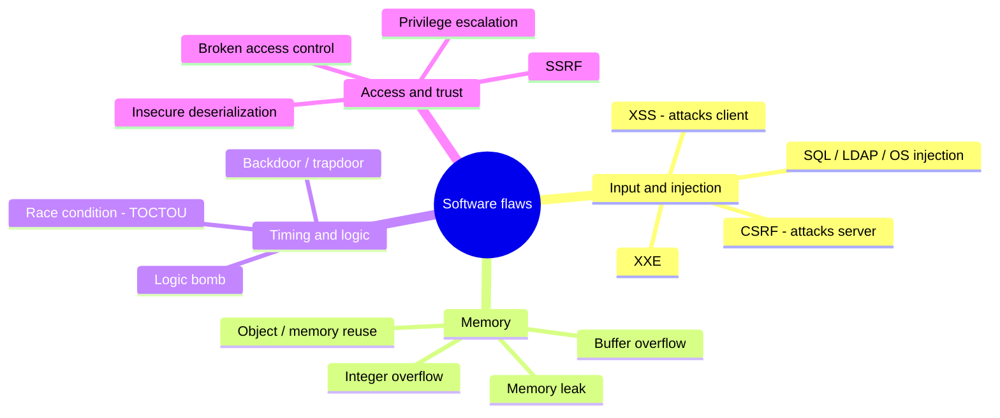

# Software Vulnerabilities and Attacks

## Overview

Software flaws are where most real-world breaches start: a single unvalidated input or unpatched library can hand an attacker the whole system. This note catalogs the flaws the exam expects you to recognize and the one-line defense for each. The high-value skill is matching a symptom to its named vulnerability (injection, XSS, race condition) and to the *correct* defense — the exam rewards the precise fix, not a generic "validate input."

## Key Concepts

### OWASP Top 10 (Key Categories)
| Vulnerability | Description | Defense |
|--------------|-------------|---------|
| **Injection** (SQL, LDAP, OS) | Untrusted data sent as commands | Input validation, parameterized queries, ORMs |
| **Broken Authentication** | Flawed auth/session management | MFA, secure session handling |
| **Sensitive Data Exposure** | Inadequate data protection | Encryption, proper key management |
| **XML External Entities (XXE)** | Processing malicious XML | Disable external entities, use JSON |
| **Broken Access Control** | Improper authorization checks | Enforce least privilege, deny by default |
| **Security Misconfiguration** | Default or insecure settings | Hardening, security baselines |
| **Cross-Site Scripting (XSS)** | Injecting scripts into web pages | Output encoding, CSP headers |
| **Insecure Deserialization** | Manipulating serialized objects | Input validation, integrity checks |
| **Using Known Vulnerabilities** | Unpatched components | Patch management, SCA tools |
| **Insufficient Logging** | Inadequate monitoring | Comprehensive logging and monitoring |

### Buffer Overflow
- Writing data beyond the bounds of allocated memory
- Can allow arbitrary code execution
- Types: stack overflow, heap overflow
- Defenses: ASLR, DEP/NX bit, stack canaries, bounds checking, safe languages

### Other Key Vulnerabilities
| Vulnerability | Description |
|--------------|-------------|
| **Race Condition** | Timing dependency that can be exploited (TOCTOU - Time of Check/Time of Use) |
| **Integer Overflow** | Arithmetic exceeds variable capacity |
| **Memory Leak** | Memory not freed; eventually exhausts resources |
| **Covert Channel** | Unauthorized communication path |
| **Backdoor/Trapdoor** | Hidden entry point bypassing security |
| **Logic Bomb** | Code triggered by specific condition |
| **Privilege Escalation** | Gaining unauthorized elevated access |
| **CSRF** (Cross-Site Request Forgery) | Forcing authenticated user to perform unwanted actions |
| **SSRF** (Server-Side Request Forgery) | Forcing server to make requests to internal resources |

### Web Application Attack Types
- **SQL Injection** - manipulating database queries through user input
- **XSS** - injecting malicious scripts (Stored, Reflected, DOM-based)
- **CSRF** - exploiting trusted authentication to perform unauthorized actions
- **Directory Traversal** - accessing files outside intended directories (../../)
- **Session Hijacking** - stealing or forging session tokens

### XSS Types and XSS vs CSRF (high-value distinction)
- **Three XSS types:**
  - **Stored / Persistent** - script saved on the server (e.g., a comment field), runs for **all viewers** → **most DANGEROUS**.
  - **Reflected** - script in a crafted link/request is **echoed back** to the one victim who clicks it → **most COMMON**.
  - **DOM-based** - manipulation happens **entirely in the client's browser**; the payload **never reaches the server**.
- **Who is the target?** XSS attacks the **CLIENT** — script runs in the **victim's browser** (steals sessions/keystrokes, redirects).
- **CSRF** attacks the **SERVER** — tricks the victim's browser into sending a **forged authenticated request**, acting as the logged-in user.
- **Exam line:** XSS and CSRF have **opposite targets** — XSS = run script in the user's browser (client); CSRF = forge an authenticated request to the server (server).

### Object / Memory Reuse
- **Residual data** left in memory or in a **reused object** that a new process can read = an **information leak** (e.g., a freshly allocated buffer still holding the previous user's data).
- **Control:** **clear/zeroize** memory and objects on release before reuse.

### Mobile Code
- **Mobile code** = code **downloaded and executed in the browser/client** — **Java applets, ActiveX, JavaScript**.
- A common attack vector (legacy ActiveX/applets especially).
- **Control:** run it in a **sandbox** with **restricted privileges**.

## Exam Tips

- **SQL injection** is prevented by **parameterized queries** (not input filtering alone)
- **XSS** is prevented by **output encoding** (escaping special characters)
- **Buffer overflow** is the most dangerous; can lead to arbitrary code execution
- **TOCTOU** is a race condition between checking and using a resource
- Know the OWASP Top 10 categories at a high level

## Diagrams

### Software Vulnerability Taxonomy
The flaw families the exam expects you to recognize, grouped by where they live.

## Related Topics

- [Secure Coding Practices](Secure%20Coding%20Practices.md) - preventing these vulnerabilities
- [Software Testing Methods](../06-security-assessment-and-testing/Software%20Testing%20Methods.md) - detecting these vulnerabilities
- [Domain 4 - Communication and Network Security](../04-communication-and-network-security/00%20Domain%204%20-%20Communication%20and%20Network%20Security.md) - network-level attacks
- [Access Control Attacks](../05-identity-and-access-management/Access%20Control%20Attacks.md)
